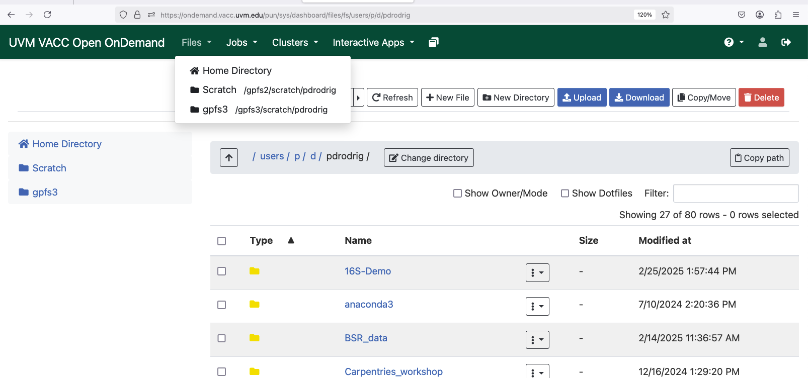

## Frequently Asked Questions

On this page I will update as they come common problems experienced by students when using the VACC cluster with suggestions on how to resolve them. 

### Why do I see `$'\r':command not found`? 

It is likely that you created the job script on a Windows machine, which uses different newline characters. To overcome this, you can try the following command: 

```bash
sed -i 's/\r$//' your-script-name.sh
```

then run: 

```bash
sh your-script-name.sh
```

### Setup of SRA tools 

When running SRA Tools for the first time it is necessary to run `vdb-config --interactive` and then press 'x' to save a basic configuration. This is not necessary for further usage. 

### Why do I see `Unable to locate a modulefile for 'gcc/'`? 

It is most likely that you are logging into the "old" VACC cluster. This class has transitioned to using the "new" VACC cluster which can be accessed with: 

```
ssh uvmid@login.vacc.uvm.edu

#replace uvmid id with your netid
```

The website for the new VACC cluster on OpenOnDemand can be found [here](https://ondemand.vacc.uvm.edu/pun/sys/dashboard)

### Which modules require loading `gcc/13.3.0-xp3epyt` first? 

Using `module avail` you will be able to view the list of modules that require this compiler:

```
-------- /gpfs1/sw/spack/0.22.2/modules/linux-rhel9-x86_64/gcc/13.3.0 ---------
   angsd/0.935-4asngpy          hisat2/2.2.1-x7h4grf
   bamtools/2.5.2-twq7d2p       htslib/1.19.1-6ivqauw
   bcftools/1.19-iq5mwek        kraken2/2.1.3-5jimqoc
   bedtools2/2.31.1-xip5kr5     minimap2/2.28-qcu5ixf
   bismark/0.24.1-zmqux7v       openmpi/4.1.6-67ovor6
   blast-plus/2.14.1-ca7iit2    picard/3.1.1-otrgwkh
   boost/1.85.0-bhfhhhm         py-htseq/2.0.3-mb7ap7s
   bowtie2/2.5.2-qd4omrm        py-multiqc/1.15-fmpaaj7
   bwa/0.7.17-iqv3cxl           samtools/1.19.2-pfmpoam
   cgal/5.6-ng5gssh             sratoolkit/3.0.0-y2rspiu
   eigen/3.4.0-auuuz67          star/2.7.11a-cp575va
   fastp/0.23.4-mjw7rak         trimgalore/0.6.10-namgrp2
   fastqc/0.12.1-qxseug5        trimmomatic/0.39-vdnktze
   freebayes/1.3.6-r67va2b      xtb/6.6.0-ivf4oeb
```

### How do I transfer files (HTML, PDFs, etc) off the VACC? 

Navigate to the Files tab on OpenOnDemand, then Home Directory. Navigate to the file you would like to download and click on the white box beside it to select. Then click Download!

<figure markdown="span">
  { width="500"}
</figure>


