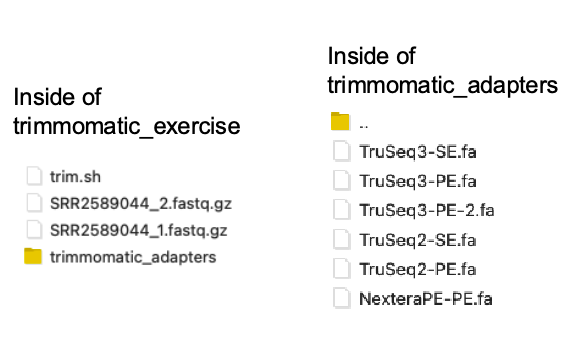

## Helpful Tips for HW#7

### **Step 1: Is Trimming Required or Not?** 

Determine whether your samples require trimming. Trimming was covered [here](https://prodriguez19.github.io/MMG3320-5320/ch05/10_trimming/). In this tutorial, you were asked to make a copy of the `trimmomatic_exercise/` folder. This folder contains a subfolder called `trimmomatic_adapters/`. You will need to specify the path to `trimmomatic_adapters/` along with the appropriate FASTA file containing the adapters to trim. See your options below: 

<figure markdown="span">
  { width="400"}
</figure>

### **Step 2: Aligning using HISAT2** 

During Week 6, we covered the aligner HISAT2. There were two key exercises:

+ `HISAT2_example1` (L11) – For single-end (SE) samples
+ `HISAT2_example2` (L13) – For paired-end (PE) samples

Use the appropriate script based on your sample type.

!!! tip 
  
    Need a refresher? Review the slides on Alignment Outputs (L14) to revisit the differences between these scripts. 

During alignment, you will need to specify the location to the Genomic Index. More information regarding the indexes and where to find them can be found [here](genome_index-2025.md). 

!!! warning 

    You will ONLY need to specify the LOCATION/PATH of the Genomic Index when running HISAT2.
    Please DO NOT make a copy of these indexes! They are extremely large and should not be duplicated.


!!! danger "**Strandedness: Don't Forget this Step!**"

    + Before aligning your full dataset, run the alignment on one sample first to determine the strandedness of your samples.

    + If you do not specify `--rna-strandness` during alignment, HISAT2 assumes unstranded data, which can lead to incorrect alignments and downstream errors.

#### How to Specify Strandedness in HISAT2 

```bash
--rna-strandness <string>
```

For single-end reads, use `F` or `R`.

+ `F` means a read corresponds to a transcript.
+ `R` means a read corresponds to the reverse complement. 

For paired-end reads, use either `FR` or `RF`.

!!! tip 
  
    Need a refresher? Review the slides on Alignment Outputs (L15) to revisit the differences between these scripts. 

#### RSeQC and MultiQC Struggles

MultiQC sometimes struggles with processing RSeQC outputs.

+ To determine strandedness, you can use the [Sequera.io MultiQC](https://seqera.io/multiqc/) website.
+ Or you can use the multiQC container (i.e."/gpfs1/cl/mmg3320/course_materials/containers/multiqc-1.20.sif"). This was covered in L15. 

The bed12 files to be used with RseQC can be found in this location: 

```bash
/gpfs1/cl/mmg3320/course_materials/RseQC_bed12
```


### **Step 3: Counting Reads**

+ The `htseq_demo` folder contains the script you created to run `htseq-count` on samples.
+ Each sample takes approximately 30 minutes to process.
    + To be safe, request `24:00:00` for time.
+ More information regarding the GTF file and its location can be found: 