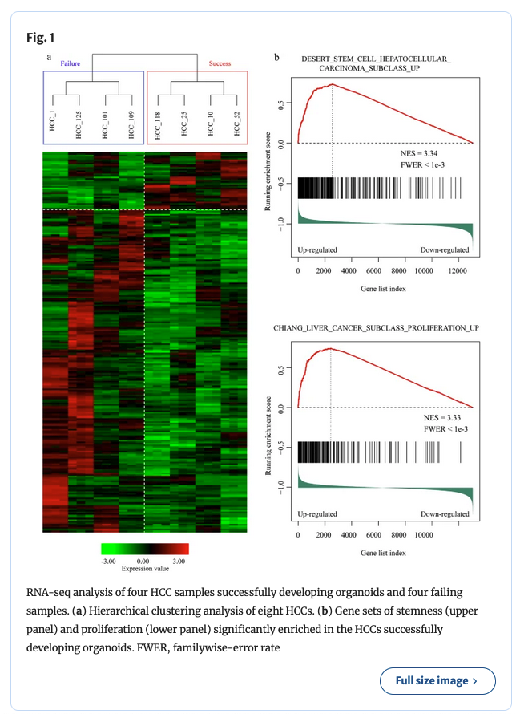

## Final Project Materials

Final Project Materials will be made available here as well as Brightspace. 

[Final Project Overview PowerPoint - January 22, 2025](Final-Project-Discussion-mmg3320-JAN2025.pdf)

[Final Project Guidelines PDF - January 22, 2025](Guidelines-for-Final-Project.pdf)

## Past Final Project Submissions 

Below are examples of final project submissions from previous years. Please note that the guidelines and rubric have changed for Spring 2025—these examples are provided only for general reference. They are intended to illustrate the green, blue, and black trail projects, not to serve as templates for formatting or content.

### Green Trail Examples 

For the green trail, the goal is to recreate a figure or figure panel from a publication. In the Green Trail Example #1, this student was able to recreate Figure 1 from [Xian et al. 2022](https://link.springer.com/article/10.1007/s13402-022-00707-3)

<figure markdown="span">
  { width="400" }
</figure>

[Green Trail Example #1](HCC_figure.html)

[Green Trail Example #2](Berglund.html)

[Green Trail Example #3](Final_Project.html)

[Green Trail Example #4](Fig1B.html)

### Blue Trail Examples 

For the blue trail, the goal is compare bioinformatic programs and contrast results. In the Blue Trail Example #1 & #2, the students successfully compared a genomic (STAR) vs transcriptomic (SALMON) aligner or fast-aligner (HISAT2). In Blue Trail Example #2, the students used [nf-core/rnaseq](https://nf-co.re/rnaseq/3.14.0/) to compare multiple aligners at once. 

<figure markdown="span">
  { width="400" }
</figure>

[Blue Trail Example #1](MMG5320_finalproject_IHastomo.html)

[Blue Trail Example #2](AsreesFinalProject.html)

[Blue Trail Example #3](lilie_frankie.nb.html)

### Black Trail Examples 

For the black trail, the goal is to test an original hypothesis and to generate results not seen in the published manuscript. The powerpoint presentation given by the student for Black Trail Example #1 are provided [here](Kmiecik_MMG232_Final_Bear.pdf). Please note that all of these analysis contained multiple parts since the students did multiple pairwise comparisons. 

[Black Trail Example #1](Kmiecik_MMG232_Bear_Project.html)

[Black Trail Example #2](Rmarkdown_Blackwell.Patch_MMG3320.5320_Final_Project_Part.II.html)

[Black Trail Example #3](Gullickson_MMG232_Final_Part2_M1andM1T863_VS_M0.html)
