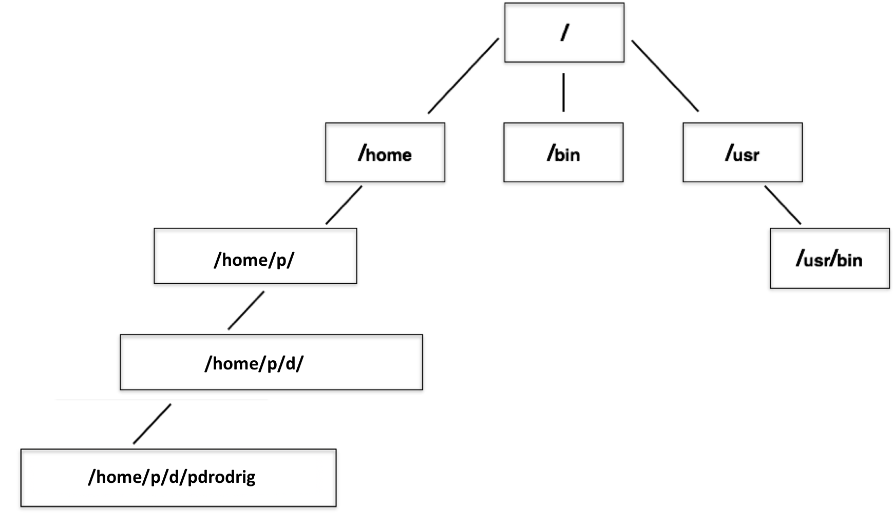
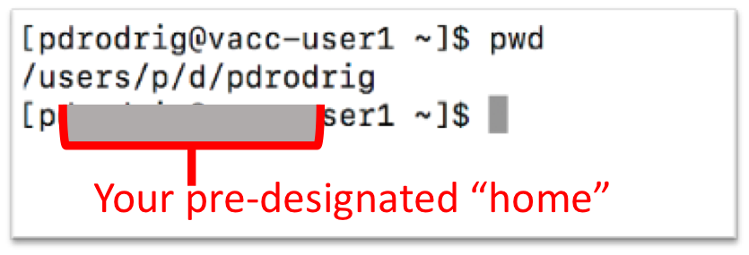
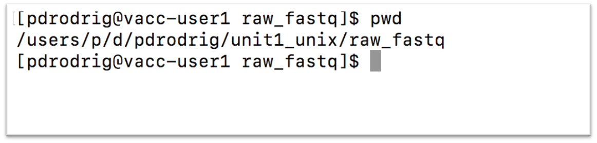

***

## Learning Objectives for Today's Lesson
-  Understand the organization of the Filesystem 
-  Distinguish between Full versus Relative paths
-  listing, copying, creating, moving and removing data

***

# Navigating the Filesystem
A filesystem organizes a computer's files and directories into a tree structure. 

<p align="center">

</p>

+ The first directory in the filesystem is the **root directory**. It is the parent of all other directories and files in the filesystem. That `/` or root is the 'top' level.
+ Each parent directory contains child directories and/or files. 
+ Each child directory can also contain more files

> Note: When you log in to a remote computer you land on one of the branches of that tree, i.e. your pre-designated "home" directory that usually has your login name as its name (e.g. `/users/username`).

<p align="center">

</p>

To navigate the file system with ease we will now introduce the concept of **tab completion**. 

## Shortcut: Tab Completion 
<kbd>tab</kbd>    
<kbd>caps lock</kbd>

Typing out file or directory names can waste a lot of time and its easy to make typing mistakes. Instead we should get in the habit of using tab complete as a shortcut. The `tab` key is located on the left side of your keyboard, right above the `caps lock` key. When you start typing out the first few characters of a directory name, then hit the `tab` key, Shell will try to fill in the rest of the directory name. Let's put this into practice now. 

Navigate into the `raw_fastq` directory and see what's inside. **Remember to use tab!**

```bash
cd raw_fastq/
```

***

## Class Exercise: 
* List the file sizes of raw_fastq/ folder. 

***

## Paths

Where is `raw_fastq` folder in relation to our home directory?
To answer this, let's learn more about the "addresses" of directories, called **"path"** and move around the file system.

Let's check to see what directory we currently are in. The command prompt tells us which directory we are in, but it doesn't give information about where the `raw_fastq` directory is with respect to our "home" directory. 

The command to check our current location is `pwd`, this command does not take any arguments and it returns the path or address of your **p**resent **w**orking **d**irectory (the folder you are in currently).

```bash
pwd
```

<p align="center">

</p>

In the output above, each folder is separated from its "parent" or "child" folder by a "/", and the output starts with the root `/` directory. So, now you are able to determine the location of `raw_fastq` directory relative to the root directory. 

But what if you would like to navigate back to your home directory? To do so, one way would be to type `cd ~` and this will bring you back to your home directory. The "~" is an abbreviation for the current user's home folder. 

```bash
cd ~
```

After doing this what is your present working directory now?

```bash
pwd
```

It should look something like this: 

```
/users/p/d/pdrodrig
```

This should display a shorter string of directories starting with root. This is the full address to your *home directory*, also referred to as "**full path**". 


### Using paths with commands

You can do a lot more with the idea of stringing together *parent/child* directories. Let's say we want to look at the contents of the `raw_fastq` folder, but do it from our current directory (the home directory). We can use the list command and follow it up with the path to the folder we want to list!

```bash
cd

ls ~/unit1_unix/reference_data
```

```
chr1.fa  chr1-hg19_genes.gtf
```

Remember that these two scripts indicate the same path:

```
/users/p/d/pdrodrig/unit1_unix/reference_data

EQUALS 

~/unit1_unix/reference_data
```

***

## Class Exercise: 
* Change directories from `~` (home) to `raw_fastq` in a single step then print working directory. 

>
>   <details>
>     <summary>Answer</summary>
>     <P>cd ~/unit1_unix/raw_fastq</P>
>   </details>


***

Now, what if we want to move back up a level back into the `unix_lesson` directory?   
Type `cd unix_lesson` and see what happens.

```
unix_lesson/: No such file or directory
```

*Unfortunately, that won't work because when you say `cd unix_lesson`, shell is looking for a folder called `unix_lesson` within your current directory, i.e. `raw_fastq`.*

Can you think of an alternative? 

+ You can use the full path to `unix_lesson`
+ You can do cd .. (allows you to move one folder up)

```bash
cd .. 
```

### File Names 
Probably one of the most frustrating parts of bioinformatics is the lack of consistency with how files are labeled. Files often have obscure names that is only relevant to the researcher, or have names that are **very** similar to one another. But nonetheless we will persevere! 

Let's go into the `raw_fastq`, then type `ls Mov10_oe_`, followed by pressing the `tab` key once:

```bash
cd raw_fastq/
ls Mov10_oe_<tab>
```

**Notice that nothing happens!!**

The reason is there are multiple files in the `raw_fastq` directory that start with `Mov10_oe_`. As a result, shell does not know which one to fill in. When you hit `tab` a second time again, the shell will then list all the possible choices.

```bash
ls Mov10_oe_<tab><tab>

Mov10_oe_1.subset.fq  Mov10_oe_2.subset.fq  Mov10_oe_3.subset.fq
```


Now you can select the one you are interested in listed, and enter the number and hit tab again to fill in the complete name of the file.

```bash
ls Mov10_oe_1<tab>
```

**Tab completion is your friend!** It helps prevent spelling mistakes, and speeds up the process of typing in the full command. We encourage you to use this when working on the command line. 


## Relative paths

We have talked about **full** paths so far, but there are other ways to specify paths to folders and files without having to worry about the root directory. 

Let's **create** a folder in raw_fastq using the `mkdir` command. 

```
syntax: `mkdir  name-of-folder-to-be-created`
```

```bash
mkdir data
```

Now let's navigate back into `unit1_unix` 

***

## Class Exercise: 
* Change directories from `unit1_unix` to `data` in a single step. 

>
>   <details>
>     <summary>Answer</summary>
>     <P>cd raw_fastq/data/</P>
>   </details>

***

In this case we are using a relative path, relative to our current location - wherein we know that the `raw_fastq` folder is within `unit1_unix` and `data` is within the `raw_fastq` folder. 


## Synopsis of Full versus Relative paths

**A full path always starts with a `/`, a relative path does not.**

A relative path is like getting directions from someone on the street. They tell you to "go right at the Stop sign, and then turn left on Main Street". That works great if you're standing there together, but not so well if you're trying to tell someone how to get there from another country. A full path is like GPS coordinates. It tells you exactly where something is no matter where you are right now.

You can usually use either a full path or a relative path depending on what is most convenient. If we are in the home directory, it is more convenient to just enter the relative path since it involves less typing. However, when using some programs, full paths are required. 

<p align="center">

</p>


### Example using Full Paths:   
It can get really complex, real fast!  

```
samtools merge WT_Ikaros_rep2_merged.bam 
/gpfs2/scratch/jrboyd/pipelines/cutruntools/output_mm10_cutnrun_bcell_stim_032621/aligned.aug10/sorted/WTU_Ikaros_H100_rep1_2_S23_L002_aligned_reads.bam 
/users/p/d/pdrodrig/cutnrun_bcell/unmerged_bams/WT_H100_IK_rep1.IK2_S2_L001_aligned_reads.bam;
```
> Lets break this down! 

+ Program + argument = samtools merge  
+ New file to be created = merge WT_Ikaros_rep2_merged.bam 
+ 1st file = WTU_Ikaros_H100_rep1_2_S23_L002_aligned_reads.bam
+ 2nd file = WT_H100_IK_rep1.IK2_S2_L001_aligned_reads.bam


Over time, it will become easier for you to keep a mental note of the structure of the directories that you are using and how to quickly navigate among them.

***

# Copying, creating, moving and removing data

Now we can move around within the directory structure using the command line. But what if we want to do things like copy files or move them from one directory to another, or rename them? 

Let's move into the `raw_fastq` directory, this contains some fastq files which are the output of sequencing. 

```bash
cd ~/unit1_unix/raw_fastq
```

> **Tip** - These files are referred to as "raw" data since it has not been changed or analyzed after being generated.

## Copying

Let's use the copy (`cp`) command to make a copy of one of the files in this folder, `Mov10_oe_1.subset.fq`, and call the copied file `Mov10_oe_1.subset-copy.fq`. 
The copy command has the following syntax: 

`cp  path/to/item-being-copied  path/to/new-copied-item`

In this case the files are in our current directory, so we just have to specify the name of the file being copied, followed by whatever we want to call the newly copied file.

```bash
cp Mov10_oe_1.subset.fq Mov10_oe_1.subset-copy.fq

ls -l
```

The copy command can also be used for copying over whole directories, but the `-r` argument has to be added after the `cp` command. The `-r` stands for "recursively copy everything from the directory and its sub-directories". We used it earlier when we copied over the `unit1_unix` directory to our home directories.


***

## Creating

Next, let's create a directory called `fastq_backup` and we can move the copy of the fastq file into that directory. 

```bash
mkdir fastq_backup
```

> **Tip** - File/directory/program names with spaces in them do not work well in Unix, use characters like hyphens or underscores instead. Using underscores instead of spaces is called "snake_case". Alternatively, some people choose to skip spaces and rather just capitalize the first letter of each new word (i.e. MyNewFile). This alternative technique is called "CamelCase".

## Moving

We can now move our copied fastq file in to the new directory. We can move files around using the move command, `mv`, syntax: 

`mv  path/to/item-being-moved  path/to/destination` 

In this case we can use relative paths and just type the name of the file and folder.

```bash
mv  Mov10_oe_1.subset-copy.fq  fastq_backup
```

Let's check if the move command worked like we wanted:

```bash
ls -l fastq_backup
```

## Renaming

The `mv` command has a second functionality. You can use `mv` to rename files too. The syntax is identical to when we used `mv` for moving, but this time instead of giving a directory as its destination, we just give a new name as its destination. 

Let's try out this functionality!

The name Mov10_oe_1.subset-copy.fq is not very informative, we want to make sure that we have the word "backup" in it so we don't accidentally delete it.

```bash
cd fastq_backup

mv  Mov10_oe_1.subset-copy.fq   Mov10_oe_1.subset-backup.fq

ls
```

> **Tip** - You can use move to move a file and rename it at the same time!

**Important notes about `mv`**:
* When using `mv`, shell will **not** ask if you are sure that you want to "replace existing file" or similar unless you use the -i option. 
* Once replaced, it is not possible to get the replaced file back!

## Removing

We found out that we did not need to create backups of our fastq files manually as backups were already generated by our collaborator. So in the interest of saving space on the cluster, we want to delete the contents of the `fastq-backup` folder and the folder itself. 

```bash
rm  Mov10_oe_1.subset-backup.fq
```

Important notes about `rm`
* `rm` permanently removes/deletes the file/folder. 
* There is no concept of "Trash" or "Recycle Bin" on the command-line. When you use `rm` to remove/delete they're really gone. 
* **Be careful with this command!**
* You can use the `-i` argument if you want it to ask before removing, `rm -i file-name`.

Let's delete the fastq_backup folder too. First, we'll have to navigate our way to the parent directory (we can't delete the folder we are currently in/using). 

```bash
cd ..

rm  fastq_backup 
```

Did that work? Did you get an error?

<details>
  <summary><i>Explanation</i></summary>
  <P>By default, <code>rm</code>, will NOT delete directories, but you use the <code>-r</code> flag if you are sure that you want to delete the directories and everything within them. To be safe, let's use it with the <code>-i</code> flag.</P>
</details><br>

```bash
rm -ri fastq_backup
```

- `-r`: recursive, commonly used as an option when working with directories, e.g. with `cp`. 
- `-i`: prompt before every removal.

***

## Commands

```
cd          # Change Directory
               +   used to move throughout the filesystem of a computer 

ls          # List 
              +   list the contents of a directory

pwd         # Print Working Directory   
              +  displays the file path from the root directory to the current working directory 

tree        # prints a tree of the file structure

cp          # Copy
              +   used to copy files or directories 

mkdir       # Make Directory
              +   used to make a new directory 

mv          # Move 
              +   move a file into a directory 

rm          # Remove
              +   used to delete files and directories 
```
***

## Homework Assignment #1 (50 points)
**For this assignment you will have until 10AM on Tuesday, January 23rd to submit. Late assignments will not be accepted.**  

### Directions for Students: 
Open a new Microsoft Word Document, the first four lines of your document should contain the following:  
+ Your name
+ MMG3320/5320
+ Today's date
+ Homework Assignment # 1
 

### Task 1: 
* On Terminal, open the manual page for the `rm` command. Skim through the information. 
  
1)  What happens if you add the `-f` argument?   
2)  Is there any argument available to "undelete" a file?   
    
* Quit the `man` buffer page and come back to your command prompt.  

> **Tip** - Shell commands can get extremely complicated. No one can possibly learn all of these arguments, of course. So you will probably find yourself referring to the manual page frequently.

> **Tip** - If the manual page within the Terminal is hard to read , the manual exists online too. For example, here is the linux manual page for `cp`. https://man7.org/linux/man-pages/man1/cp.1.html In addition to the arguments, you can also find good examples online; ***Google is your friend.***


### Task 2: 
* Use the `-lh` option for the `ls` command to display more information for each item in the `unit1_unix` folder. 
 
3) Submit a screenshot of your terminal screen and underneath describe what additional information is provided that you didn't see with the bare `ls` command. 


**For #4-6, submit a screenshot of your terminal screen. Be sure to clear your terminal screen using <button>control</button> + L before proceeding**  

4) Create a new folder in `unit1_unix` called `selected_fastq`  
5) Copy over the Irrel_kd_2.subset.fq and Mov10_oe_2.subset.fq from `raw_fastq` to the `selected_fastq` folder  
6) Rename the `selected_fastq` folder and call it `exercise1` 


## Citation
*This lesson has been developed by members of the teaching team at the [Harvard Chan Bioinformatics Core (HBC)](http://bioinformatics.sph.harvard.edu/). These are open access materials distributed under the terms of the [Creative Commons Attribution license](https://creativecommons.org/licenses/by/4.0/) (CC BY 4.0), which permits unrestricted use, distribution, and reproduction in any medium, provided the original author and source are credited.*

* *The materials used in this lesson were derived from work that is Copyright © Data Carpentry (http://datacarpentry.org/). 
All Data Carpentry instructional material is made available under the [Creative Commons Attribution license](https://creativecommons.org/licenses/by/4.0/) (CC BY 4.0).*
* *Adapted from the lesson by Tracy Teal. Original contributors: Paul Wilson, Milad Fatenejad, Sasha Wood and Radhika Khetani for Software Carpentry (http://software-carpentry.org/)*
*authors: Sheldon  McKay, Mary Piper, Radhika Khetani, Meeta Mistry, Jihe Liu*
*date posted: September 28, 2020*

*Other parts of this lesson were derived from:*  
Erin Alison Becker, Anita Schürch, Tracy Teal, Sheldon John McKay, Jessica Elizabeth Mizzi, 
François Michonneau, et al. (2019, June). datacarpentry/shell-genomics: Data Carpentry: Introduction to the shell for genomics data, 
June 2019 (Version v2019.06.1). Zenodo. http://doi.org/10.5281/zenodo.3260560

---