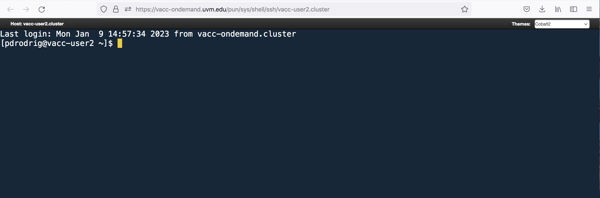

## How to log-in to VACC-OOD:  

1. Use the [VACC-OOD](https://ondemand.vacc.uvm.edu/) link to access the site 

2. Add your UVM netid and password

3. You should be viewing the following dashboard

    

4. To access the Terminal Go to <button>Clusters</button>  and click `>_VACC Shell Access`

    

### Additional Information about VACC-OOD

More information about VACC-OOD usage can be found here [VACC_OOD-start-guide](https://www.uvm.edu/vacc/docs/start_guide/ondemand/)

## Connecting to VACC with SSH 

Step by step instructions can be found here at the [VACC_start_guide](https://www.uvm.edu/vacc/docs/start_guide/ssh/)

## Using VACC-OOD OFF-campus

To use OFF-campus you will need to VPN first. See [install-cisco-vpn](https://www.uvm.edu/it/kb/article/install-cisco-vpn/) for more information. 
