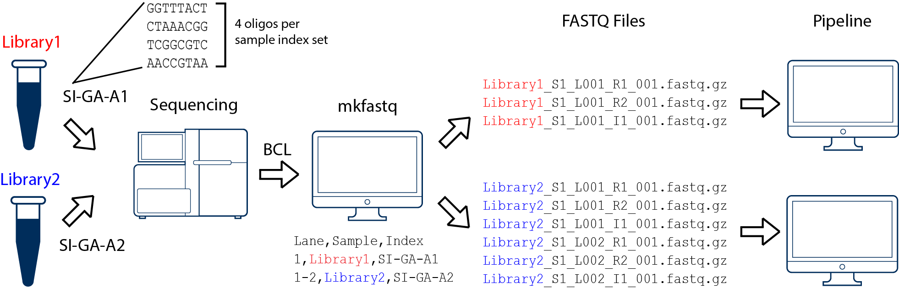
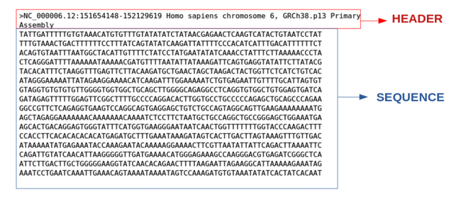

# Learning Objectives
  - Implement tab completion when writing paths
  - Use of the asterisk `*` wildcard to select multiple items
  - List a few shortcuts 
  - View the contents of a file

***

# Recap from last week 

## Commands

```
cd          # Change Directory
               +   used to move throughout the filesystem of a computer 

ls          # List 
              +   list the contents of a directory

pwd         # Print Working Directory   
              +  displays the file path from the root directory to the current working directory 

cp          # Copy
              +   used to copy files or directories 

mkdir       # Make Directory
              +   used to make a new directory 

mv          # Move 
              +   move a file into a directory 

rm          # Remove
              +   used to delete files and directories 
```


## Home directory or "~"

Dealing with the home directory is very common. In shell, the tilde character "~" is a shortcut for your home directory. Let's navigate to the `raw_fastq` directory: 

Then enter the command:

```bash
cd ~
```

This allows you to easily navigate to your home directory. The tilde "~" is equivalent to "/gpfs1/home/p/d/pdrodrig" as we had mentioned in the previous lesson.

## Parent directory or ".."

Another shortcut you encountered in the previous lesson is ".."

```bash
cd ..
```

The shortcut `..` always refers to the parent directory of whatever directory you are in currently. Let navigate to `reference_data` to test `..` once again. 

We can also chain `..` together and separate them by `/` to navigate to two directories above. 

```bash
cd ../..
```


## Current directory or "."

Finally, `.` always refers to your current directory. Recall that we use `.` a number of times, when copying data to your home directory.


***

**Class Activity #1**

Before moving on, please complete the following class activity below. You will have ~5 minutes. 

[Class-activity1](https://forms.gle/gCuupcxiKYkgBAiq8)

***

# Saving time with wildcards and other shortcuts 
*Remember to use <kbd>tab</kbd> completion!* 

## Wild cards

**The "\*" wildcard:**

Navigate to the `~/unit1_unix/raw_fastq` directory. This directory contains FASTQ files and these files contain the sequencing reads (nucleotide sequences) output from a high throughput sequencer. 

<p align="center">

</p>

Let's see what is inside:  

```bash
ls
```
```
Irrel_kd_1.subset.fq	Irrel_kd_3.subset.fq	Mov10_oe_2.subset.fq
Irrel_kd_2.subset.fq	Mov10_oe_1.subset.fq	Mov10_oe_3.subset.fq
```

Let's take a moment to point a few things out: 
+ .fq vs .fastq 
+ .gz 

> .gz is a file format used for compressed files. This is especially important when dealing with large data. 
> /gpfs1/home/p/d/pdrodrig/class_data/GSE164713_Tcf1/ChIPseq 

***
**Class Activity #2** 

Create a directory within `raw_fastq` and call it **fastq** and another file called **data**. Then list the contents. 
Your output should look like below: 

```
data   Irrel_kd_1.subset.fq  Irrel_kd_3.subset.fq  Mov10_oe_2.subset.fq
fastq  Irrel_kd_2.subset.fq  Mov10_oe_1.subset.fq  Mov10_oe_3.subset.fq
```
***


The "*" or wildcard character is a shortcut for "everything". You can use it by typing in shift + 8.  Now try this command:

```bash
ls *.fq
```
> Notice, this lists every file that ends with a `fq` and our newly made directory **fastq** is missing. 

```
Irrel_kd_1.subset.fq	Irrel_kd_3.subset.fq	Mov10_oe_2.subset.fq
Irrel_kd_2.subset.fq	Mov10_oe_1.subset.fq	Mov10_oe_3.subset.fq
```

***
**Class Activity #3** 

Remove the newly created folders **fastq** and **data**. 

***


Now try a more complicated command to list every file in `/usr/bin` directory that ends in the characters `.sh`. The `bin` directory is where some built-in programs are stored. 

```bash
ls /usr/bin/*.sh
```

```
/usr/bin/gettext.sh  /usr/bin/lesspipe.sh  /usr/bin/rescan-scsi-bus.sh   /usr/bin/unix-lpr.sh
/usr/bin/gvmap.sh    /usr/bin/lprsetup.sh  /usr/bin/setup-nsssysinit.sh
```

Let's quickly try it without `*.sh` - notice that you have so many more options! 

***

## Command History

You can easily access previous commands by hitting the <button>up</button> arrow key on your keyboard, this way you can step backwards through your command history. On the other hand, the <button>down</button> arrow key takes you forward in the command history.

***Try it out! While on the command prompt hit the <button>up</button> arrow a few times, and then hit the <button>down</button> arrow a few times until you are back to where you started.***

You can also review your recent commands with the `history` command. Just enter:

```bash
$ history
```

You should see a numbered list of commands, including the `history` command you just ran! 

> **NOTE:** So far we have only run very short commands that have very few or no arguments. It would be faster to just retype it than to check the history. However, as you start to run analyses on the command-line you will find that the commands are longer and more complex, and the `history` command will be very useful then!


***

The wildcard "*" can be placed anywhere in your pattern. For example:

```bash
ls Mov10*fq
```

This lists only the files that begin with 'Mov10' and end with `fq`.

```
Mov10_oe_1.subset.fq  Mov10_oe_2.subset.fq  Mov10_oe_3.subset.fq
```

So how does this actually work? The Shell (bash) considers an asterisk * to be a wildcard character that can match one or more occurrences of any character, including no character. In the example above the * took place of 13 characters! 

> **Tip** - An asterisk/star is only one of the many wildcards in Unix, but this is the most powerful one and we will be using this one the most for our exercises.

**The "?" wildcard:**

Another wildcard that is sometimes helpful is `?`    
+ `?` is similar to `*` except that it is a placeholder for exactly one position. 
+ Recall that `*` can represent any number of following positions, including no positions. 
+ To highlight this distinction lets look at a few examples. First, try this command:

`ls /bin/d*`

This will display all files in `/bin/` that start with "d" regardless of length. However, if you only wanted the things in `/bin/` that start with "d" and are two characters long then you can use:

`ls /bin/d?`

Lastly, you can chain together multiple "?" marks to help specify a length. In the example below, you would be looking for all things in `/bin/` that start with a "d" and have a name length of three characters.  

`ls /bin/d??` 

****

**Class Activity #4** 

Perform each of the following tasks using a single `ls` command *without* navigating to a different directory.

1.  List all of the files in `/bin` that start with the letter 'c'

2.  List all of the files in `/bin` that contain the letter 'a'

3.  List all of the files in `/bin` that end with the letter 'o'

4. BONUS: List all of the files in `/bin` that start with 'ch' and are only 5 letters in length. 


    <details>
      <summary><b><i>Answers</i></b></summary>
      <p><br>Click each question below to reveal the answer.</p>
      <details>
        <summary><i>Question 1</i></summary>
        <code>ls /bin/c*</code>
      </details>
      <details>
        <summary><i>Question 2</i></summary>
        <code>ls /bin/*a*</code>
      </details>
      <details>
        <summary><i>Question 3</i></summary>
        <code>ls /bin/*o</code>
      </details>
      <details>
      <summary><i>BONUS</i></summary>
      <code>ls /bin/ch???</code>
      </details>
    </details>

****

## Cancel a command

Sometimes as you enter a command, you realize that you don't want to continue or run the current line. Instead of deleting everything you have entered (which could be very long), you could quickly cancel the current line and start a fresh prompt with <button>Ctrl</button> + <button>C</button>.

```bash
cd /users/p/d/pdrodrig/class_data/GSE164713_Tcf1/ChIPseq
fastqc SRR13416485_1.fastq.gz
```

```
Started analysis of SRR13416485_1.fastq.gz
Approx 5% complete for SRR13416485_1.fastq.gz
```

then I hit <button>Ctrl</button> + <button>C</button>

****

# Examining Files

Now let's explore a few more commands to examine files. 

## `cat` command

The easiest way to examine a file is to print out all of its contents using the command `cat`. We can test this out by printing the contents of `~/unit1_unix/other/sequences.fa`

```bash
cat sequences.fa
```

The `cat` command prints out the all the contents of `sequences.fa` to the screen.

> `cat` stands for catenate; it has many uses and printing the contents of a files onto the terminal is one of them.

**What does this file contain?**

```bash

>SRR014849.1 EIXKN4201CFU84 length=93 
GGGGGGGGGGGGGGGGCTTTTTTTGTTTGGAACCGAAAGGGTTTTGAATTTCAAACCCTTTTCGGTTTCCAACCTTCCAAAGCAATGCCAATA

>gi|340780744|ref|NC_015850.1| Acidithiobacillus caldus SM-1 chromosome, complete genome
ATGAGTAGTCATTCAGCGCCGACAGCGTTGCAAGATGGAGCCGCGCTGTGGTCCGCCCTATGCGTCCAACTGGAGCTCGTCACGAG
TCCGCAGCAGTTCAATACCTGGCTGCGGCCCCTGCGTGGCGAATTGCAGGGTCATGAGCTGCGCCTGCTCGCCCCCAATCCCTTCG
TCCGCGACTGGGTGCGTGAACGCATGGCCGAACTCGTCAAGGAACAGCTGCAGCGGATCGCTCCGGGTTTTGAGCTGGTCTTCGCT
CTGGACGAAGAGGCAGCAGCGGCGACATCGGCACCGACCGCGAGCATTGCGCCCGAGCGCAGCAGCGCACCCGGTGGTCACCGCCT
CAACCCAGCCTTCAACTTCCAGTCCTACGTCGAAGGGAAGTCCAATCAGCTCGCCCTGGCGGCAGCCCGCCAGGTTGCCCAGCATC
CAGGCAAATCCTACAACCCACTGTACATTTATGGTGGTGTGGGCCTCGGCAAGACGCACCTCATGCAGGCCGTGGGCAACGATATC
CTGCAGCGGCAACCCGAGGCCAAGGTGCTCTATATCAGCTCCGAAGGCTTCATCATGGATATGGTGCGCTCGCTGCAACACAATAC
CATCAACGACTTCAAACAGCGTTATCGCAAGCTGGACGCCCTGCTCATCGACGACATCCAGTTCTTTGCGGGCAAGGACCGCACCC

>gi|129295|sp|P01013|OVAX_CHICK GENE X PROTEIN (OVALBUMIN-RELATED)
QIKDLLVSSSTDLDTTLVLVNAIYFKGMWKTAFNAEDTREMPFHVTKQESKPVQMMCMNNSFNVATLPAE

```

> This is a FASTA file. FASTA format is a text-based format for representing either nucleotide or peptide sequences. The structure of a FASTA file is represented below where the header row always begins with the ">" symbol. 

<p align="center">

</p>

***
Question: What command would I use to clear my terminal screen? 

<details>
      <summary><b><i>Answer</i></b></summary>
      <p><br><button>Ctrl</button> + <button>L</button> </p>
</details>  

***

## `less` command

`cat` is a terrific command, but notice what it is doing. It is **PRINTING** the file contents on the screen. 


When the file is really big and has a ton of lines, this can be cumbersome to use. In practice, when you are running your analyses on the command-line you will most likely be dealing with large files so you need to learn how to view them. 

Instead, we will use the `less` command 

```bash
less Mov10_oe_1.subset.fq
```
Rather than printing to screen, the `less` command opens the file in a new buffer allowing you to navigate through it. Does this look familiar? You might remember encountering a similar interface when you used the `man` command. This is because `man` is using the `less` command to open up the documentation files! The keys used to move around the file are identical to the `man` command. Below we have listed some additional shortcut keys for navigating through your file when using `less`.

<span class="caption">Shortcuts for `less`</span>

| key              | action                 |
| ---------------- | ---------------------- |
| <kbd>SPACE</kbd> | to go forward          |
| <kbd>b</kbd>     | to go backwards        |
| <kbd>g</kbd>     | to go to the beginning of the file|
| <kbd>G</kbd>     | to go to the end of a file |
| <kbd>q</kbd>     | to quit or exit `less`|


Use the shortcut keys to move through your FASTQ file, we will explore these files in more detail later in the workshop. 

### Searching files with `less`

`less` also gives you a way of searching through files. 

Just type in <kbd>/</kbd> to begin a search, you will see that the `/` will show up at the  bottom of the `less` buffer. Let's say you are interested in searching for the following 8-letter adapter sequence: 

```
/GGCGAATT
```

Enter the name of the string of characters you would like to search for and hit the enter key. The interface will move to show you the location where that string is found, and highlight the string. 

If you hit <kbd>/</kbd> then <kbd>ENTER</kbd>, `less` will just repeat the previous search. 

`less` searches from the current location and works its way forward. For instance, the sequence `GGCGAATT` was found in our file, but if we started the search at the end of the file, `less` will not find it. You need to go to the beginning of the file and search.

To exit hit <kbd>q</kbd>. 

## `head` and `tail` commands

There is another way that we can peek inside files. In particular, if we just want to see the beginning or end of the file to see how it's formatted.

The commands are `head` and `tail` and they just let you look at the beginning and end of a file respectively.

```bash
head Mov10_oe_1.subset.fq
```

```bash
tail Mov10_oe_1.subset.fq
```

By default, the first or last 10 lines will be printed to screen. The `-n` option can be used with either of these commands to specify the number `n` lines of a file to display. For example, let's print the first/last line of the file:

```bash
head -n 20 Mov10_oe_1.subset.fq

tail -n 20 Mov10_oe_1.subset.fq
```

*** 

## Summary: Commands, options, and keystrokes covered

The wildcard *
+ can represent zero or more other characters
+ can be placed anywhere in your pattern

```
~           # home dir
.           # current dir
..          # parent dir
*           # wildcard
ctrl + c    # cancel current command
ctrl + a    # start of line
ctrl + e    # end of line
ctrl + l    # clear your terminal screen
history
cat         # prints out the all the contents of file 
less        # allows you to view and move through file content 
head        # allows you to view beginning of file 
tail        # allows you to view end of file 

```

***

## Homework Assignment #2 (50 points)
**This "mini" assignment is due on Tuesday, January 30th anytime before class start. Late assignments will not be accepted.**  

### Directions for Students: 
Open a new Microsoft Word Document and submit answers to the questions below. The first four lines of your document should contain the following:  
+ Your name
+ MMG3320/5320
+ Today's date
+ Homework Assignment #2

1.  Type `ls'` then type `history` then hit <button>return</button>

	The output should look something like this: 
	
	```
	$ ls' 
	>history
	>
	```
	
	Oh no! How would you escape this so you are able to move on to Question 2? 
	Submit a screenshot of your terminal screen.

2. This is a multi-part question:   
	a. Change directories into `genomics_data`. You can do this using a full or relative path.  
	b. Use the `less` command to open up the file `Encode-hesc-Nanog.bed`.  
	c. Search for the string `chr11`; you'll see all instances in the file highlighted.  
	d. Staying in the `less` buffer, use the shortcut to get to the end of the file.     
	> **Report** three rows starting with `chr11`.   Exit the `less` buffer and come back to the command prompt.  

3. Print to screen the last 5 lines of the file `Encode-hesc-Nanog.bed`. Submit a screenshot of the output of Terminal.

4. How many commands have you typed after going through this exercise? Submit a screenshot of the output of Terminal.

****

## Citation

*This lesson has been developed by members of the teaching team at the [Harvard Chan Bioinformatics Core (HBC)](http://bioinformatics.sph.harvard.edu/). These are open access materials distributed under the terms of the [Creative Commons Attribution license](https://creativecommons.org/licenses/by/4.0/) (CC BY 4.0), which permits unrestricted use, distribution, and reproduction in any medium, provided the original author and source are credited.*

* *The materials used in this lesson were derived from work that is Copyright © Data Carpentry (http://datacarpentry.org/). 
All Data Carpentry instructional material is made available under the [Creative Commons Attribution license](https://creativecommons.org/licenses/by/4.0/) (CC BY 4.0).*
* *Adapted from the lesson by Tracy Teal. Original contributors: Paul Wilson, Milad Fatenejad, Sasha Wood and Radhika Khetani for Software Carpentry (http://software-carpentry.org/)*  
* *Other Authors include: Sheldon  McKay, Mary Piper, Radhika Khetani, Meeta Mistry, Jihe Liu, Mary Piper, Meeta Mistry, Jihe Liu, & Will Gammerdinger*

