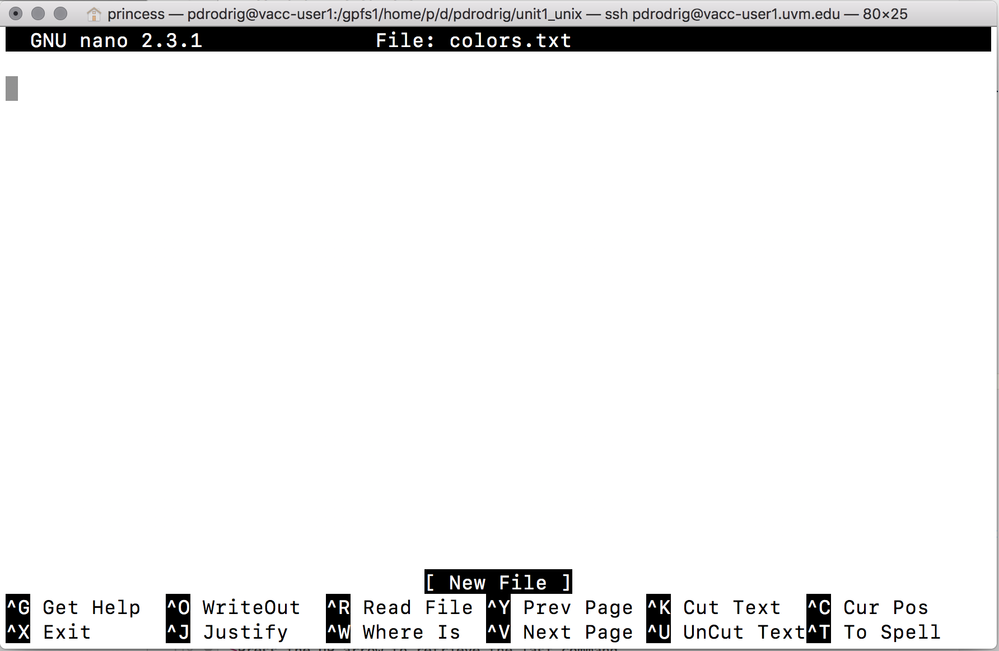

## Learning Objectives
- Learn to use tab completion to simplify typing file and directory paths.  
- Use of the asterisk `*` wildcard to match and select multiple files in a directory. 
- View the contents of a file using commands such as `less`, `head`, or `cat`. 
- Use Nano, a simple text editor, to create and edit files directly from terminal. 

***


!!! example "Class Exercise"  

    Please complete the following class activity below. You will have ~5 minutes to complete. 

    [Class-activity](https://forms.gle/6L5eDqiiLijc8i6H8)

***


# Saving time with wildcards and other shortcuts 
*Remember to use <kbd>tab</kbd> completion!* 

## Wild cards

**The "\*" wildcard:**

Navigate to the `~/unit1_unix/raw_fastq` directory. This directory contains FASTQ files and these files contain the sequencing reads (nucleotide sequences) output from a high throughput sequencer. 

<figure markdown="span">
  { width="600"}
</figure>


Let's see what is inside:  

```bash
ls
```

```
## Irrel_kd_1.subset.fq  Irrel_kd_2.subset.fq  Irrel_kd_3.subset.fq  Mov10_oe_1.subset.fq  Mov10_oe_2.subset.fq  Mov10_oe_3.subset.fq
```

Let's take a moment to point a few things out: 

+ .fq vs .fastq 
+ .gz 

> .gz is a file format used for compressed files. This is especially important when dealing with large data. 


!!! example "Class Exercise"  

    Create a directory called `fastq` in `~/unit1_unix/raw_fastq` directory. Then check to see that it was created. 

The `*` or wildcard character is a shortcut for "everything". 

You can use the `*` by typing in <kbd>shift + 8</kbd>. 

```bash
ls *.fq
```
> Notice, this lists every file that ends with a `fq` and our newly made directory **fastq** is missing. 

```
Irrel_kd_1.subset.fq	Irrel_kd_3.subset.fq	Mov10_oe_2.subset.fq
Irrel_kd_2.subset.fq	Mov10_oe_1.subset.fq	Mov10_oe_3.subset.fq
```

***

## Command History

You can easily access previous commands by hitting the <button>up</button> arrow key on your keyboard, this way you can step backwards through your command history. On the other hand, the <button>down</button> arrow key takes you forward in the command history.

***Try it out! While on the command prompt hit the <button>up</button> arrow a few times, and then hit the <button>down</button> arrow a few times until you are back to where you started.***

You can also review your recent commands with the `history` command. Just enter:

```bash
history
```

You should see a numbered list of commands, including the `history` command you just ran! 

***

The wildcard `*` can be placed anywhere in your pattern. For example:

```bash
ls Mov10*fq
```

This lists only the files that begin with 'Mov10' and end with `fq`.

```
## Mov10_oe_1.subset.fq  Mov10_oe_2.subset.fq  Mov10_oe_3.subset.fq
```

So how does this actually work? The Shell (bash) considers an asterisk `*` to be a wildcard character that can match one or more occurrences of any character, including no character. In the example above the `*` took place of 13 characters! 

> **Tip** - An asterisk/star is only one of the many wildcards in Unix, but this is the most powerful one and we will be using this one the most for our exercises.

### The "?" wildcard 

Another wildcard that is sometimes helpful is `?`    

+ `?` is similar to `*` except that it is a placeholder for exactly one position. 

+ Recall that `*` can represent any number of following positions, including no positions. 

+ To highlight this distinction lets look at a few examples. First, try this command:

`ls /bin/d*`

This will display all files in `/bin/` that start with "d" regardless of length. The `bin` directory is where some built-in programs are stored. However, if you only wanted the things in `/bin/` that start with "d" and are two characters long then you can use:

`ls /bin/d?`

Lastly, you can chain together multiple "?" marks to help specify a length. In the example below, you would be looking for all things in `/bin/` that start with a "d" and have a name length of three characters.  

`ls /bin/d??` 

****

!!! example "Class Exercise"  

    Perform each of the following tasks using a single `ls` command *without* navigating to a different directory.

    1.  List all of the files in `/bin` that start with the letter 'c'

    2.  List all of the files in `/bin` that contain the letter 'a'

    3.  List all of the files in `/bin` that end with the letter 'o'

    4. BONUS: List all of the files in `/bin` that start with 'ch' and are only 5 letters in length. 


<details>
  <summary><b><i>Answers</i></b></summary>
  <p><br>Click each question below to reveal the answer.</p>
  <details>
    <summary><i>Question 1</i></summary>
    <code>ls /bin/c*</code>
  </details>
  <details>
    <summary><i>Question 2</i></summary>
    <code>ls /bin/*a*</code>
  </details>
  <details>
    <summary><i>Question 3</i></summary>
    <code>ls /bin/*o</code>
  </details>
  <details>
    <summary><i>BONUS</i></summary>
    <code>ls /bin/ch???</code>
  </details>
</details>

****


## Examining Files

Now let's explore a few more commands to examine files. 

### `cat` command

The easiest way to examine a file is to print out all of its contents using the command `cat`. We can test this out by printing the contents of `~/unit1_unix/other/sequences.fa`

```bash
cat sequences.fa
```

The `cat` command prints out the all the contents of `sequences.fa` to the screen.

> `cat` stands for catenate; it has many uses and printing the contents of a files onto the terminal is one of them.

**What does this file contain?**

```bash

>SRR014849.1 EIXKN4201CFU84 length=93 
GGGGGGGGGGGGGGGGCTTTTTTTGTTTGGAACCGAAAGGGTTTTGAATTTCAAACCCTTTTCGGTTTCCAACCTTCCAAAGCAATGCCAATA

>gi|340780744|ref|NC_015850.1| Acidithiobacillus caldus SM-1 chromosome, complete genome
ATGAGTAGTCATTCAGCGCCGACAGCGTTGCAAGATGGAGCCGCGCTGTGGTCCGCCCTATGCGTCCAACTGGAGCTCGTCACGAG
TCCGCAGCAGTTCAATACCTGGCTGCGGCCCCTGCGTGGCGAATTGCAGGGTCATGAGCTGCGCCTGCTCGCCCCCAATCCCTTCG
TCCGCGACTGGGTGCGTGAACGCATGGCCGAACTCGTCAAGGAACAGCTGCAGCGGATCGCTCCGGGTTTTGAGCTGGTCTTCGCT
CTGGACGAAGAGGCAGCAGCGGCGACATCGGCACCGACCGCGAGCATTGCGCCCGAGCGCAGCAGCGCACCCGGTGGTCACCGCCT
CAACCCAGCCTTCAACTTCCAGTCCTACGTCGAAGGGAAGTCCAATCAGCTCGCCCTGGCGGCAGCCCGCCAGGTTGCCCAGCATC
CAGGCAAATCCTACAACCCACTGTACATTTATGGTGGTGTGGGCCTCGGCAAGACGCACCTCATGCAGGCCGTGGGCAACGATATC
CTGCAGCGGCAACCCGAGGCCAAGGTGCTCTATATCAGCTCCGAAGGCTTCATCATGGATATGGTGCGCTCGCTGCAACACAATAC
CATCAACGACTTCAAACAGCGTTATCGCAAGCTGGACGCCCTGCTCATCGACGACATCCAGTTCTTTGCGGGCAAGGACCGCACCC

>gi|129295|sp|P01013|OVAX_CHICK GENE X PROTEIN (OVALBUMIN-RELATED)
QIKDLLVSSSTDLDTTLVLVNAIYFKGMWKTAFNAEDTREMPFHVTKQESKPVQMMCMNNSFNVATLPAE

```

> This is a FASTA file. FASTA format is a text-based format for representing either nucleotide or peptide sequences. The structure of a FASTA file is represented below where the header row always begins with the ">" symbol. 

<figure markdown="span">
  { width="500" }
</figure>


***
Question: What command would I use to clear my terminal screen? 

<details>
      <summary><b><i>Answer</i></b></summary>
      <p><br><button>Ctrl</button> + <button>L</button> </p>
</details>  

***

### `less` command

`cat` is a terrific command, but notice what it is doing. It is **PRINTING** the file contents on the screen. 


When the file is really big and has a ton of lines, this can be cumbersome to use. In practice, when you are running your analyses on the command-line you will most likely be dealing with large files so you need to learn how to view them. 

Instead, we will use the `less` command 

```bash
less Mov10_oe_1.subset.fq
```
Rather than printing to screen, the `less` command opens the file in a new buffer allowing you to navigate through it. Does this look familiar? You might remember encountering a similar interface when you used the `man` command. This is because `man` is using the `less` command to open up the documentation files! The keys used to move around the file are identical to the `man` command. Below we have listed some additional shortcut keys for navigating through your file when using `less`.

<span class="caption">Shortcuts for `less`</span>

| key              | action                 |
| ---------------- | ---------------------- |
| <kbd>SPACE</kbd> | to go forward          |
| <kbd>b</kbd>     | to go backwards        |
| <kbd>g</kbd>     | to go to the beginning of the file|
| <kbd>G</kbd>     | to go to the end of a file |
| <kbd>q</kbd>     | to quit or exit `less`|


Use the shortcut keys to move through your FASTQ file, we will explore these files in more detail later in the workshop. 

#### Searching files with `less`

`less` also gives you a way of searching through files. 

Just type in <kbd>/</kbd> to begin a search, you will see that the `/` will show up at the  bottom of the `less` buffer. Let's say you are interested in searching for the following 8-letter adapter sequence: 

```
/GGGATAA
```

Enter the name of the string of characters you would like to search for and hit the enter key. The interface will move to show you the location where that string is found, and highlight the string. 

If you hit <kbd>/</kbd> then <kbd>ENTER</kbd>, `less` will just repeat the previous search. 

`less` searches from the current location and works its way forward. For instance, the sequence `GGCGAATT` was found in our file, but if we started the search at the end of the file, `less` will not find it. You need to go to the beginning of the file and search.

To exit hit <kbd>q</kbd>. 

## `head` and `tail` commands

There is another way that we can peek inside files. In particular, if we just want to see the beginning or end of the file to see how it's formatted.

The commands are `head` and `tail` and they just let you look at the beginning and end of a file respectively.

```bash
head Mov10_oe_1.subset.fq
```

```bash
tail Mov10_oe_1.subset.fq
```

By default, the first or last 10 lines will be printed to screen. The `-n` option can be used with either of these commands to specify the number `n` lines of a file to display. For example, let's print the first/last line of the file:

```bash
head -n 20 Mov10_oe_1.subset.fq

tail -n 20 Mov10_oe_1.subset.fq
```

***

## Good names for files and directories 

Complicated names of files and directories can make your life painful when working on the command line. Here we provide a few useful tips for the names of your files and directories.

    Don’t use spaces.

Spaces can make a name more meaningful, but since spaces are used to separate arguments on the command line it is better to avoid them in names of files and directories. You can use - or _ instead (e.g. fastq-data-files/ rather than fastq data files/). To test this out, try typing mkdir fastq data files and see what directory (or directories!) are made when you check with ls -F.

1. Don’t begin the name with - (dash).
    
2. Don’t begin the name with numbers.

3. Stick with letters in the beginning and then use numbers, . (period), - (dash), or an _ (underscore) in the middle of the file or directory name. 


You may have noticed by now that all the files we are using are named ‘something dot something’. 

+ This is just a convention; we can call a file mythesis or almost anything else we want. However, most people use two-part names most of the time to help them (and their programs) tell different kinds of files apart. 


<figure markdown="span">
  { width="300"}
</figure>


+ The second part of such a name is called the filename extension and indicates what type of data the file holds: **.txt** signals a plain text file, **.pdf** indicates a PDF document, **.png** is a PNG image, and so on.
+ This is just a convention, albeit an important one. Files merely contain bytes; it’s up to us and our programs to interpret those bytes according to the rules for plain text files, PDF documents, configuration files, images, and so on.
+ However, naming a PNG image of a whale as whale.mp3 doesn’t somehow magically turn it into a recording of whale song, though it might cause the operating system to associate the file with a music player program. In this case, if someone double-clicked whale.mp3 in a file explorer program,the music player will automatically (and erroneously) attempt to open the whale.mp3 file.

<figure markdown="span">
  { width="300"}
</figure>

***

## Writing files

We've been able to do a lot of work with files that already exist, but what if we want to create our own files? 

In order to create or edit files we will need to use a **text editor**. When we say, "text editor," we really do mean "text". These editors can only work with plain character data, not tables, images, or any other media. Text editors can generally be grouped into two categories:  **command-line editors** and **graphical user interface editors**. 


### Command-line editors
Some popular editors include:

+ [Emacs](http://www.gnu.org/software/emacs/)
+ [Vim](http://www.vim.org/)
+ [Gedit](http://projects.gnome.org/gedit/) 

These are editors which are generally available for use on high-performance compute clusters. There are also simpler editors available for use on the cluster (e.g. [Nano](http://www.nano-editor.org/)), but tend to have limited functionality. We will use Nano in this lesson. 


### Nano 
Nano is a simple text editor for UNIX/Linux operating systems. Nano is easy-to-use but has its' limitations. 


#### Creating or editing a file with Nano 

To create a new file or edit an existing one type: 

```
nano filename
```

Type the following in your terminal: 

```
nano colors.txt
```

After pressing the Enter key, the nano editor appears. Notice the following elements: 

+ the top line displays the version of nano in the left corner and the name of the file being edited 

+ the 3rd line from the bottom indicates the status of the file you're editing; it shows that color.txt is a "New File" 

+ the last two lines of the screen present a menu of useful shortcuts for nano. They all will require you to use the <button>control</button> button on your laptop. 

<figure markdown="span">
  { width="600"}
</figure>

At this point we can begin typing: 

```
red
blue 
yellow
```

Notice that after your first keystroke, the word "Modified appears in the upper-right corner. This shows that you have changed the contents of your file but it has not been saved yet. 

<figure markdown="span">
  { width="600"}
</figure>


+ **Saving your work:** To save your edited file to disk, press Ctrl-o. Nano displays the current filename. (To save the file under a different name, delete the filename that Nano displays and type a new one.) Press Enter. 

+ **Exiting Nano:**  To exit Nano, press <button>control</button> + x. If you made any changes since the last save, Nano will ask whether or not to save them. Type `y` for yes or `n` for no. Press Enter. 

<figure markdown="span">
  { width="600"}
</figure>


>### Summary Basic nano commands
>
>| key              | action                 |
>| ---------------- | ---------------------- |
>| <button>control</button> + X     | exit from the editor |
>| <button>control</button> + A      | Let's you jump from the beginning of the line |
>| <button>control</button> + E     | Let's you jump from the end of the line  |
>| <button>control</button> + V      | Scroll page down |
>| <button>control</button> + Y      | Scroll page up |
>| <button>control</button> + O      | Save the file |
>| <button>control</button> + K      | It cuts the entire selected line |

***
!!! example "Class Exercise"  

    **You will have ~5 minutes to complete**

    1. Make a copy of `get-pip.py` from this location `/gpfs1/cl/mmg3320/course_materials/tutorials` and save in the `~/unit1_unix/other` directory. 
    2. Open `get-pip.py`
    3. Copy and paste the 3rd line as the answer for the final participation grade question
    4. Exit and return to terminal 


*** 

## Summary: Commands, options, and keystrokes covered

The wildcard *

+ can represent zero or more other characters
+ can be placed anywhere in your pattern

```
~           # home dir
.           # current dir
..          # parent dir
*           # wildcard
ctrl + c    # cancel current command
ctrl + a    # start of line
ctrl + e    # end of line
ctrl + l    # clear your terminal screen
history
cat         # prints out the all the contents of file 
less        # allows you to view and move through file content 
head        # allows you to view beginning of file 
tail        # allows you to view end of file 

```

****

## Citation

*This lesson has been developed by members of the teaching team at the [Harvard Chan Bioinformatics Core (HBC)](http://bioinformatics.sph.harvard.edu/). These are open access materials distributed under the terms of the [Creative Commons Attribution license](https://creativecommons.org/licenses/by/4.0/) (CC BY 4.0), which permits unrestricted use, distribution, and reproduction in any medium, provided the original author and source are credited.*

* *The materials used in this lesson were derived from work that is Copyright © Data Carpentry (http://datacarpentry.org/). 
All Data Carpentry instructional material is made available under the [Creative Commons Attribution license](https://creativecommons.org/licenses/by/4.0/) (CC BY 4.0).*
* *Adapted from the lesson by Tracy Teal. Original contributors: Paul Wilson, Milad Fatenejad, Sasha Wood and Radhika Khetani for Software Carpentry (http://software-carpentry.org/)*  
* *Other Authors include: Sheldon  McKay, Mary Piper, Radhika Khetani, Meeta Mistry, Jihe Liu, Mary Piper, Meeta Mistry, Jihe Liu, & Will Gammerdinger*

