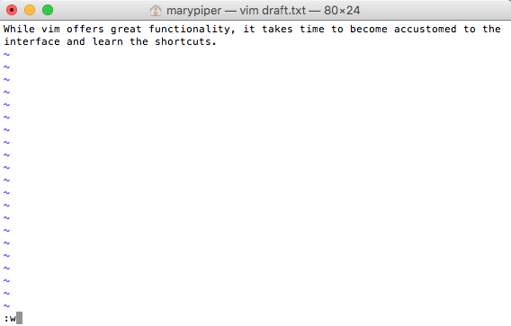
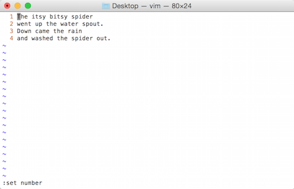

# Learning Objectives
  - Use nano and/or vim to create and edit files 

***

# Recap from last week: Working with files 

```
~           # home dir
.           # current dir
..          # parent dir
*           # wildcard
ctrl + c    # cancel current command
ctrl + l    # clear your terminal screen
cat         # prints out the all the contents of file 
less        # allows you to view and move through file content 
head        # allows you to view beginning of file 
tail        # allows you to view end of file 
```

The wildcard *
+ can represent zero or more other characters
+ can be placed anywhere in your pattern


## Good names for files and directories 

Complicated names of files and directories can make your life painful when working on the command line. Here we provide a few useful tips for the names of your files and directories.

    Don’t use spaces.

Spaces can make a name more meaningful, but since spaces are used to separate arguments on the command line it is better to avoid them in names of files and directories. You can use - or _ instead (e.g. fastq-data-files/ rather than fastq data files/). To test this out, try typing mkdir fastq data files and see what directory (or directories!) are made when you check with ls -F.

    Don’t begin the name with - (dash).
    
    Don’t begin the name with numbers.

    Stick with letters in the beginning and then use numbers, . (period), - (dash), or an _ (underscore) in the middle of the file or directory name. 


You may have noticed by now that all the files we are using are named ‘something dot something’. 
+ This is just a convention; we can call a file mythesis or almost anything else we want. However, most people use two-part names most of the time to help them (and their programs) tell different kinds of files apart. 

<p align="center">

</p>

+ The second part of such a name is called the filename extension and indicates what type of data the file holds: .txt signals a plain text file, .pdf indicates a PDF document, .cfg is a configuration file full of parameters for some program or other, .png is a PNG image, and so on.
+ This is just a convention, albeit an important one. Files merely contain bytes; it’s up to us and our programs to interpret those bytes according to the rules for plain text files, PDF documents, configuration files, images, and so on.
+ However, naming a PNG image of a whale as whale.mp3 doesn’t somehow magically turn it into a recording of whale song, though it might cause the operating system to associate the file with a music player program. In this case, if someone double-clicked whale.mp3 in a file explorer program,the music player will automatically (and erroneously) attempt to open the whale.mp3 file.

<p align="center">

</p>

***

**Class Activity**

Before moving on, please complete the following class activity below. You will have ~5 minutes to answer all questions except the final one! 
+ Open the quiz in a separate screen and keep it open. 
+ We will return to this screen at a later time. 

[Class-activity](https://forms.gle/J9tg4mP3NdeaNf6K6)

***

# Writing files

We've been able to do a lot of work with files that already exist, but what if we want to create our own files? 

In order to create or edit files we will need to use a **text editor**. When we say, "text editor," we really do mean "text". These editors can only work with plain character data, not tables, images, or any other media. Text editors can generally be grouped into two categories:  **command-line editors** and **graphical user interface editors**. 


## Command-line editors
Some popular editors include:
+ [Emacs](http://www.gnu.org/software/emacs/)
+ [Vim](http://www.vim.org/)
+ [Gedit](http://projects.gnome.org/gedit/) 

These are editors which are generally available for use on high-performance compute clusters. There are also simpler editors available for use on the cluster (e.g. [Nano](http://www.nano-editor.org/)), but tend to have limited functionality. We will discuss Nano and Vim in this lesson. 

# Which editor to use? 

## Nano 
Nano is a simple text editor for UNIX/Linux operating systems. Nano is easy-to-use but has its' limitations. 


### Creating or editing a file 

To create a new file or edit an existing one type: 

```
nano filename
```

Type the following in your terminal: 

```
nano colors.txt
```

After pressing the Enter key, the nano editor appears. Notice the following elements: 
+ the top line displays the version of nano in the left corner and the name of the file being edited 
+ the 3rd line from the bottom indicates the status of the file you're editing; it shows that color.txt is a "New File" 
+ the last two lines of the screen present a menu of useful shortcuts for nano. They all will require you to use the <button>control</button> button on your laptop. 

<p align="center">

</p>

At this point we can begin typing: 
```
red
blue 
yellow
```

Notice that after your first keystroke, the word "Modified appears in the upper-right corner. This shows that you have changed the contents of your file but it has not been saved yet. 

<p align="center">

</p>

+ Saving your work: To save your edited file to disk, press Ctrl-o. Nano displays the current filename. (To save the file under a different name, delete the filename that Nano displays and type a new one.) Press Enter. 

+ Exiting Nano:  To exit Nano, press <button>control</button> + x. If you made any changes since the last save, Nano will ask whether or not to save them. Type `y` for yes or `n` for no. Press Enter. 

<p align="center">

</p>

>### Summary Basic nano commands
>
>| key              | action                 |
>| ---------------- | ---------------------- |
>| <button>control</button> + X     | exit from the editor |
>| <button>control</button> + A      | Let's you jump from the beginning of the line |
>| <button>control</button> + E     | Let's you jump from the end of the line  |
>| <button>control</button> + V      | Scroll page down |
>| <button>control</button> + Y      | Scroll page up |
>| <button>control</button> + O      | Save the file |
>| <button>control</button> + K      | It cuts the entire selected line |

***
Class activity #2 
**You will have ~5 minutes to complete**

1. Grab `get-pip.py` from this location /gpfs1/cl/mmg3320/course_materials/tutorials
2. Open `get-pip.py`
3. Copy and paste the 5th line as the answer for the final quiz question
4. Exit and return to terminal 

***

## Introduction to Vim 

Vim is another text editor, but it is much more powerful than Nano because it offers extensive text editing options. We will explore some of the differences. 

> ### How do I keep track of all these shortcuts in Vim?
> To help you remember some of the keyboard shortcuts that are introduced and to allow you to explore additional functionality on your own, hbctraining has already compiled a [cheatsheet linked here](https://github.com/hbctraining/In-depth-NGS-Data-Analysis-Course/blob/master/resources/VI_CommandReference.pdf). Download it to your computer, it is a useful resource to have open while using Vim.
> <p align="center">
> 
> </p>


## Vim Interface

You can create a document by calling a text editor (in our case `vim`) and providing the name of the document you wish to create. 

Change directories to the `unix_lesson/other` and create a document using called `draft.txt` using the `vim` command:

```bash	
vim draft.txt
```
<p align="center">

</p>

>**Notice the `"draft.txt" [New File]` typed at the bottom left-hand section of the screen.** This tells you that you just created a new file in vim. 


### Vim Modes
Vim has **_two basic modes_** that will allow you to create documents and edit your text:   

- **_command mode (default mode):_** will allow you to save and quit the program (and execute other more advanced commands).  

- **_insert (or edit) mode:_** will allow you to write and edit text


Upon creation of a file, vim is automatically in command mode. Let's _change to insert mode_ by typing <button>i</button>. **Note the `--INSERT--` at the bottom left hand of the screen.** 

Now type in a few lines of text:

<p align="center">

</p>

After you have finished typing, **press <button>esc</button> to enter command mode.** 

>**Note the `--INSERT--` has now disappeared from the bottom of the screen.**

>### Review of Vim modes
>
>| key              | action                 |
>| ---------------- | ---------------------- |
>| <button>i</button>     | insert mode - to write and edit text |
>| <button>esc</button>     | command mode - to issue commands / shortcuts  |


### Saving and Quitting

To **"write to file"** or save the modifications made to the file, type <button>:w</button> when in command mode. You can see the commands you type in the bottom left-hand corner of the screen. 

<p align="center">

</p>

After you have saved the file, the total number of lines and characters in the file will print out at the bottom left-hand section of the screen.

<p align="center">

</p>


Alternatively, we can **write to file (save changes) and quit** all at once by typing <button>:wq</button>. After typing <button>:wq</button> while on command mode, you will exist vim and be returned back to your command prompt.

> ### Review of saving and quitting
 >
> | key (in command mode)  | action           |
> | ---------------- | ---------------------- |
> | <button>:w</button>     | to write to file (save) |
> | <button>:wq</button>     | to write to file and quit |
> | <button>:q!</button>     | to quit without saving |

***
Class activity #3 
**You will have ~5 minutes to complete**

1. Create a new file called `spider.txt` using `vim`. 
2. Go into *insert mode* and enter the text as shown below in the screenshot: 

<p align="center">

</p>

***

Once you have finished typing, you can display line numbers by changing to *command mode* and then typing the <kbd>:set number</kbd> command. Later, if you choose to remove the line numbers you can reset it with <kbd>:set nonumber</kbd>.

<p align="center">

</p>

| key (in command mode)  | action                 |
| ---------------- | ---------------------- |
| <button>:set number</button>     | to number lines |
| <button>:set nonumber</button>     | to remove line numbers    |


**Save the document using <button>:w</button>** 

Now **while in command mode**, try moving around the file `spider.txt` and familiarizing yourself with some of these shortcuts!  

**Navigating around the file**

| key (in command mode) | action                 |
| ---------------- | ---------------------- |
| <button>gg</button>     | to move to top of file |
| <button>G</button>     | to move to bottom of file     |
| <button>$</button>     | to move to end of line |
| <button>0</button>     | to move to beginning of line     |
| <button>w</button>     | to move to next word     |
| <button>b</button>     | to move to previous word     |

Practice some of the editing shortcuts, then **quit the document and remember to save changes**.

**Editing the file**

| key (in command mode) | action                 |
| ---------------- | ---------------------- |
| <button>dw</button>     | to delete word |
| <button>dd</button>     | to delete line     |
| <button>u</button>     | to undo |
| <button>Ctrl + r</button>     | to redo     |
| <button>/*pattern*</button>     | to search for a pattern (*n/N* to move to next/previous match)    |
| <button>:%s/*search*/*replace*/g</button>     | to search for a pattern and replace for all occurrences     |

***

**Class Exercise #4**

1. Open `spider.txt` and delete the word "water" from line #2. Note, you will need to be at the first letter of the word, to delete the entire word!
2. Replace every occurrence of "spider" with "unicorn".
3. Delete the line: "Down came the rain." 
4. Delete the first word from each of the remaining lines.
5. Save the file.
6. Open the file and take a screenshot of your terminal screen. Submit this screenshot as homework Part A. 

***

## GUI text editors

A GUI is an interface that has buttons and menus that you can click on to issue commands to the computer and you can move about the interface just by pointing and clicking. These include [BBEdit](http://www.barebones.com/products/bbedit/) and [Visual Studio Code](https://code.visualstudio.com/), which allow you to write and edit plain text documents. These editors often have features to easily search text, extract text, and highlight syntax from multiple programming languages. They are great tools, and indeed you should download one to use to create your own scripts in the future! 

*** 

## Homework Assignment #3 (50 points)

### Please note that you will have until next class (Thursday, February 1st - 10AM) to submit this assignment. Late submissions will not be accepted.  

### Directions for Students: 
Open a new Microsoft Word Document and submit two screenshot (Part A, B, and C). The first four lines of your document should contain the following:  
+ Your name
+ MMG3320/5320
+ Today's date
+ Homework Assignment #3

Part A: Class Exercise #4 output. 

Part B: Generating your own script
You got the following line of codes from a trusted source but need to modify it so you can submit it to the VACC-Bluemoon server. You decide its time to make your own script. Follow the steps below: 

1. Create a new file called `script.sh` in a text editor of your choice. 
+ The ".sh" file extension typically indicates that a file is a **shell script**. 
+ In Unix-like operating systems (such as Linux and macOS), shell scripts are plain text files containing a sequence of commands that can be executed by a shell.

2. Paste in the code below to `script.sh`. 

	```
	STAR --runThreadN 4 \
	--runMode genomeGenerate \
	--genomeDir /username/chr1_hg19_STAR_index/ \
	--genomeFastaFiles /username/reference_data_ensembl/Homo_sapiens.GRCh19.dna.chromosome.1.fa \
	--sjdbGTFfile /username/reference_data_ensembl/Homo_sapiens.GRCh19.gtf 
	```
	
3. Replace every occurrence of "username" with your home directory. 
4. Delete the line containing --runMode
5. Change the --runThreadN from 4 to 6  
6. You would also like to use the newest genome assembly, human reference 38. Change this as well in your script. 
7. Save the file. 
8. Submit a screenshot of your final script as homework Part B. 

**Please Take Note:** 
+ The argument --genomeDir is pointing to an entire directory while --genomeFastaFiles is pointing to a specific file. This is really important as the program is looking for "specific" files or entire directories (with files in them!) to run successfully. 
+ Each line here ends with a `\`. This is an escape character that signals that the character following it has a special meaning in this case its a continuation. 


Part C: Using "vim" one more time 

1. Grab `update_hg19_chromosomes.txt` from this location /gpfs1/cl/mmg3320/course_materials/tutorials
2. Delete the final 5 lines of this document
3. Replace every occurrence of "sequence" with "peptide" 
4. Report how many substitutions were created and how many lines were altered due to these changes as your final answer. Your answer should be one sentence. 

## Citation

*This lesson has been developed by members of the teaching team at the [Harvard Chan Bioinformatics Core (HBC)](http://bioinformatics.sph.harvard.edu/). These are open access materials distributed under the terms of the [Creative Commons Attribution license](https://creativecommons.org/licenses/by/4.0/) (CC BY 4.0), which permits unrestricted use, distribution, and reproduction in any medium, provided the original author and source are credited.*

* *The materials used in this lesson were derived from work that is Copyright © Data Carpentry (http://datacarpentry.org/). 
All Data Carpentry instructional material is made available under the [Creative Commons Attribution license](https://creativecommons.org/licenses/by/4.0/) (CC BY 4.0).* 
* *Original Authors: Sheldon  McKay, Bob Freeman, Mary Piper, Radhika Khetani, Meeta Mistry, Jihe Liu, Will Gammerdinger*