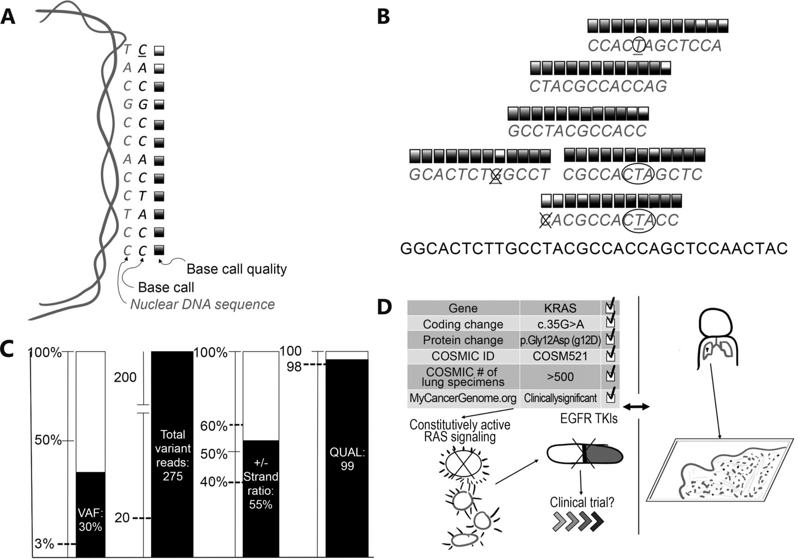
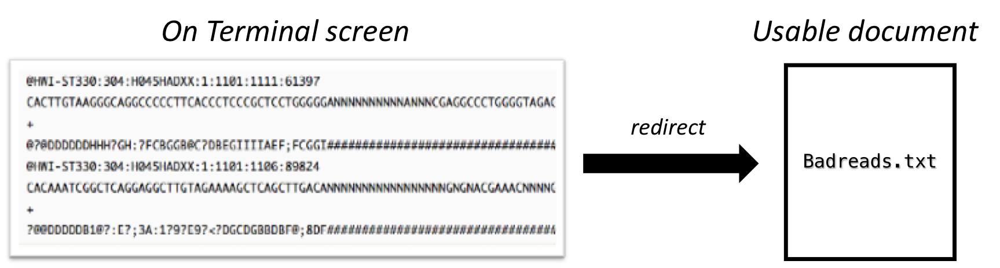
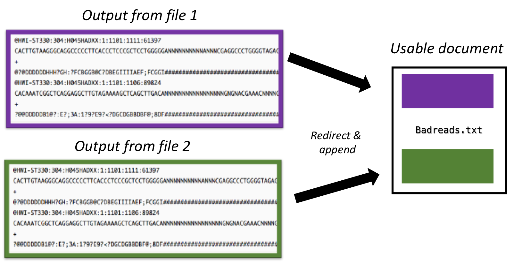

## Learning objectives
- Search for characters or patterns in a text file using the `grep` command
- Write to and append a file using output redirection 
- Use of pipe (`|`) character  
    + How can I combine existing commands to do new things? 
        
***

## Recap from last week

+ `*` matches zero or more characters in a filename
+ `?` matches a single character in a filename 
+ Use of the <button>control</button> key may be described in many ways, including Ctrl-X, Control-X, or ^X. 
+ The shell does not have a trash bin, once something is deleted it is really gone. 
+ Most file names are **something.extension**. The extension is not required, but does help bioinformatic programs find required files for downstream processing. 
+ Depending on the type of work you do, you may need a more powerful text editor than Nano. 

***

!!! example "Class Exercise"  

    Before moving on, please complete the following class activity below. You will have ~5 minutes to answer all questions. Please submit the quiz without answering the last question. 

    [Class-activity](https://forms.gle/jfEXWCkfBo5oPa4R7)

*** 


## Searching files with `grep` command

In the same way that many of us now use ‘Google’ as a verb meaning ‘to find’, UNIX programmers often use the word `grep`. 

+ `grep` is a contraction of ‘**g**lobal/**r**egular **e**xpression/**p**rint’, a common sequence of operations in early UNIX text editors. It is also the name of a very useful command-line program.

+ `grep` allows you to search plain-text files without opening them. 


The syntax for `grep` is as follows: 

```bash
grep  search-term  filename
```

The pattern that we want to search is specified in the `search-term` slot, and the file we want to search within is specified in the `filename` slot. Let's generate a file to try this on first!  

***
!!! example "Class Exercise"  

    You will have ~5 minutes to complete.  
    **NOTE: It is never my intention to rush you. If you do find you need more time to participate, please let me know.**

    1. Copy the following text into a text file. Name the text file haiku.txt. 

	    > It might be good to make a folder called *class-exercises* or something like that for activities like this moving forward!  

	    ```bash
	    The Tao that is seen
	    Is not the true Tao, until
	    You bring fresh toner.

	    With searching comes loss
	    and the presence of absence:
	    "My Thesis" not found.

	    Yesterday it worked
	    Today it is not working
	    Software is like that.
	    ```
    2. Now that you have haiku.txt created save and exit the text editor. 
    
    3. On your terminal try the following command: 

	    ```bash
	    grep not haiku.txt
	    ```
    4. Copy-and-paste the output from this command as an answer in the class-activity quiz. 

    5. Now try the following command: 
	
	    ```bash
	    grep Not haiku.txt
	    ```
    6. Finally, try the following command: 

	    ```bash
	    grep The haiku.txt
	    ```

***

### Class Exercise Discussion 
In the above exercise, *not* was the first pattern we were searching for. The `grep` command searches through the file, and then looks for matches to the pattern specified. To use it you typed `grep`, then the pattern you were searching for and finally the name of the file (or files) you were searching in. 

+ You also would have noticed that by default `grep` searches for a pattern in a *case-sensitive way*. 

+ Finally, you would have saw upon completing #6, the search pattern we have selected does not have to form a *complete word or phrase* as the following where two results: 
       
    + The Tao
        
    + My **The**sis

***

### Other useful options for grep

To restrict matches to lines containing the word **The** on its own, we can give `grep` the `-w` option. This will limit matches to word boundaries.

```bash
grep -w
```

Sometimes we don’t want to search for a single word, but for a phrase. We can also do this by putting the phrase in quotes: 

```bash
grep "is not" haiku.txt
```

Another useful option is `-n` which numbers the lines that match:

```bash
grep -n "it" haiku.txt
```
Here, we can see that lines 5, 9, and 10 contain the letters ‘it’. 

`grep` has lots of other options. To find out what they are, we can type: 

```bash
grep --help
```

***

## Searching within FASTQ files with `grep`

The Next-Generation Sequencing (NGS) technologies all rely on a complex interplay of chemistry, hardware and optical sensors. Adding to this complexity is software to analyze the sensor data to predict the individual bases. This last step in the process is referred to as **base-calling**. Below is figure from [Cancer Biology & Medicine](https://www.cancerbiomed.org/content/13/1/3) which shows the importance of base-calling in variant analysis. Base-calling algorithms process the raw signal to decode the sequence of bases within strands of DNA or RNA into data stored in BAM or FASTQ files. 

<figure markdown="span">
  { width="600" }
  <figcaption>Summary of technical validity and clinical utility assessment for cancer NGS. (A) NGS basecalling, wherein a DNA sequence and corresponding confidence score is generated from a nuclear genomic DNA template. (B) The next step, which compares all available data to the reference and each other. Variant calling is then performed (underlined bases in panel B), comparing base calls across many reads; many false positive variant calls (x'ed out bases) can be filtered, while true positives (circled bases) should generate a strong signal. (C) Multiple quality metrics are generated during variant calling, which can be compared to cutoffs established during assay validation (dashed lines). (D) Detailed review of available databases and literature (left side) and comparison to clinical history and tumor pathology (right side) to assess clinical utility. VAF, variant allele frequency; QUAL, variant call quality; COSMIC, Catalogue of Somatic Mutations in Cancer; TKIs, tyrosine kinase inhibitor therapies. </figcaption>
</figure>


FASTQ files contain the sequencing reads (nucleotide sequences) output from a high throughput sequencer. Each sequencing read in a FASTQ file is associated with four lines, with the first line (header line) always starting with an `@` symbol. A whole FASTQ record for a single read should appear similar to the following:

	@HWI-ST330:304:H045HADXX:1:1101:1111:61397
	CACTTGTAAGGGCAGGCCCCCTTCACCCTCCCGCTCCTGGGGGANNNNNNNNNNANNNCGAGGCCCTGGGGTAGAGGGNNNNNNNNNNNNNNGATCTTGG
	+
	B?@DDDDDDHHH?GH:?FCBGGB@C?DBEGIIIIAEF;FCGGI#########################################################

> **More information about the FASTQ file format**
>
> |Line|Description|
> |----|-----------|
> |1|Read name preceded by '@'|
> |2|The actual DNA sequence|
> |3|Read name (same as line 1) preceded by a '+' or just a '+' sign|
> |4|String of characters which represent the quality score of each nucleotide in line 2; must have same number of characters as line 2|
>

So what happens if the sequencer is unable to decide which base (A, G, C, T) is the correct one? In this case, the sequencer will designate an **N**. 

***
!!! example "Class Exercise"  

    Suppose we want to find the exact line(s) in the file Mov10_oe_1.subset.fq that contain 10 consecutive Ns (NNNNNNNNNN).
	
	Perform the appropriate command and be ready to report the line number of the first match.

***

Notice, that this output will only return the lines that contain the `NNNNNNNNNN`. However, each read in the FASTQ file is made up of 4 lines (as discussed above).   

So what if we wanted to see the whole FASTQ record for each of the reads? We would need to modify the default behavior of `grep` and specify additional argument/options. 

The `-B` and `-A` arguments are useful to return the matched line plus one before (`-B 1`) and two lines after (`-A 2`). Therefore, using these arguments will return the whole read record. 

```bash
grep -B 1 -A 2 NNNNNNNNNN Mov10_oe_1.subset.fq
```

```bash
@HWI-ST330:304:H045HADXX:1:1101:1111:61397
CACTTGTAAGGGCAGGCCCCCTTCACCCTCCCGCTCCTGGGGGANNNNNNNNNNANNNCGAGGCCCTGGGGTAGAGGGNNNNNNNNNNNNNNGATCTTGG
+
@?@DDDDDDHHH?GH:?FCBGGB@C?DBEGIIIIAEF;FCGGI#########################################################
--
@HWI-ST330:304:H045HADXX:1:1101:1106:89824
CACAAATCGGCTCAGGAGGCTTGTAGAAAAGCTCAGCTTGACANNNNNNNNNNNNNNNNNGNGNACGAAACNNNNGNNNNNNNNNNNNNNNNNNNGTTGG
+
?@@DDDDDB1@?:E?;3A:1?9?E9?<?DGCDGBBDBF@;8DF#########################################################
```

***

### Group separators (`--`), and how to remove them
You will notice that when we use the `-B` and/or `-A` arguments with the `grep` command, the output has some additional lines with dashes (`--`), these dashes work to separate your returned "groups" of lines and are referred to as "group separators". This might be problematic if you are trying to maintain the FASTQ file structure or if you simply do not want them in your output. Using the argument `--no-group-separator` with `grep` will disable this behavior:

```bash
grep -B 1 -A 2 --no-group-separator NNNNNNNNNN Mov10_oe_1.subset.fq
```

Now your output should be returned as:

```bash
@HWI-ST330:304:H045HADXX:1:1101:1111:61397
CACTTGTAAGGGCAGGCCCCCTTCACCCTCCCGCTCCTGGGGGANNNNNNNNNNANNNCGAGGCCCTGGGGTAGAGGGNNNNNNNNNNNNNNGATCTTGG
+
@?@DDDDDDHHH?GH:?FCBGGB@C?DBEGIIIIAEF;FCGGI#########################################################
@HWI-ST330:304:H045HADXX:1:1101:1106:89824
CACAAATCGGCTCAGGAGGCTTGTAGAAAAGCTCAGCTTGACANNNNNNNNNNNNNNNNNGNGNACGAAACNNNNGNNNNNNNNNNNNNNNNNNNGTTGG
+
?@@DDDDDB1@?:E?;3A:1?9?E9?<?DGCDGBBDBF@;8DF#########################################################
```

### Which line number has a match?
A useful option is the `-n` option which will print out the line number from the file for the match. Add this option to the previous command:

```bash
grep -B 1 -A 2 --no-group-separator -n NNNNNNNNNN Mov10_oe_1.subset.fq
```

This would return the output:

```bash
861213-@HWI-ST330:304:H045HADXX:1:1101:1111:61397
861214:CACTTGTAAGGGCAGGCCCCCTTCACCCTCCCGCTCCTGGGGGANNNNNNNNNNANNNCGAGGCCCTGGGGTAGAGGGNNNNNNNNNNNNNNGATCTTGG
861215-+
861216-@?@DDDDDDHHH?GH:?FCBGGB@C?DBEGIIIIAEF;FCGGI#########################################################
861953-@HWI-ST330:304:H045HADXX:1:1101:1106:89824
861954:CACAAATCGGCTCAGGAGGCTTGTAGAAAAGCTCAGCTTGACANNNNNNNNNNNNNNNNNGNGNACGAAACNNNNGNNNNNNNNNNNNNNNNNNNGTTGG
861955-+
861956-?@@DDDDDB1@?:E?;3A:1?9?E9?<?DGCDGBBDBF@;8DF#########################################################
```

A small thing you should note is that when using the `-n` option, lines that have a `:` after the line number correspond to the lines with the match (e.g `861214:CACTTGTAAGGGCAGGCCCCCTTCACCCTCCCGCTCCTGGGGGANNNNNNNNNNANNN...`), while lines with a `-` after the line number are the surrounding lines retrieved when using the `-A` and/or `-B` options (e.g. `861213-@HWI-ST330:304:H045HADXX:1:1101:1111:61397`).


***
!!! example "Class Exercise"  

    1. Use `grep` to search for the sequence CTCAATGAGCCA in `Mov10_oe_1.subset.fq`. Write the command so that only the read name and sequence are shown.

    2. If you wanted to search for the above sequence in **all** Mov10 replicate fastq files, what command would you use? Which FASTQ file contains the most reads with the 'CTCAATGAGCCA' barcode?


***

## Redirection

When we use `grep`, the matching lines are displayed in the Terminal (also called **Standard Output** or stdout). If the result of the `grep` search contains only a few lines, we can easily read them. However, if the output is very long, the lines will keep scrolling, and we’ll only be able to see the last few lines on the screen. You might have experienced this when searching for the pattern `NNNNNNNNNN`.

So, how can we capture this output and save it for later review instead of letting it scroll past in the Terminal?

We can achieve this using redirection. Redirection allows us to send the output from the Terminal to another destination. In this case, we can save the output to a file, which lets us examine it at our convenience.

<figure markdown="span">
  { width="600"}
</figure>


### Redirecting with `>` AKA "Greater-than sign" 

**The redirection command for writing something into a file is `>`.**

Let's put all the sequences that contain `NNNNNNNNNN` from the `Mov10_oe_1.subset.fq` into another file called `bad_reads.txt`.

```bash
grep -B 1 -A 2 NNNNNNNNNN Mov10_oe_1.subset.fq > bad_reads.txt
```

Now you should have a new file called `bad_reads.txt` in the raw_fastq directory. 

```bash
 ls -l 
```

Take a look at the file and see if it contains what you think it should. 

> NOTE: If we already had a file named `bad_reads.txt` in our directory, it would have overwritten it without any warning!

***

### Redirecting (and appending) with `>>`

**The redirection command for appending something to an existing file is `>>`.**

If we use `>>` it will **append** to the existing content in a file rather than overwrite it. This can be useful for saving more than one search. For example, the following command will append the bad reads from **Mov10_oe_2** to the `bad_reads.txt` file that we just generated.
    
```bash
 grep -B 1 -A 2 NNNNNNNNNN Mov10_oe_2.subset.fq >> bad_reads.txt
 ls -l 
```

Did the size of the `bad_reads.txt` file change? How do we explain this? 

<figure markdown="span">
  { width="500"}
</figure>

***

## Passing output to another command with `|` (or pipe)

The vertical bar or **pipe key** <button>|</button> is very likely not something you use very often. It is on the same key as the back slash, right above the (Enter/Return)key. 

What `|` does is take the output from one command and runs it through the command specified after it. 

First, to really see the benefit let's type the following command again: 

```bash
grep -B 1 -A 2 NNNNNNNNNN Mov10_oe_1.subset.fq 
```

>Notice that we are at the **end** of the document automatically. It just whizzed on by! And if we wanted to find the first line, it get's messy and "jumpy" - there are even gaps! 

Now let's **pipe the output of `grep` command** to `less`. This will allow us to slowly scroll through the entire document using the up and down arrows! 

```bash
grep -B 1 -A 2 NNNNNNNNNN Mov10_oe_1.subset.fq | less
```

> Remember to use `q` to get out of less

Or let's say we are interested in the first few lines, we could do the following:

```bash
grep -B 1 -A 2 NNNNNNNNNN Mov10_oe_1.subset.fq | head -n 5
```

Another thing we can also do is count the number of lines output by `grep`. 

We will introduce another command called `wc`. The `wc` command stands for ***w**ord **c**ount*. This command counts the number of lines, words and characters in the text input given to it. The `-l` argument will only count the number of lines instead of counting everything.

```bash
grep -B 1 -A 2 NNNNNNNNNN Mov10_oe_1.subset.fq | wc -l
```
There are a total of 148 lines that are shown as the output. 

How many lines contain `NNNNNNNNNN` in the document Mov10_oe_1.subset.fq?  

***

### The Power of Pipes 
* The pipe is a very important/powerful concept in Shell
* You can string along as many commands together as you like

<figure markdown="span">
  { width="600"}
</figure>

The philosophy behind the three redirection operators (`>`, `>>`, `|`) you have learned so far is that none of them by themselves do a lot. BUT when you start chaining them together, you can do some really powerful things really efficiently. 

**To be able to use the shell effectively, becoming proficient in the use of the pipe and redirection operators is essential.**

***

## Practice with searching and piping/redirection

Let's use the new commands in our toolkit and a few new ones to examine the gene annotation file **chr1-hg19_genes.gtf**. We will be using this file to find the genomic coordinates of all known exons on chromosome 1. This file is located in the following directory: 

```bash
~/unix_lesson/reference_data/
```

### Introducing the GTF file format

Let's explore our `chr1-hg19_genes.gtf` file a bit. What information does it contain?

```bash
head -10 chr1-hg19_genes.gtf | less -S 
```
```
chr1    unknown exon    14362   14829   .       -       .       gene_id "WASH7P"
chr1    unknown exon    14970   15038   .       -       .       gene_id "WASH7P"
chr1    unknown exon    15796   15947   .       -       .       gene_id "WASH7P"
chr1    unknown exon    16607   16765   .       -       .       gene_id "WASH7P"
chr1    unknown exon    16858   17055   .       -       .       gene_id "WASH7P"
chr1    unknown exon    17233   17368   .       -       .       gene_id "WASH7P"
chr1    unknown exon    17606   17742   .       -       .       gene_id "WASH7P"
chr1    unknown exon    17915   18061   .       -       .       gene_id "WASH7P"
chr1    unknown exon    18268   18366   .       -       .       gene_id "WASH7P"
chr1    unknown exon    24738   24891   .       -       .       gene_id "WASH7P
```

> **The GTF (Gene Transfer Format) file** is a tab-delimited file with information arranged in a very specific manner, usually for NGS analysis. That information is specifically about all the various entities or features found in a genome; in this case, on chromosome 1. 

The columns in the **GTF file contain the genomic coordinates (location) of gene features (exon, start_codon, stop_codon, CDS) along with the associated gene_names, transcript_ids and protein_ids (p_id)**. 

|Line|Description|
|----|-----------|
|1| chromosome number|
|2| source, name of program that generated the feature - its "unknown" above|
|3|feature type name|
|4|start position of feature|
|5|end position of feature|
|6|score|
|7|strand, defined at + (forward) or - (reverse)|
|8|frame|
|9|attribute, provides additional information about each feature|

> For more information on this file format, check out the [Ensembl site](http://useast.ensembl.org/info/website/upload/gff.html). 


Given our understanding of splice isoforms, we know that a given exon can be part of 2 or more different transcripts generated from the same gene. In a GTF file, this exon will be represented multiple times, once for each transcript (or splice isoform). For example, 

```bash
grep PLEKHN1 chr1-hg19_genes.gtf | less -S
```

This search returns two different transcripts of the same gene, NM_001160184 and NM_032129, that contain the same exon.

***

## Cut & Sort 

* **`cut` is a command that extracts columns from files.** 

We will use `cut` with the `-f` argument to specify which specific fields or columns from the dataset we want to extract. Let's say we want to get the 1st column (chromosome number) and the 4th column (starting genomic position) and 5th column (ending genomic position) from `chr1-hg19_genes.gtf` file, we can say:

```bash
grep PLEKHN1 chr1-hg19_genes.gtf | cut -f 1,4,5 | head
```
How can we output this to a different document? 

```bash
grep PLEKHN1 chr1-hg19_genes.gtf | cut -f 1,4,5 > coordinates_PLEKHN1.txt
```

> Note: The `cut` command assumes our data columns are separated by tabs (i.e. tab-delimited). The `chr1-hg19_genes.gtf` is a tab-delimited file, so the default `cut` command works for us. However, data can be separated by other types of delimiters like "," or ";". If your data is not tab delimited, there is an argument you can add to your `cut` command, `-d` to specify the delimiter (e.g. `-d ","` with a .csv file).


* **`sort` is a command used to sort the contents of a file in a particular order.** It has arguments that let you pick which column to sort by (`-k`), what kind of sorting you want to do (numeric `n`) and also if the result of the sorting should only return unique (`-u`) values. These are just 2 of the many features of the sort command. 

Let's run the following command first before using `sort`: 

```bash
cut -f 1,4 chr1-hg19_genes.gtf | wc -l
```
*How many lines are returned to you?*

<details>
	<summary><b><i>Click here to check your output</i></b></summary>
	<p>Your command should have returned 76,767 lines.</p>
</details>

Pipe the output to `less` - notice all the duplicates! 

```bash
cut -f 1,4 chr1-hg19_genes.gtf | less
```

Now apply the `sort -u` command before counting the lines.

```bash
cut -f 1,4 chr1-hg19_genes.gtf | sort -u | wc -l
```
*How many lines do you see now? Also be sure to actually look at the output!*

<details>
	<summary><b><i>Click here to check your output</i></b></summary>
	<p>Your command should have returned 27,852 lines.</p>
</details>

***

## Summary

```
grep          # Allows for searching within files without opening them
               +   grep search_term filename 

>          	  # Redirect output to another file  

>>            # append to an existing file rather than overwrite it  

|             # Pipe key 
				+ takes the output and runs it through the command specified after it 

cut           # used to extract specific columns from a tab-delimited file 

sort 		  # used to sort a specific column within a tab-delimited file

```

***


---
## Citation

*This lesson has been developed by members of the teaching team at the [Harvard Chan Bioinformatics Core (HBC)](http://bioinformatics.sph.harvard.edu/). These are open access materials distributed under the terms of the [Creative Commons Attribution license](https://creativecommons.org/licenses/by/4.0/) (CC BY 4.0), which permits unrestricted use, distribution, and reproduction in any medium, provided the original author and source are credited.*

* *The materials used in this lesson were derived from work that is Copyright © Data Carpentry (http://datacarpentry.org/). 
All Data Carpentry instructional material is made available under the [Creative Commons Attribution license](https://creativecommons.org/licenses/by/4.0/) (CC BY 4.0).*

* *Adapted from the lesson by Tracy Teal. Contributors: Paul Wilson, Milad Fatenejad, Sasha Wood, and Radhika Khetani for Software Carpentry (http://software-carpentry.org/)*

* *Original Authors: Sheldon  McKay, Bob Freeman, Mary Piper, Radhika Khetani, Meeta Mistry, Jihe Liu, Will Gammerdinger*

