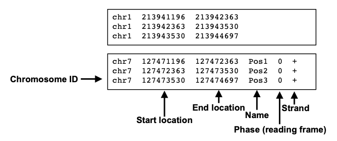

## Learning Objectives

- Capture commands into a shell script
- Implement variables in a shell script

## Recap 

+ `wc` counts lines, words, and characters in its inputs 
+ command `>` [file] redirects a command's output to a file (overwriting any existing content)
+ command `>>` [file] appends a command's output to a file 
+ [first] `|` [second] is a pipeline: the output of the first command is used as the input to the second

## Cut 

* **`cut` is a command that extracts columns from files.** 

We can use `cut` with the `-f` argument to specify which specific fields or columns from the dataset we want to extract. Let's say we want to get the 1st and 3rd column of a file, we can use:

```bash
cut -f 1,3 file.csv
```

Please note: the argument `-f 1,3` cannot be written with spaces between the field numbers. If you write it as `-f 1, 3` (with a space), the cut command will treat 1, as one argument and 3 as another, leading to an error.

```bash
cut -f 1, 3 file.csv
# Error: "cut: invalid byte, character, or field list"
```

***

!!! example "Class Exercise: Participation Grade"  

	Before moving on, please complete the following class activity below. You will have ~10 minutes to answer all questions.

	[Class-activity](https://forms.gle/z16AAU9oxNg9Dohk6)

***

## Sort 

* **`sort` is a command used to sort lines in text files in a particular order.** The sort command comes with many options, some of them are further explained below: 

| Option | Description | Example Usage | 
| -------| ------------| --------------|
| `-u` (unique) | Outputs unique lines | `sort -u [FILE]` | 
| `-k` (key)| Allows sorting based on a specific key field/column in each line | `sort -k 2 [FILE]` |
| `-n` (numerics) | Performs a numeric sort | `sort -n [FILE]` | 


***

## BED File Structure

A BED file is a widely used format in genomics to store genomics regions and associated annotations. It is primarily used for specifying intervals or features on a reference genome such as genes, exons, or regulatory elements. A BED file consists of at least three required columns but can include additional optional columns. 

Required Columns:

1. Chromosome: The name of the chromosome (`chr1`)
2. Start: The start position of a feature 
3. End: The end position of a feature

<figure markdown="span">
  { width="400"}
</figure>

***

!!! example "Class Exercise #2" 

	**Dr.Patel: "Emma I noticed that the file `coordinates_PLEKHN1.txt` contained a number of duplicates. Can you please modify this file and save it as a BED file so I can upload it to UCSC Genome Browser. The file extension is `.bed`. Thanks."**

***

## Shell scripts

Over the past few weeks, you have been introduced to a number of commands to explore data files. To demonstrate the function of each command we have run them one at a time at the command prompt. The command prompt is useful for testing out commands and also performing simple tasks like exploring and organizing the file system. However, when we are running bioinformatic analyses which require a series of tasks to be run, there is a more efficient way to do this. 

Shell scripts are **text files that contain commands we know we want to run**. 

### What can shell scripts be used for? 

+ for creating, maintaining and implementing system-wide scripts
+ automating tedious repetitive tasks
+ scheduling and executing system tasks
+ for automating the installation process for new software or for new software updates across the organization
+ for scheduling data backup process

### Writing a simple shell script

We are ready to see what makes the shell such a powerful programming environment. To create our first script, we are going to take some of the commands we have run previously and save them into a file so that we can **re-run all those operations** again later, by typing just **one single command**. For historical reasons, a bunch of commands saved in a file is referred to as shell script, but make no mistake, this is actually a small program! 

Interestingly, when working on the command line you can give files any extension (.txt, .tsv, .csv, etc.). Similarly, for a shell script you don't need a specific extension. However, it is **best practice to give shell scripts the extension `.sh`** (bash shell script file). 

<figure markdown="span">
  { width="300"}
</figure>


***

!!! example "Class Exercise #3" 

	**You will have ~5 minutes to complete. NOTE: It is never my intention to rush you. If you do find you need more time to participate, please let me know.**

	Objective: Create a script that contains 3 lines: 

	1. Navigate into the `raw_fastq` directory and create a new file, call it `practice.sh`. 
 
	2. Write the First line. This line should: 
    	
		+ Grab all reads from `Mov10_oe_1.subset.fq` that contain 10 consecutive N's 
    	+ Be sure to use the appropriate arguments to output all (4) lines contained within a FASTQ read 
    	+ Then redirect the output to a new file called `redirect.txt` 

	3. Copy and paste the `echo` line below: 
		 
    	```bash
    	echo "The number of lines in redirect.txt is:" 
    	```

		+ You are adding some verbosity to your script by using the `echo` command. The `echo` command is used to display a line of text that is passed in as an argument. 

	4. Write the Third line. This line should:
    	+  Count the number of lines in redirect.txt 

	> To run the shell script you can use the `sh` command, followed by the name of your script:

		```bash
		sh practice.sh
		```

	**Final Question:** *Dr.Patel: "Emma thanks for carrying out that exercise. How many FASTQ reads in `Mov10_oe_1.subset.fq` contained 10 consecutive N's or more?*
	
	**Submit your answer in Class Participation survey.**
	
	<figure markdown="span">
  	  { width="400"}
	  <figcaption> One FASTQ Read </figcaption>
	</figure>


## Executing Scripts 

There are two main ways to execute a script: 

**1. Direct Invocation by the Shell:** When you use `sh script-name.sh`, the shell (*i.e. way to interact with kernel*) reads and executes the script file. The executable permissions of the script file is not checked because we are directly passing it as an argument to the shell interpreter. 

+ `sh script.sh`:  The script does not need executable permissions as `sh` is invoked manually 
+ Best for testing scripts

**2. Executable Permissions:** Making a script executable allows you to run it directly using `./script-name.sh`. Here, the kernel (*core of the OS, manages hardware and system resources*) will check if the script file has executable (`x`) permissions and invokes the interpreter specified in the scripts shebang line. 

+ `./script.sh`: Requires the script file to have executable permissions and the kernel uses the interpreter specified in the shebang line. 
+ Best for automation and reusable scripts 

## Bash variables

A **variable** is a common concept shared by many programming languages. **Think of variables as a temporary store or *bucket* for a piece of information.** This bucket will have a name associated with it therefore when referring to the information inside the bucket, we can use the name of the bucket instead! 

First, to create a variable in bash, you will provide the name of the variable, followed by the equals sign and finish with the value we want to assign to the variable. 

```bash
name_of_variable=value_of_variable
```

+ Note that the variable name cannot contain spaces, nor can there be spaces on either side of the equals sign.

+ The variable name can have only letters (a to z or A to Z), numbers (0 to 9), or the underscore character (_). The wrong character usage in the variable name will cause a syntax error.

+ By convention, the variable names in UNIX are in UPPERCASE.


Let's start by creating a variable called `NUM` that has the number 25 stored inside it:

```bash
NUM=25
```
If we are using our bucket analogy - You can think of the variable `NUM` like this: 

<figure markdown="span">
  { width="600"}
</figure>

Once you press return, you will find yourself back at the command prompt. But nothing happened... so how do we know that we actually created a variable? 

One way to see the variable created is by using the `echo` command. 

### `echo` command
The `echo` command is used to display text or the value of variables to the terminal/standard output. 

```bash
echo "Hello, World!"
```

```bash
## Hello, World!"
```

In the case of variable values: 

```bash
NAME=ALICE
echo "Hello, $name!"
```

```bash
## Hello, Alice!
```

To display the contents of the variable we need to **explicitly use a `$` in front of the variable name**:

```bash
echo $NUM
```

You should see the number 25 returned to you. Notice that when we created the variable, we did not use the `$`. 

### What is the `$`

The `$` is a standard shell notation for defining and using variables. The `$` tells the shell interpreter to treat the variable as a variable name and substitute its value in its place, rather than treat it as text or an external command.

**Therefore, when defining a variable (i.e. setting the value) you can just type it as is, but when retrieving the value of a variable you must use the `$`!** 

> **NOTE:** Variables are not physical entities like files. When you create files you can use `ls` to list contents and see if the file exists. To list all variables in your environment you can use the command `declare` with the `-p` option. You will notice that while you only have created one variable so far, the output of `declare -p` will be more than just one variable. These other variables are called environment variables. To remove a variable you can use `unset`. 


## Use variables as input to commands

One important aspect of the variable is that the value stored inside can be used as input to commands. 

Let's solidify this important concept. 

***

!!! example "Class Exercise #4" 

	1. Create a new variable called `FILE`. Use the name of one of the fastq files in the `raw_fastq` directory as the value of the variable.

	2. Recall the variable with `echo` 

	3. Check the number of lines in the `FILE` variable. 


	> **NOTE:** The variables we create in a session are system-wide, and independent of where you are in the filesystem. This is why we can reference it from any directory. However, it is only available for your current session. If you exit the cluster and login again at a later time, the variables you have created will no longer exist.

***

## `basename`

When creating shell scripts variables are used to store information that can be used later in the script (once or many times over). The value stored can be hard-coded in as we have done above, assigning the variable a numeric or character value. Alternatively, the value stored can be the output of another command. We will demonstrate this using a new command called `basename`.

The **`basename` command** is used to extract the file name or directory name from a given file path. This is accomplished using **string splitting**. 

> String splitting is a way to break a larger string into smaller parts based on a specified delimiter. The delimiter is a character or a sequence of characters that indicates where the string should be split. For example, if you have the string "apple,banana,orange" and use a comma as the delimiter, you can split it into three separate strings: "apple", "banana", and "orange". It's a handy technique often used in programming for data manipulation and analysis.

<figure markdown="span">
  { width="300"}
</figure>

> Other "common" strings used include: 
    
+ Space: Useful for splitting words in a sentence.
+ Tab (\t): Often used in tab-delimited data files.
+ Semicolon (;): Another popular choice for separating values in data.
+ Colon (:): Commonly used in key-value pairs.
+ Pipe (|): Used in various data formats, such as CSV files.
+ Hyphen (-): Can be used to split ranges or parts of a string.
+ Underscore (_): Frequently used in variable or function names.
+ Forward dash (/): Useful for splitting file paths. 

**Put more simply, a basename refers to the file or directory name without its path information.** It essentially provides the core name of the file or directory by removing the directory path and any leading prefixes or extensions. 

### Basic Usage of `basename`: 

**1. Extract file name**

```bash
basename /path/to/file.txt
```

```bash
## file.txt
```

For example, if you have the file path `/home/user/documents/report.txt` the basename would be `report.txt`. 

Let's try an example together: 

```bash
basename ~/unit1_unix/raw_fastq/Mov10_oe_1.subset.fq
```

The command returns only the file name. 

**2. Remove file extension**

```bash
basename /path/to/file.txt .txt
```

```bash
## file
```

Suppose we wanted to also *trim off the file extension* (i.e. remove `.fq` leaving only the file *base name*). We can do this by *adding a parameter* to the command to specify what string of characters we want trimmed.

```bash
basename ~/unit1_unix/raw_fastq/Mov10_oe_1.subset.fq .fq
```

You should now see that only `Mov10_oe_1.subset` is returned. 


***
!!! example "Class Exercise #5" 

	Use `basename` with the file `Irrel_kd_1.subset.fq` as input. Return only `Irrel_kd_1` to the terminal.

***

### Storing the `basename` output in a variable 

The `basename` command returns a character string and this too can be stored inside a variable. To do this without error, we need to add another special syntax because when we run the command we will generate spaces. If you remember earlier, one of the rules of creating variables is that there cannot be any spaces. 

> **NOTE:** The special syntax involves a key that is probably not used much on your keyboard, it is **the backtick key** <kbd>`</kbd>. On most keyboards this character is located just underneath the <kbd>esc</kbd> key. If you have trouble finding it you can also just copy and paste it from the materials.

```bash
VARIABLE=`basename /path/to/file`
```

Let's try an example:

```bash
samplename=`basename ~/unit1_unix/raw_fastq/Mov10_oe_1.subset.fq .fq`
```

Once you press return you should be back at the command prompt. Check to see what got stored in the `samplename` variable:

```bash
echo $samplename
```

> #### The `basename` command
> It is hard to see the utility of this command by just running it at command-line, but it is very useful command when creating scripts for analysis. Within a script it is common to create an output file and the `basename` allows us to easily create a prefix to use for naming the output files. This utility will be demonstrated in more detail next. 


## Shell scripting with bash variables using Jupyter Notebook 

Now it's time to put all of these concepts together to create a more advanced version of the script. This script will allow the user to get information on any given directory. These are the steps you will code into a shell script using Jupyter Notebook:

1. Assign the path of the directory to a variable
2. Create a variable that stores only the directory name (and no path information)
3. Move from the current location in the filesystem into the directory we selected in 1.
4. List the contents of the directory
5. List the total number of files in the directory

It seems like a lot, but you are equipped with all the necessary concepts and commands to do this quite easily!

### What is Jupyter Notebook 

Jupyter Notebook is an open-source web application that allows you to create and share documents containing live code, equations, visualizations, and narrative text. It's widely used in data science, scientific research, and education. The term "Jupyter" is derived from the combination of three core programming languages it supports: Julia, Python, and R.

Slurm Account: mmg3320 
Partition: general
Everything else leave as default 
Press Launch

<figure markdown="span">
  { width="300"}
</figure>

***

**Class Exercise #6 and your Homework Assignment Part B**

This is a self-paced assignment. This is also the final assignment for today. If you would like to do this from home feel free! You will need to submit (2) screenshots with your homework for this week. 

1. To get started move into the `other` directory. Jupyter Notebook is user-friendly. You should be able to click from `unit1_unix` into `other` easily. 

2. Press New (Right-side) -> New file -> and create a script called `directory_info.sh`. 

	+ In this script, we will be adding **comments by using the hashtag symbol `#`**. Lines in your script that begin with `#` will **not** be interpreted as code by command-line. Comments are crucial for proper documentation of your scripts. This will allow your future self to know what each line of code is doing!

3. Copy and paste the line below as line 1. 

	```bash
	## USAGE: Provide a full path to the directory you want information on
	```

4. Have your script create a variable called `dirPath`. Assign this variable as the full path to `raw_fastq\`. This will be line 2. 

5. Skip a line and then copy and paste the line below to line 4. *Yes, it is okay to skip a line to increase read-ability!* 

	```
	# Get only the directory name
	```

6. Next have your script create another variable called `dirName`. Use this variable to store the directory name extracting it from `dirPath`. *Make use of the `$` to retrieve the value stored inside the variable!* This will be line 5. 


	**The next few tasks will require simple commands for changing directories and listing contents of the `raw_fastq` directory.**

7. Copy and paste the line below to line 7. 

	```bash
	echo "Reporting on the directory" $dirName "..."
	```

8. Write a command to change directories into `dirPath`. This will be line 8. 

9. Copy and paste the lines below to line 10-11. Modify to make sure the sizes listed are human-readable. 

	```bash
	echo "These are the contents of" $dirName 
	ls -l
	``` 

10. Copy and paste the lines below starting at line 13. 

	```bash
	echo "The total number of files contained in" $dirName
	ls | wc -l

	echo "Report complete!"
	```

11. After adding in a final `echo` statement, you are all set with script! Take a Screenshot of your final script before hitting Save. Submit this screenshot with this week's homework. 

12. Run the script `directory_info.sh`. Take a screenshot of the results. Submit this screenshot with this week's homework. 


***


## Summary   

In today's lesson, we described shell scripts and introduced a few related concepts that are helpful when you are starting out. It is important to understand each of the indvidual concepts, but also to see how they all come together to add flexibility and efficency to your script. Later on we will further illustrate the power of scripts and how they can make our lives (when coding) much easier. Any type of data you will want to analyze will inevitably involve not just one step, but many steps and perhaps many different tools/software programs. Compiling these into a shell script is the first step in creating your analysis workflow!

***
## Citation

*This lesson has been developed by members of the teaching team at the [Harvard Chan Bioinformatics Core (HBC)](http://bioinformatics.sph.harvard.edu/). These are open access materials distributed under the terms of the [Creative Commons Attribution license](https://creativecommons.org/licenses/by/4.0/) (CC BY 4.0), which permits unrestricted use, distribution, and reproduction in any medium, provided the original author and source are credited.*

* *The materials used in this lesson were derived from work that is Copyright © Data Carpentry (http://datacarpentry.org/). 
All Data Carpentry instructional material is made available under the [Creative Commons Attribution license](https://creativecommons.org/licenses/by/4.0/) (CC BY 4.0).*
* *Adapted from the lesson by Tracy Teal. Original contributors: Paul Wilson, Milad Fatenejad, Sasha Wood and Radhika Khetani for Software Carpentry (http://software-carpentry.org/)*

* *Other Authors: Meeta Mistry, Bob Freeman, Mary Piper, Radhika Khetani, Jihe Liu, Will Gammerdinger*


