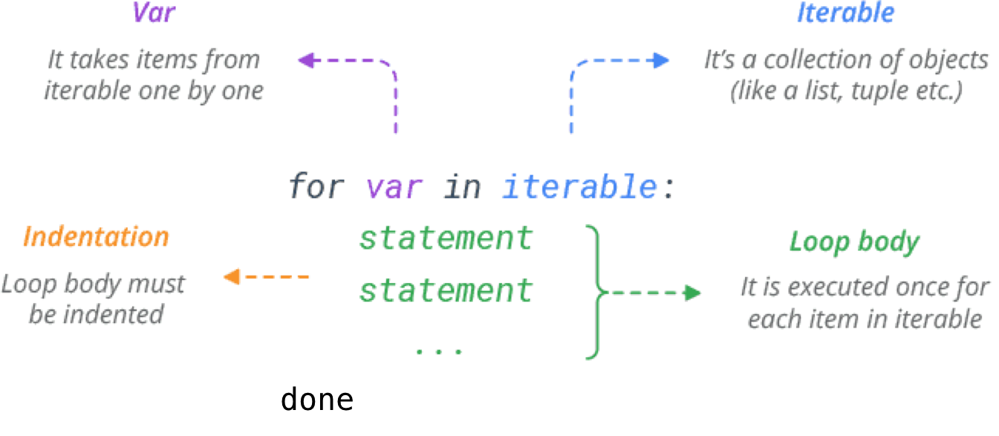

## Learning Objectives

* Describe the concept of 'looping' to iterate commands over multiple items
* Automate a task by using a loop inside of a shell script

## Recap
+ You can save commands in files (usually called shell scripts) for re-use.
+ `sh` [filename] will run the command saved within the shell script
+ shell script end in `.sh`
+ You should place variables in backticks (`) if the values might have spaces in them


***

!!! example "Class Exercise" 	

	Before moving on, please complete the following class activity below. You will have ~5 minutes to answer both questions.

	[Class-activity](https://forms.gle/vng9b1HvgabFr8Y66)

***

## Loops

Typically, when you are running analyses on the cluster, you are running multiple commands which correspond to individual steps in your workflow. We learned earlier that we can compile these commands into a single shell script to make this process more efficient. What if we could further increase our efficiency so that the same series of commands could be easily repeated for each sample in our dataset? We can do this with the use of loops in Shell!

Looping is a concept shared by several programming languages, and its implementation in bash is very similar to other languages. 

The structure or the syntax of (*for*) loops in bash is as follows:

```bash
for (variable_name) in (list)
do
 (command1 $variable_name)
 (command2 $variable_name)
done
```

The text that is **bold, are parts of the loop structure that remain constant**. That is, for every loop your create you will need to have the words: `for`, `in`, `do` and `done`. *This syntax/structure is virtually set in stone.* The text that goes in between those words will change depending on what it is you want your loop to do.

<figure markdown="span">
  { width="500"}
</figure>


### How do loops work?

Let's use the example below to go through step-by-step how a loop is actually working.


Together we will create a script called `loop.sh` in Nano: 

```bash
cd raw_fastq/

for x in Mov10_oe_1.subset.fq Mov10_oe_2.subset.fq Mov10_oe_3.subset.fq
do
 echo $x
 wc -l $x
done
```

```
Mov10_oe_1.subset.fq
 1223600 Mov10_oe_1.subset.fq
Mov10_oe_2.subset.fq
 1110016 Mov10_oe_2.subset.fq
Mov10_oe_3.subset.fq
  690816 Mov10_oe_3.subset.fq
```

|    Loop component      |      Value          |
| ---------------- | ---------------------- |
| ***variable_name*** | `x` |
| **list** | `Mov10_oe` FASTQ files |
| ***body (commands to be executed)*** | `echo` and `wc -l` |

### Loop.sh explained 

1. When we start the loop, the temporary variable is initialized by taking the value of the first item in the list. 

	> **We don't explicitly see this, but the variable has been defined as `x=Mov10_oe_1.subset.fq`.**

2. Next, all of the commands in the body of the loop (between the `do` and `done`) are executed. Usually, the commands placed here will be using the temporary variable as input. **Remember, if you are using the value stored in the variable you need to use $ to reference it!** In the example, we are running two commands:

	* `echo $x`: print out the value stored in `x`
	* `wc -l $x`: count/report the number of lines in `x`

3. Once those two commands are complete, the temporary variable is assigned a new value. It now takes the value of the second item in the list.

	> **The variable is reassigned a value `x=Mov10_oe_2.subset.fq`.**

4. Once again, all of the commands in between the `do` and `done` are executed. This time they are using the new value stored in `x` as input.

5. The temporary variable then takes on the value of the third item in the list.

	> **The variable is reassigned a value `x=Mov10_oe_3.subset.fq`.**

6. Once again, all of the commands in between the `do` and `done` are executed using the new value stored in `x`. 

7. Now that we have gone through every item in the list, the loop is `done` and it exits. 

Essentially, **the number of items in the list = number of times the code will loop through**. So in our case, we had three files listed and so the series of commands in the body of the loop were repeated three times. If we had provided all six files, the series of commands would be repeated six times.

> #### Running loops at the command prompt
> In our materials, the for loop is written out using multiple lines rather than the single line commands we have been running so far. When running this at the command prompt begin by typing out the `for` statement, then press the return key. You will notice that you are not back at your command prompt. Rather than a `$`, you should see a `>`. The shell has acknowledged that you have started a for loop and is waiting for you to complete it. Continue to type code line by line. Once you type in `done` and press return the shell will know you are done and will run the loop. 

### Creating loops using best practices

#### Meaningful variable names
It doesn't matter what variable name we use, but it is advisable to make it something more intuitive. In the long run, it's best to use a name that will help point out a variable's functionality, so your future self will understand what you are thinking now.

#### Using the wildcard to define the list 
In the example above, we typed out each item in the list leaving a space in between each item. This is usually fine for one or two items, but with larger lists this can become tedious and error-prone. If the list you are iterating over share some similarities in the naming we recommend using the wildcard shortcut to specify the list. 

***

!!! example "Class Exercise"  

	Change the for loop above so that:
	
		1) `x` variable is given a more meaningful name
		2) the script runs on all six FASTQ files 
		3) and it prints out the first two lines of all six files 

***


## Automating more with Scripts

Imagine, if you will, a script that would do the following for us each time we get a new data set:

- Use for loop to iterate over each FASTQ file
- Generate a prefix to use for naming our output files
- Dump out bad reads into a new file
- Get the count of the number of bad reads and report it to a running log file

It might seem daunting, but everything outlined above is something that you know how to do. Let's get started...

***

!!! example "Class Exercise and Homework Assignment #4"  

	1. Create a directory called `badreads` in `unit1_unix`

	2. Use Jupyter Notebooks/Nano to create a new script called `generate_bad_reads_summary.sh` in `badreads/`

	3. At the beginning of your script add a **shebang line**. 
    
   		```bash
    	#!/bin/bash
    	```

    	This line is the absolute path to the Bash interpreter. The shebang line ensures that the bash shell interprets the script even if it is executed using a different shell.

    	> #### Why do you need a shebang line? 
    	> Having a shebang line is best practice. While your script will run fine without it in environments where bash is the default shell, it won't if the user of this script is using a different shell. To avoid any issues, we explicitly state that this script needs to executed using the bash shell.

	4. After the shebang line, skip a line and copy-and-paste the following in Line 3: 
    
    	```bash
    	# enter directory with raw FASTQs
    	```

	5. In line 4 write a command to change directories into the `raw_fastq` directory. 

	6. Add the following comment as Line 6. 
    
    	```bash
    	# loop over each FASTQ file
    	```

	7. Now you are ready to begin writing the for loop. To create the first line of your for loop use the following: 

    	|    Loop component      |      Value          |
    	| ---------------- | ---------------------- |
    	| ***variable_name*** | `filename` |
    	| **list** | **all** FASTQ files |

	8. Type `do` in Line 8. 

	9. Skip a line. On line 10 copy-and-paste the following comment. Yes it is okay to skip a line! 

    	```bash
    	# create a prefix for all output files
    	```

    
	10.  Now you are ready to move on to create a prefix for all (6) fastq files. These prefixes will be stored in a second variable called `samplename` in line 11. To write this line of code successfully, remember the following:
        
		```
		variable_name=value_of_variable
		```

    	+ The value_of_variable should be equal to the `basename` of `filename`. 
    	+ Be sure to trim off the file extension `.subset.fq`

    	> Why are we doing this? Storing the prefixes in `samplename` will allow us to uniquely label our output files later on! 

	11. Copy-and-paste the following into lines 12 and 13. The `echo` statement will keep the user informed on which file is being processed in real-time. 

    	```bash
    	# tell us what file we're working on
    	echo $filename
    	```

	12. Complete the command below to extract and save all "bad reads" into an output file. A read is considered "bad" if it contains 10 consecutive N's. Below, you are given the right side of the command, which specifies the output file location. Your task is to complete the left side of the command using `grep`. These will be lines 15 and 16 of your script.
    
    	```bash
    	# Extract all bad read records and save them to a new file  
    	WRITE-THE-COMMAND-HERE > ~/unit1_unix/badreads/${samplename}_badreads.fq  
    	``` 
    	+ Ensure that all four lines of each matching sequence read are included in the output. 

    	#### Explanation of command above
     	You are using `grep` to find all the bad reads (in this case, bad reads are defined as those with 10 consecutive N's), and then extracting the four lines associated with each sequence read and writing them to a file. The output file is named using the `samplename` variable you created earlier in the loop. You will also notice we are adding a path to redirect the output into the `badreads` directory.

    	#### Why are we using curly brackets with the variable name?
    	When we append a variable to some other free text, we need shell to know where our variable name ends. By encapsulating the variable name in curly brackets we are letting shell know that everything inside it is the variable name. This way when we reference it, shell knows to print the variable `$base` and not to look for a variable called `$base_badreads.fq`.

	13. You are almost finished! Copy and paste the lines below in lines 18-20. 

    	```bash
    	# grab the number of bad reads and write it to a summary file
    	grep -cH NNNNNNNNNN $filename >> ~/unit1_unix/badreads/badreads.count.summary
    	done
    	```
    
    	#### Explanation of command above
    	Above, you are counting the number of identified bad reads using the count flag of `grep`, `-c`, which will return the number of matches rather than the actual matching lines. Here, you are using the `-H` flag; this will report the filename along with the count value. This is useful because you are writing this information to a running summary file. So rather than just reporting a count value you will also know which file it is associated with. You then closed the loop with `done`. 

	14. Save and exit, and voila! You now have a script you can use to assess the quality of all your new datasets. 

	To run this script simply enter the following command:

	```bash
	sh generate_bad_reads_summary.sh
	```

	#### How do we know if your script worked? 
	Take a look inside the `badreads` directory. You should see that for every one of the original FASTQ files, one bad read file was created. You should also have a summary file documenting the total number of bad reads from each file.

	```
	badreads.count.summary  Irrel_kd_2_badreads.fq  Mov10_oe_1_badreads.fq  Mov10_oe_3_badreads.fq
	Irrel_kd_1_badreads.fq  Irrel_kd_3_badreads.fq  Mov10_oe_2_badreads.fq
	```


***


---
*This lesson has been developed by members of the teaching team at the [Harvard Chan Bioinformatics Core (HBC)](http://bioinformatics.sph.harvard.edu/). These are open access materials distributed under the terms of the [Creative Commons Attribution license](https://creativecommons.org/licenses/by/4.0/) (CC BY 4.0), which permits unrestricted use, distribution, and reproduction in any medium, provided the original author and source are credited.*

* *The materials used in this lesson were derived from work that is Copyright © Data Carpentry (http://datacarpentry.org/). 
All Data Carpentry instructional material is made available under the [Creative Commons Attribution license](https://creativecommons.org/licenses/by/4.0/) (CC BY 4.0).*
* *Adapted from the lesson by Tracy Teal. Original contributors: Paul Wilson, Milad Fatenejad, Sasha Wood and Radhika Khetani for Software Carpentry (http://software-carpentry.org/)*


