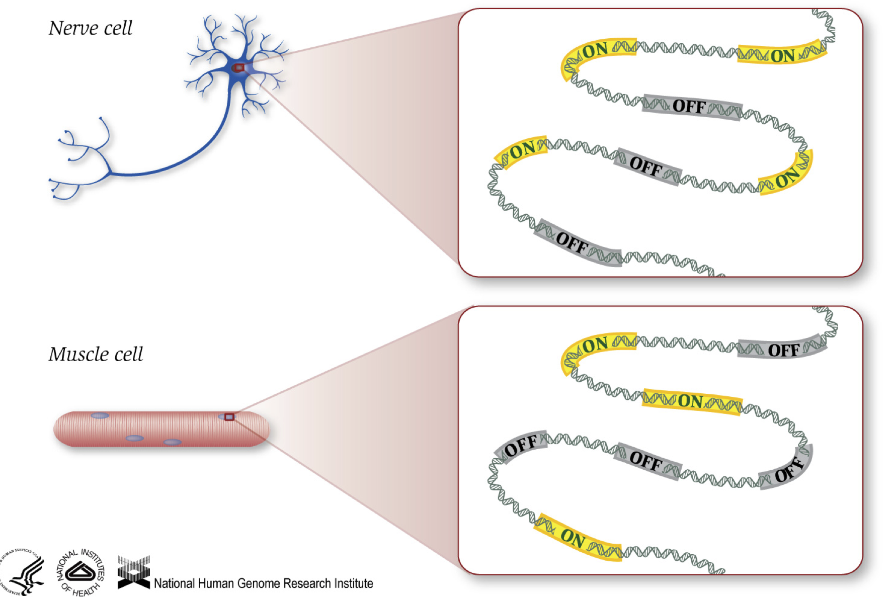
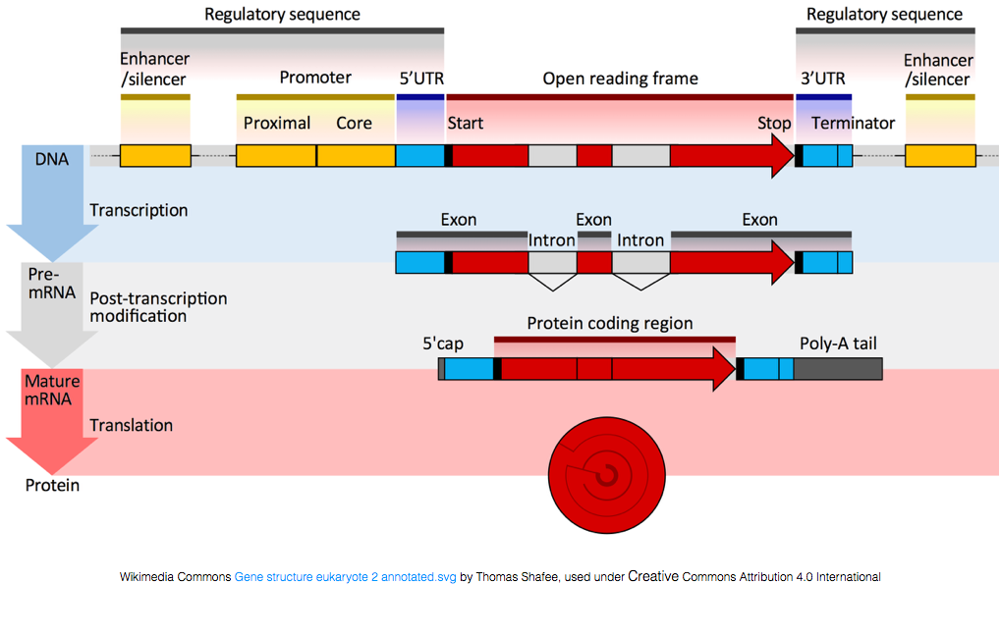
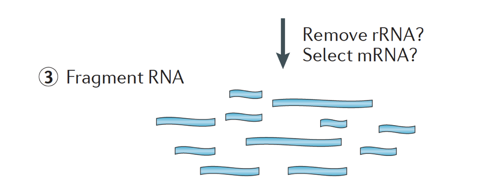
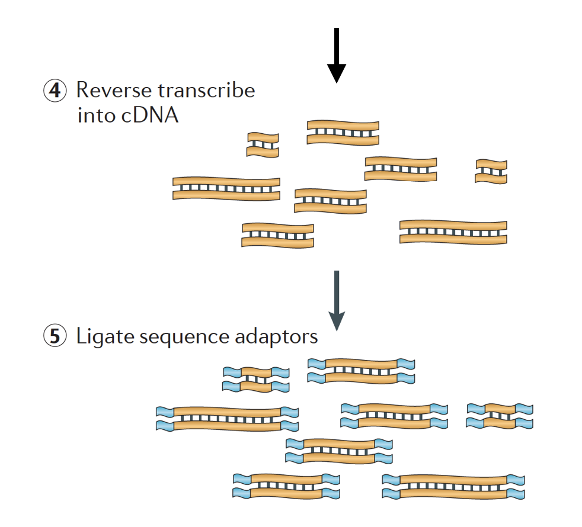
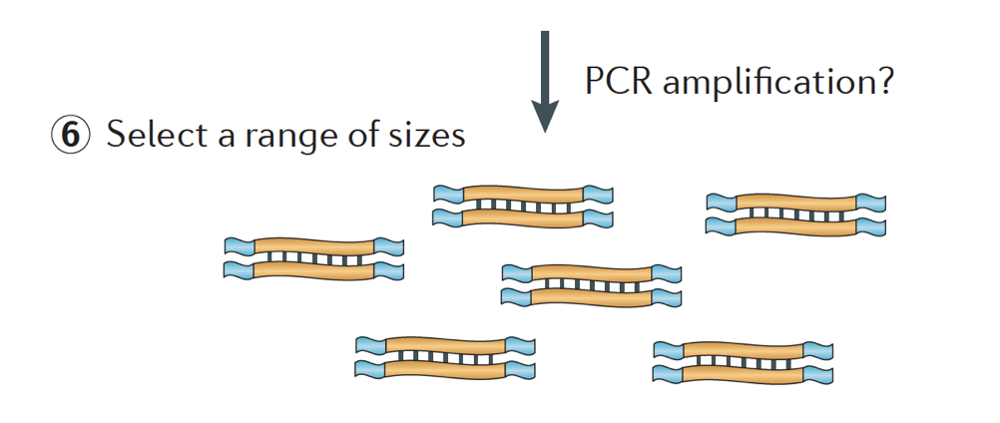

# Learning Objectives:

* Understand some applications of RNA sequencing
* Introduce the overall differential expression workflow
* Understand experimental design concepts such as replicates and batch effects 
* Understand different types of library preps, their requirements and uses. 
* Understand how sequencing works 

## Introduction to RNA-seq

RNA-seq is an exciting experimental technique that is utilized to explore and/or quantify gene expression within or between conditions. 

As we know, genes provide instructions to make proteins, which perform some function within the cell. Although **all cells contain the same DNA sequence**, muscle cells are different from nerve cells and other types of cells because of the **different genes that are turned on in these cells and the different RNAs and proteins produced**. 

Different biological processes, as well as mutations, can affect which genes are turned on and which are turned off, in addition to, *how much* specific genes are turned on/off.

To make proteins, the DNA is transcribed into messenger RNA, or mRNA, which is translated by the ribosome into protein. However, some genes encode RNA that does not get translated into protein; these RNAs are called non-coding RNAs, or ncRNAs. Often these RNAs have a function in and of themselves and include rRNAs, tRNAs, and siRNAs, among others. All RNAs transcribed from genes are called transcripts.

To be translated into proteins, the RNA must undergo processing to generate the mRNA. In the figure below, the top strand in the image represents a gene in the DNA, comprised of the untranslated regions (UTRs) and the open read frame. Genes are transcribed into pre-mRNA, which still contains the intronic sequences.  After post-transciptional processing, a 5' cap and polyA tail are added and the introns are spliced out to yield mature mRNA transcripts, which can be translated into proteins.

**While mRNA transcripts have a polyA tail, many of the non-coding RNA transcripts do not as the post-transcriptional processing is different for these transcripts.**

### Transcriptomics

The transcriptome is defined as a collection of all the transcript readouts present in a cell. RNA-seq data can be used to explore and/or quantify the transcriptome of an organism, which can be utilized for the following types of experiments:

- **Differential Gene Expression**: *quantitative* evaluation and comparison of transcript levels between conditions
- **Transcriptome assembly**: building the profile of transcribed regions of the genome, a *qualitative* evaluation
- **Refinement of gene models**: building better gene models and verifying them using transcriptome assembly
- **Metatranscriptomics**: community transcriptome analysis

#### Differential gene expression

We will be focused on the application of differential gene expression analysis for this unit. Differential gene expression analysis allows us to explore the gene expression changes that occur in disease or between different conditions, by measuring the quantity of RNA expressed by all genes in each of the different conditions. Using this analysis we can answer questions such as:

- What genes are differentially expressed between conditions?

- Are there any trends in gene expression over time or across conditions?

- Which groups of genes change similarly over time or across conditions?

- What processes or pathways are important for my condition of interest?

To perform differential gene expression analysis, we perform the following steps:

# Experimental Design 

Understanding the steps in the experimental process of RNA extraction and preparation of RNA-Seq libraries is helpful for designing an RNA-Seq experiment and important to consider when selecting a dataset to analyze. There are special considerations that should be highlighted which can greatly affect the quality of a differential expression analysis. 

These important considerations include:

1. Number and type of **replicates**
2. Avoiding **confounding** variables 
3. Addressing **batch effects**

## Replicates

Experimental replicates can be performed as **technical replicates** or **biological replicates**. 

*Image credit: [Klaus B., EMBO J (2015) **34**: 2727-2730](https://dx.doi.org/10.15252%2Fembj.201592958)*

- **Technical replicates:** use the same biological sample to repeat the technical or experimental steps in order to accurately measure technical variation and remove it during analysis. 

- **Biological replicates** use different biological samples of the same condition to measure the biological variation between samples. 

**Biological replicates are absolutely essential for differential expression analysis**. In fact, the more biological replicates, the better for estimates of biological variation and the more precise our estimates of the mean expression levels. This leads to more accurate modeling of our data and identification of more differentially expressed genes.

*Image credit: [Liu, Y., et al., Bioinformatics (2014) **30**(3): 301–304](https://doi.org/10.1093/bioinformatics/btt688)*

As the figure above illustrates, **biological replicates are of greater importance than sequencing depth**. The figure shows the relationship between sequencing depth and number of replicates on the number of differentially expressed genes identified [[1](https://academic.oup.com/bioinformatics/article/30/3/301/228651/RNA-seq-differential-expression-studies-more)]. Note that an **increase in the number of replicates tends to return more DE genes than increasing the sequencing depth**. Therefore, generally more replicates are better than higher sequencing depth, with the caveat that higher depth is required for detection of lowly expressed DE genes and for performing isoform-level differential expression. 

Replicates are almost always preferred to greater sequencing depth for bulk RNA-Seq. 

## Confounding
  
A confounded RNA-Seq experiment is one where you **cannot distinguish the separate effects of two different sources of variation** in the data. 

For example, we know that sex has large effects on gene expression, and if all of our *control* mice were female and all of the *treatment* mice were male, then our treatment effect would be confounded by sex. **We could not differentiate the effect of treatment from the effect of sex.**

  

**To AVOID confounding:**

- Ensure animals in each condition are all the **same sex, age, litter, and batch**, if possible.

- If not possible, then ensure to split the animals equally between conditions

  

## Batch effects

Batch effects are a significant issue for RNA-Seq analyses, since you can see significant differences in expression due solely to the batch effect.

*Image credit: [Hicks SC, et al., bioRxiv (2015)](https://www.biorxiv.org/content/early/2015/08/25/025528)*

### How to know whether you have batches?

- Were all RNA isolations performed on the same day and with the same kit?

- Were all library preparations performed on the same day?

- Did the same person perform the RNA isolation/library preparation for all samples?

- Did you use the same reagents for all samples?

- Did you perform the RNA isolation/library preparation in the same location?

If *any* of the answers is **‘No’**, then you have batches.

### Best practices regarding batches:

- Design the experiment in a way to **avoid batches**, if possible.

- If unable to avoid batches:

  - **Do NOT confound** your experiment by batch:

    
    
    *Image credit: [Hicks SC, et al., bioRxiv (2015)](https://www.biorxiv.org/content/early/2015/08/25/025528)*
  
  - **DO** split replicates of the different sample groups across batches. The more replicates the better!
  
    

    *Image credit: [Hicks SC, et al., bioRxiv (2015)](https://www.biorxiv.org/content/early/2015/08/25/025528)*
    
  - **DO** include batch information in your **experimental metadata**. During the analysis, we can regress out the variation due to batch so it doesn’t affect our results if we have that information.

    
  
 ***
 **Homework Assignment #7**
 
 Directions: Download the Microsoft Excel document from Brightspace. Fill out the table, as directed below, and resubmit. This homework assignment is due by Thursday, February 15th by 10am. No late work will be accepted. 
 
Your experiment has three different treatment groups, A, B, and C. Due to the lengthy process of tissue extraction, you can only isolate the RNA from two samples at the same time. You plan to have 4 replicates per group.

1. Fill in the `RNA isolation` column of the metadata table. Since we can only prepare 2 samples at a time and we have 12 samples total, you will need to isolate RNA in 6 batches. In the `RNA isolation` column, enter one of the following values for each sample: `group1`, `group2`, `group3`, `group4`, `group5`, `group6`. Make sure to fill in the table so as to avoid confounding by batch of `RNA isolation`. 

2. To perform the RNA isolations more quickly, you devote two researchers to perform the RNA isolations. Fill in their initials to the `researcher` column for the samples they will prepare: use initials `AB` or `CD`.

  | sample | treatment | sex | replicate | RNA isolation | Researcher|
  | --- | --- | --- | --- | --- |--- |
  | sample1 | A | F | 1 | 
  | sample2 | A | F | 2 |
  | sample3 | A | M | 3 |
  | sample4 | A | M | 4 |
  | sample5 | B | F | 1 |
  | sample6 | B | F | 2 |
  | sample7 | B | M | 3 |
  | sample8 | B | M | 4 |
  | sample9 | C | F | 1 |
  | sample10 | C | F | 2 |
  | sample11 | C | M | 3 |
  | sample12 | C | M | 4 |

***    

## Library preparation

 The general workflow for library preparation is detailed in the step-by-step images below.

**Briefly, the RNA is isolated from the sample and contaminating DNA is removed with DNase.**

 

**The RNA sample then undergoes either selection of the mRNA (polyA selection) or depletion of the rRNA. The resulting RNA is fragmented.** 

> Generally, ribosomal RNA represents the majority of the RNAs present in a cell, while messenger RNAs represent a small percentage of total RNA, ~2% in humans. Therefore, if we want to study the protein-coding genes, we need to enrich for mRNA or deplete the rRNA. 

 

 

> *The size of the target fragments in the final library is a key parameter for library construction. DNA fragmentation is typically done by physical methods (i.e., acoustic shearing and sonication) or enzymatic methods (i.e., non-specific endonuclease cocktails and transposase tagmentation reactions.*
 
 

 

**The RNA is then reverse transcribed into double-stranded cDNA and sequence adapters are then added to the ends of the fragments.**

> The cDNA libraries can be generated in a way to retain information about which strand of DNA the RNA was transcribed from. Libraries that retain this information are called stranded libraries, which are now standard with Illumina’s TruSeq stranded RNA-Seq kits. Stranded libraries should not be any more expensive than unstranded, so there is not really any reason not to acquire this additional information. 
> 
> There are 3 types of cDNA libraries available:
> 
> * Forward (secondstrand) – reads resemble the gene sequence or the secondstrand cDNA sequence
> * Reverse (firststrand) – reads resemble the complement of the gene sequence or firststrand cDNA sequence (TruSeq)
> * Unstranded

 

 
**Finally, the fragments are PCR amplified if needed, and the fragments are size selected (usually ~300-500bp) to finish the library.**

 

 *Image credit: [Martin J.A. and Wang Z., Nat. Rev. Genet. (2011) 12:671–682](https://www.nature.com/articles/nrg3068)*

## Strandedness 

Another consideration is whether to generate strand-preserving libraries as libraries can be either stranded or unstranded. The implication of **stranded** libraries is that one could distinguish whether the reads are derived from the forward or reverse-endoded transcripts. 

 

> Red = positive strand and Blue = negative strand 

# Illumina Sequencing

## Single-end versus Paired-end

After preparation of the libraries, sequencing can be performed to generate the nucleotide sequences of the ends of the fragments, which are called **reads**. You will have the choice of sequencing a single end of the cDNA fragments (single-end reads) or both ends of the fragments (paired-end reads).

- SE - Single end dataset => Only Read1
- PE - Paired-end dataset => Read1 + Read2
	- often are 2 separate FastQ files! 

Generally single-end sequencing is sufficient unless it is expected that the reads will match multiple locations on the genome (e.g. organisms with many paralogous genes), assemblies are being performed, or for splice isoform differentiation. Be aware that paired-end reads are generally 2x more expensive.

## Different sequencing platforms

There are a variety of Illumina platforms to choose from to sequence the cDNA libraries.

*Image credit: Adapted from [Illumina](www.illumina.com)*

Differences in platform can alter the length of reads generated, the quality of reads, as well as the total number of reads sequenced per run and the amount of time required to sequence the libraries. The different platforms each use a different flow cell, which is a glass surface coated with an arrangement of paired oligos that are complementary to the adapters added to your template molecules. **The flow cell is where the sequencing reactions take place**.

 *Image credit: Adapted from [Illumina](www.illumina.com)*
 

## Multiplexing

Depending on the Illumina platform (MiSeq, HiSeq, NextSeq), the number of lanes per flow cell, and the number of reads that can be obtained per lane varies widely. **The researcher will need to decide on how many reads they would like per sample** (i.e. the sequencning depth) and then based on the platform you choose calculate how many total lanes you will require for your set of samples. 

Typically, charges for sequencing are per lane of the flow cell and you will be able to run multiple samples per lane. Illumina has therefore devised a nice multiplexing method which allows libraries from several samples to be pooled and sequenced simultaneously in the same lane of a flow cell. This method requires **the addition of indices** (within the Illumina adapter) or special barcodes (outside the Illumina adapter) as described in the schematic below.

- **General gene-level differential expression:**

  - ENCODE guidelines suggest 30 million SE reads per sample (stranded).
  
  - 15 million reads per sample is often sufficient, if there are a good number of replicates (>3). 

  - Use of an HiSeq or NextSeq, or NovaSeq for sequencing 

---
## Citation
*This lesson has been developed by members of the teaching team at the [Harvard Chan Bioinformatics Core (HBC)](http://bioinformatics.sph.harvard.edu/). These are open access materials distributed under the terms of the [Creative Commons Attribution license](https://creativecommons.org/licenses/by/4.0/) (CC BY 4.0), which permits unrestricted use, distribution, and reproduction in any medium, provided the original author and source are credited.*  
*Authors: Mary Piper, Meeta Mistry, Radhika Khetani*  
*Other sources - https://umich-brcf-bioinf.github.io/rnaseq_demystified_workshop/site/Module3a_Design_Prep_Seq#2_Experimental_Design_and_Practicalities* 
