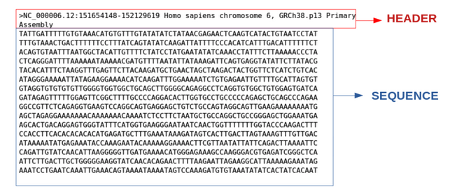
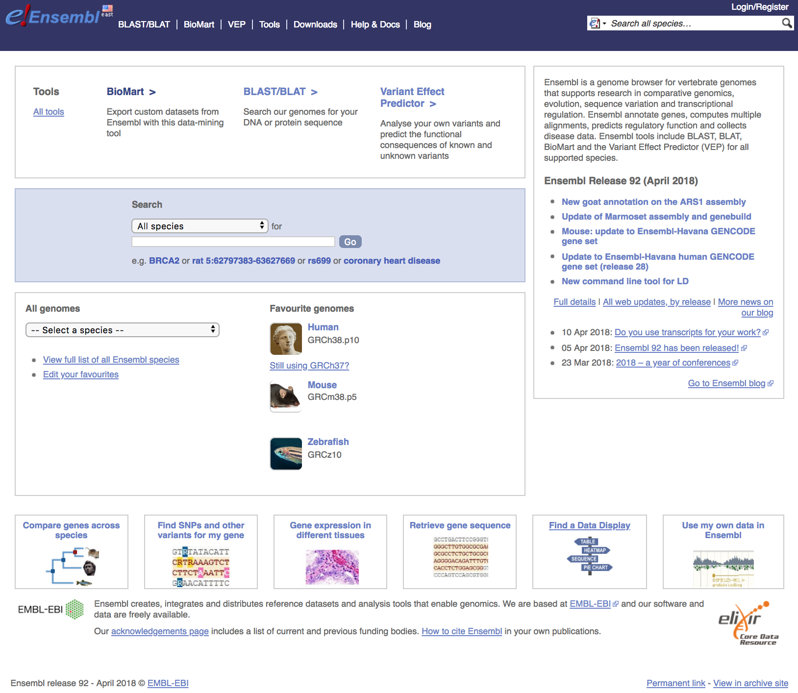

## Learning Objectives

**We spent the last few weeks introducing UNIX, navigating the file system, and working on a high performance cluster. Now we will proceed with:**

* Understand the types of data that are accessible from Gene Expression Omnibus (GEO)
* Learning how to use SRA-toolkit to retrieve data from the Sequence Reads Archive 
    + Download data from the SRA with `fastq-dump`
    + split files into forward and reverse reads 
    + Download part, not all, the data 


## Where are we heading? 

<figure markdown="span">
  { width="800"}
</figure>

## Sequence file formats 

Below is a cartoon displaying the (3) file types required to perform an RNA-Seq analysis. 

  + FASTQ files will contain the raw sequence reads
  + The reference genome will be in the form of a FASTA file
  + Gene annotations will be in the form of a GTF file 

<figure markdown="span">
  { width="600"}
</figure>


### FASTA
During an NGS experiment, the nucleotide sequences stored inside the raw FASTQ files, or "sequence reads", need to be mapped or aligned to the reference genome to determine from where these sequences originated. Therefore, we need a reference genome (in FASTA format) in which to align our sequences.

<figure markdown="span">
  { width="600"}
</figure>

### GTF 
In addition, many NGS methods require knowing where known genes or exons are located on the genome in order to quantify the number of reads aligning to different genome features, such as exons, introns, transcription start sites, etc. These analyses require reference data containing specific information about genomic coordinates of various genomic “features”, such as gene annotation files (in GTF, GFF, etc.). 

<figure markdown="span">
  { width="800"}
</figure>

### FASTQ 
These are the extension of FASTA files which contain quality scores and are output from the NGS technologies. 

## Downloading file formats 

To find and download NGS experimental data and associated reference data we will explore a few key repositories. For **finding reference data**, we will navigate the [Ensembl database](http://useast.ensembl.org/index.html). For **accessing experimental data**, we will explore the [Gene Expression Omnibus](https://www.ncbi.nlm.nih.gov/geo/) and the [Sequence Read Archive](https://www.ncbi.nlm.nih.gov/sra) repositories. 

- **General biological databases:** Ensembl, NCBI, and UCSC
- **Organism-specific biological databases:** Wormbase, Flybase, Cryptodb, etc. (often updated more frequently, so may be more comprehensive)

*Note that these reference data sources are relevant to most types of genomic analyses not just NGS analyses.

### General biological databases

Biological databases for gene expression data store genome assemblies and provide annotations regarding where the genes, transcripts, and other genomic features are located on the genome. 

Genome assemblies give us the **nucleotide sequence of the reference genome**. Although the Human Genome Project was "completed" in 2003, small gaps in the sequence remained (estimated 1% of gene-containing portions). As technology improves and more genomes are sequenced, these gaps are filled, mistakes are corrected and alternate alleles are provided. Therefore, every several years a **new genome build** is released that contains these improvements. 

The **current genome build** is GRCh38/hg38 for the human, which was released in 2013 and is maintained by the Genome Reference Consortium (GRC). 

<figure markdown="span">
  { width="600"}
</figure>


Usually the biological databases will include the updated versions as soon as they are stably released, in addition to access to archived versions.

Genome databases incorporate these genomes and generate the gene annotations with the following **similarities/differences**:

- **Ensembl, NCBI, and UCSC** all use the **same genome assemblies or builds** provided by the GRC
	- GRCh38 = hg38; GRCh37 = hg19

- Each biological database **independently determines the gene annotations**; therefore, gene annotations between these databases can differ, even though the genome assembly is the same. Naming conventions are also different (chr1=1) between databases.

- **Always use the same biological database for all reference data!**

### Ensembl

[*Ensembl*](http://useast.ensembl.org/index.html) provides a website that acts as a **single point of access to annotated genomes** for vertebrate species. For all other organisms there are additional Ensembl databases available through [Ensembl Genomes](http://ensemblgenomes.org/); however, they do not include viruses (NCBI does).

- Genome assemblies/builds (reference genomes)
	- New genome builds are released every several years or more depending on the species
	- Genome assemblies are updated every two years to include patches, or less often depending on the species

- Gene annotations
	- Gene annotations are created or updated using a variety of sources (ENA, UniProtKB, NCBI RefSeq, RFAM, miRBase, and tRNAscan-SE databases)
	- Automatic annotation is performed for all species using identified proteins and transcripts
	- Manual curation by the HAVANA group is performed for human, mouse, zebrafish, and rat species, providing better confidence of transcript annotations
	- Directly imports annotations from FlyBase, WormBase and SGD

### Using the Ensembl genomic database and genome browser

Navigate to the [Ensembl website](http://useast.ensembl.org/index.html) to view the interface. The homepage for Ensembl has a lot to offer, with the a lot of information and access to a range of functionality and tools.

<figure markdown="span">
  { width="800"}
</figure>

- **Searching Ensembl**:  Look for a gene, location, variant and more using the search box on the homepage or the box that is provided in the top right corner of any Ensembl page.

	- a gene name (for example, BRCA2) - best to use the official gene symbols ([HGNC](http://www.genenames.org))
	- a UniProt accession number (for example, P51587)
	- a disease name (for example, coronary heart disease)
	- a variation (for example, rs1223)
	- a location - a genomic region (for example, rat X:100000..200000)
	- a PDB ID or a Gene Ontology (GO) term

	Most search results will take you to the appropriate Ensembl view through a results page. These linked pages will allow you to **download information/sequences for specific genes/transcripts/exons/variants**. If you search using a location you will be directed straight to the location tab (this tab provides a view of a region of a genome). 

- **Ensembl identifiers**: When using Ensembl, note that it uses the following format for biological identifiers:
	
    - **ENSG###########:**	Ensembl Gene ID
    - **ENST###########:**	Ensembl Transcript ID
    - **ENSP###########:**	Ensembl Peptide ID
    - **ENSE###########:**	Ensembl Exon ID
	
    For non-human species a suffix is added:

    - **ENSMUSG###:** MUS (Mus musculus) for mouse 
    - **ENSDARG###:** DAR (Danio rerio) for zebrafish

- **Downloading reference data from Ensembl**: Go to Downloads, then click FTP Download on the left side bar. 

<figure markdown="span">
  { width="800"}
</figure>

*** 
!!! example "Class Exercise" 

    Amanda is an graduate student studying optimal breeding practices for cattle. They are interested in investigating transcriptional differences in cattle raised in tropical versus temperate conditions. To do this, Amanda needs to download the Bos taurus FASTA file to set up their pipeline on the VACC. Amanda comes to you for help. How would you download the Bos taurus FASTA file from Ensembl to be used on the VACC?

***

## Gene Expression Omnibus (GEO)

GEO is a database for curated functional genomics data, including gene expression datasets from microarrays, RNA-Seq, and other transcriptomic studies. It stores processed and analyzed data, such as gene expression matrices and differential expression results. This database provides access to data for tens of thousands of studies as it is a requirement for publication. For datasets containing sequencing data, GEO often links to the Sequence Read Archive (SRA) (also maintained by NCBI). Users can access the SRA database to download raw sequencing data files in the FASTQ format. 

To download FASTQ from GEO, you need the following: 

1) A list of accession numbers (SRRXXXXXX format) for the files to download using **Run Selector**
2) Knowledge of how to access and use `fastq-dump` 
3) An understanding of how to submit a script using **SLURM** batch system 


### Finding GEO data for a particular publication

**The publication will provide the GEO accession number.** Let's find the data associated with the paper, "MOV10 and FRMP regulate AGO2 association with microRNA recognition elements". First, we can navigate to the [article](https://www.ncbi.nlm.nih.gov/pmc/articles/PMC4268400/).

<figure markdown="span">
  { width="600"}
</figure>

We can search for the term **"GEO"**; different papers have different requirements for where this information is located. In this article, it is available in a separate section called **Accession Numbers**.

<figure markdown="span">
  { width="600"}
</figure>


By clicking on the GEO accession number for the experiment of interest, the GEO page for this experiment will open.

**Please Note: Many paper have multiple GEO accession numbers. Each will correspond to a specific dataset**  

<figure markdown="span">
  { width="700"}
</figure>

The GEO page contains information about the experiment, including:
	
  - an experimental summary: gives you an understanding of *how* the experiment was performed. 
  - literature citation
  - contact information
  - links to the Sample GEO pages: each sample will have its own page with additional information regarding how the sample was generated and analyzed 
  - link to the SRA project containing the raw FASTQ files


In addition, if we were interested in **downloading the raw counts matrix (`GSE50499_GEO_Ceman_counts.txt.gz`)**, which gives the number of reads/sequences aligning to each gene we could scroll down to **supplementary data** at the bottom of the page. 

<figure markdown="span">
  { width="600"}
</figure>

***

## Downloading data from SRA 

The Sequence Read Archive (SRA) is an archive for high throughput sequencing data, publicly accessible, for the purpose of enhancing reproducibility in the scientific community.

There are four hierarchical levels of SRA entities and their accessions:  

1. **STUDY** with accessions in the form of SRP, ERP, or DRP  
2. **SAMPLE** with accessions in the form of SRS, ERS, or DRS  
3. **EXPERIMENT** with accessions in the form of SRX, ERX, or DRX  
4. **RUN** with accessions in the form of SRR, ERR, or DRR

The minimum publishable unit in the SRA, is an EXPERIMENT (SRX)

<figure markdown="span">
  { width="600"}
</figure>

Since most studies include multiple samples and a high number of replicates, it is useful to know how to download all the sequencing runs from all samples in a study, without having to hunt down and type in individual SRR numbers one by one. Using the study accession number as previously shown, we can navigate to the summary page for the study. 

<figure markdown="span">
  { width="600"}
</figure>


Towards the bottom of the page you will find a link for **SRA** under the heading **Relations**.

<figure markdown="span">
  { width="600"}
</figure>

Clicking on this link takes you to a page listing all the biological samples for the study, each with links to their specific sequencing runs and files. If we were only interested in one sample, we could follow the relevant link and find its associated sequencing runs. However, since we typically need files for multiple samples and their replicates, we will use **Run Selector** to obtain a comprehensive list. 


To do this, scrolls to the bottom of the page and click **Send to**, select the radio button for **Run Selector**, and then press **Go**.

<figure markdown="span">
  { width="600"}
</figure>

***

## Run selector

You'll notice that the run selector has aggregated all the information for the study samples, including a table of metadata at the top, giving information on: 
 
  + LibraryLayout - whether the reads were sequenced using single or paired end sequencing
  + Platform - which sequencing technology was used 
  + Organism 
  + Instrument 
  + Cell type/ tissue type
  ... and other useful information that should be noted for downstream analysis.

<figure markdown="span">
  { width="600"}
</figure>

Below this there is also a summary line detailing the total number of runs in the study. Let's pause here. Notice that every sample (ex. GSM1220262, GSM1220263, etc.) has two Run accession numbers associated with it. 

<figure markdown="span">
  { width="600"}
</figure>


To fully understand what this means, we need to go back to the [sample](https://www.ncbi.nlm.nih.gov/sra?term=SRX342247) page for a sample. Notice that this sample was submitted for sequencing either twice or on two separate lanes.

<figure markdown="span">
  { width="400"}
</figure>

Therefore, for a single sample, there will be double the amount of sequencing files to process. 

<figure markdown="span">
  { width="400"}
</figure>

It is on this page that we can download the **Metadata** and **Accession List** in text format. 
  
  + The **Metadata** is a very useful text summary of all metadata for all runs in the study
  + The **Accession List** is a list of all the SRR accession numbers for the study. We will need this list to download the FASTQ files using the script below. 

***

## SRA-Toolkit

The SRA Toolkit is a set of utilities developed by the National Center for Biotechnology Information (NCBI) for accessing data in the Sequence Read Archive (SRA), a database that stores raw sequencing data from various high-throughput sequencing platforms. The toolkit provides command-line tools for downloading, manipulating, and converting sequencing data stored in the SRA format, making it easier for researchers to work with large-scale genomic data. It's widely used in bioinformatics and genomics research for tasks such as sequence alignment, quality control, and data analysis.

### `fastq-dump` 
`fastq-dump` is a command-line tool included in the SRA Toolkit developed by the National Center for Biotechnology Information (NCBI). It's used to extract data from the Sequence Read Archive (SRA) and convert it into the FASTQ format, which is a standard file format used to store biological sequences and their corresponding quality scores from high-throughput sequencing experiments.

When you download sequencing data from the SRA using `fastq-dump`, it retrieves the raw sequencing reads along with quality information and saves them into one or more FASTQ files, making it easier for researchers to perform downstream analyses such as alignment, assembly, and variant calling. `fastq-dump` is a crucial tool in bioinformatics pipelines for processing sequencing data stored in the SRA.

***

### Using `fastq-dump` with the Environmental Module System 

We would like to run the program `fastq-dump` to download the fastq files. Let's type the following command: 

```bash
fastq-dump --help
```
If this does not work it means that this program `fastq-dump` is not available in your current environment. However, a great work-around to downloading and configuring programs yourself is to first check if they are available as library packages through the Environmental Module System found within the VACC. 

Environmental Modules provide a convenient way for VACC users to load and unload packages. These packages are maintained and updated by the VACC. 
The following commands are necessary to work with modules: 

| Module commands | description |
|:---------:|:---------:|
| `module avail` | List all available software modules|
| `module load` | Loads the named software module|
| `module list` | Lists all the currently loaded modules | 
| `module unload` | Unload a specific module |
| `module purge` | Unload all loaded modules |
| `module help` | Displays general help/information about modules |

**Note:**Before using software, we have to load the software. You will have to load the software every time you would like to use it. 

Let's begin: 

```bash
module load gcc/13.3.0-xp3epyt
module load sratoolkit/3.0.0-y2rspiu
```

Once a module for a tool is loaded, you have essentially made it directly available to you like any other basic shell command. We can check using the following command: 

```bash
module list
```

```
Currently Loaded Modules:
  1) gmp/6.2.1-ip3t4a7    3) mpc/1.3.1-dv3gprk       5) zstd/1.5.6-apl64xw   7) sratoolkit/3.0.0-y2rspiu
  2) mpfr/4.2.1-344sqki   4) zlib-ng/2.1.6-ibq6yfi   6) gcc/13.3.0-xp3epyt
```


The SRAToolKit contains the program called `fastq-dump`. We would like to use this program to download FASTQ files. 

```bash
fastq-dump  --help
```

```bash
Usage:
  fastq-dump [options] <path> [<path>...]
  fastq-dump [options] <accession>

INPUT
  -A|--accession <accession>       Replaces accession derived from <path> in 
                                   filename(s) and deflines (only for single 
                                   table dump) 
  --table <table-name>             Table name within cSRA object, default is 
                                   "SEQUENCE"
```

***

## Submit a job using SLURM 
Unfortunately, SRA-toolkit doesn't have its own methods for downloading multiple SRR files at once in parallel. To download multiple **SRR FASTQ** files sometimes takes hours. Lucky for us, we have a script we can run. Lets discuss how to submit a script to be run using the SLURM batch system. 

Submitting a job to an HPC machine is done using a workload manager called SLURM (Simple Linux Utility for Resource Management). SLURM handles job scheduling, resource allocation (nodes, processors, memory, GPUs), and job monitoring. Jobs can be put in queue and then run as resources become available.

The basic steps you will follow include: 

1. Log into VACC
2. Write job script 
3. Submit job 
4. Monitor job and wait for it to run
5. Retrieve your output 

A job script can be created using any text editor - such as Nano or Vim - or any GUI editor you may want to download. 

To use the SLURM job scheduler, it requires **SLURM directives**. 

### SLURM Directives 

At the top of the job script will always be several lines that start with #SBATCH. The SLURM directives provide the job setup information used by SLURM, including resources to request. This information is then followed by the commands to be executed in the script. 

Let's create our first job script.

```bash
nano test_job.sh
```

We need to have a shebang line at the beginning of the script to specify the file is a shell script. 

```bash
#!/bin/sh
```

Next lets add the SLURM directives which must precede the executable section in your script.

```bash
# Run on the general partition 
#SBATCH --partition=general

# Request one node
#SBATCH --nodes=1

# Request one task
#SBATCH --ntasks=1

# Request 4GB of RAM
#SBATCH --mem=4G

# Run for a maximum of 30 minutes
#SBATCH --time=30:00

# Name of the job
#SBATCH --job-name=fastq

# Name the output file 
#SBATCH --output=%x_%j.out

# Set email address for notifications 
#SBATCH --mail-user=netid@uvm.edu

# Request email to be sent at both begin and end, and if job fails
#SBATCH --mail-type=ALL
```


### Partition
First, we will need to specify a partition. A partition refers to a group of nodes which are characterized by their hardware. Specifying a partition is optional and if not specified the default partition is bluemoon. As practice we will specify bluemoon anyways using the following line: 

```bash
#SBATCH --partition=bluemoon
```

Other Partitions: 

| Partition|  Intended Use  | Max Runtime |  
|:-----------:|:----------:|:----------:| 
|general | General computing – default partition |30 hours| 
|short | General computing with short runtime | 3 hours| 
|week | General computing with longer runtime | 7 days | 
|nvgpu| NVIDIA GPU partition | 48 hours| 

You can check partition usage using the following command: 

```bash
sinfo -p partition_name
sinfo -p general 
```

### Walltime 
Walltime is the maximum amount of time your job will run. 

Your job may run for less time than you request, but it will not run for more time than you request.

Walltime is requested with #SBATCH --time=<dd-hh:mm:ss>, where “dd” refers to day(s), “hh” to hour(s), “mm” to minute(s), and “ss” to second(s). You will replace each of these units with a two-digit numeral. Acceptable formats are: mm, mm:ss, hh:mm:ss, dd-hh, dd-hh:mm, dd-hh:mm:ss.

```bash
# requesting 30 hours of walltime (hh:mm:ss)
#SBATCH --time=30:00:00
```

### Nodes, Tasks, and Cores (CPUs)

The nodes, tasks, and core (CPU) resources you request depend on the type of job you are running. Useful terms to understand are:

    Node: A “node” is a server in the cluster. Each node has is configured with a certain number of cores (CPUs).
    Task: A “task” is a process sent to a core. By default, 1 core is assigned per 1 task.
    Core/CPU: The terms “core” and “cpu” are used interchangeably in high-performance computing.

VACC recommend's that you begin with 1 node and 2 processes. As we move forward, we will change the number of nodes required for "bigger" jobs.

```bash
# requesting 1 compute node
#SBATCH --nodes=1
# requesting 2 processes
#SBATCH --ntasks=2
```
### Mail Type

In order to receive emails, you must set what types of emails you would like to receive, using the flag --mail-type. The options include: BEGIN (when your job begins), END (when your job ends), FAIL (if your job fails), ALL. For example:

```bash
#SBATCH --mail-type=ALL
```

### JOB NAME

Job name is used as part of the name of the job log files. It also appears in lists of queued and running jobs.

Specifying a job name is not required. If you don’t supply a job name, the job ID (supplied by Slurm) is used.

However, if you do wish to specify a job name, use the --job-name flag. For example, where your job name is “myjob”:

```bash
# replace "myjob" with YOUR chosen job name
#SBATCH --job-name=myjob
```

### Job Submission
Once your job script is written, you can submit it. To submit your job, use the sbatch command with your filename. For example, where the filename is “myfilename”:

```bash
# replace "myfilename" with YOUR filename
sbatch myfilename
```

When you submit your job, Slurm will respond with the job ID. For example, where the job ID Slurm assigns is “123456,” Slurm will respond:

```
Submitted batch job 123456
```
>Note your job ID! 


### SLURM Commands 

|Command | What It Does | 
|:----------|:-----------|
|sbatch <file_name> | Submits a job, e.g., sbatch myjob | 
|scontrol show job <job_id> | Detailed information about a particular job, e.g., scontrol show job 123456 | 
|squeue | Checks status of all jobs in scheduling queue | 
|squeue -u <username> | Checks status of all jobs belonging to the named user, e.g., squeue -u usr1234 | 
|squeue --start -j <job_id> | Estimates earliest start time of a particular job, e.g., squeue --start -j 123456 | 
|squeue --start -u <username> | Estimates earliest start time of all jobs belonging to the named user, e.g., squeue --start -u usr1234 | 
|scancel -u <username> | Deletes/cancels all jobs belonging to the named user, e.g., scancel -u usr1234 | 
|scancel <job_id> | Deletes/cancels a particular job, e.g., scancel 123456| 

The first script is a loop that will go through your list of SRR's, and calls a second script at each iteration, passing it for each SRR number on the list. 

```bash
#!/bin/sh
#SBATCH --partition=general
#SBATCH --nodes=1
#SBATCH --ntasks=1
#SBATCH --mem=4G
#SBATCH --time=30:00
#SBATCH --job-name=fastq
#SBATCH --output=%x_%j.out
#SBATCH --mail-user=netid@uvm.edu
#SBATCH --mail-type=ALL

#while there are lines in the list of SRRs file
while read p
do
#call the bash script that does the fastq dump, passing it the SRR number next $
sbatch inner_script.sh $p
done <list_of_SRRs.txt
```

```bash
#!/bin/sh
#SBATCH --partition=general
#SBATCH --nodes=1
#SBATCH --ntasks=1
#SBATCH --mem=4G
#SBATCH --time=30:00
#SBATCH --job-name=fastq
#SBATCH --output=%x_%j.out
#SBATCH --mail-user=netid@uvm.edu
#SBATCH --mail-type=ALL

#for single end reads only
fastq-dump --gzip $1
```

**Estimated Memory Requirements** 

| Data Type | Memory Required (Approx.) |
|:---------:|:-------------------------:|
| Single-end small dataset (~1GB SRA file) | 4-8 GB|
| Single-end large dataset (~10GB SRA file) | 8-16 GB|
| Paired-end small dataset (~10-20GB SRA file)| 8-16 GB|
| Paired-end large dataset (~50GB SRA file)| 16-32 GB+|


To run the main script:

```bash
sbatch sra_fqdump.sh
```

### Paired end files
Unlike the standard format for paired end data, where we normally find two fastq files labelled as sample1_001.fastq and sample1_002.fastq, SRR files can be very misleading in that even paired end reads are found in one single file, with sequence pairs concatenated alongside each other. Because of this format, paired files need to be split at the download step. SRA toolkit has an option for this called "--split-files". By using this, one single SRR file will download as SRRxxx_1.fastq and SRRxxx_2.fastq.

Furthermore, there is a very helpful improvement on this function called "--split-3" which splits your SRR into 3 files: one for read 1, one for read 2, and one for any orphan reads (ie: reads that aren't present in both files). This is important for downstream analysis, as some aligners require your paired reads to be in sync (ie: present in each file at the same line number) and orphan reads can throw this order off. Change the inner_script.sh as follows if your reads are paired end:

```bash
#!/bin/sh
#SBATCH --partition=general
#SBATCH --nodes=1
#SBATCH --ntasks=1
#SBATCH --mem=4G
#SBATCH --time=30:00
#SBATCH --job-name=fastq
#SBATCH --output=%x_%j.out
#SBATCH --mail-user=netid@uvm.edu
#SBATCH --mail-type=ALL

#splits paired read sra files into two normal fastq files plus a third for any orphaned reads, to keep paired files in sync
fastq-dump --split-3  $1
```

*** 
!!! example "Class Exercise" 

    1. To check that you are able to download fastq files using the scripts above, please download the `SRR_download` folder: 

    ```bash
    /gpfs1/cl/mmg3320/course_materials/SRR_download
    ```
    
    2. Run the `sra_fqdump.sh` script
    
    3. If this ran successfully, you should see two new fastq files and an email in your inbox. 

    ```bash
    SRR25462427.fastq.gz
    SRR25462429.fastq.gz
    ```

    4. Check their sizes to see that SRR25462396 is 3.2MB and SRR25462427 is 4.6MB. 

    5. When you are finished show me your laptop. 


***

### Bypassing storage issues with /scratch  
When downloading large datasets to the server, it’s important to consider storage limits. If you download files to your home directory, the maximum storage allowed is 100GB. This can become an issue when handling tens or hundreds of FASTQ files because SRA-Toolkit does not download FASTQ files directly. Instead, it first writes an intermediate cache file of equal size, which is not automatically removed. As a result, you may quickly run into storage errors, causing incomplete downloads and error messages in your log file.

To avoid this, use the scratch space on the VACC (/scratch). This location has a much larger storage limit (12TB) and is better suited for handling large downloads.


## Summary of Header Lines 

|Header Line| What It Does| Example| 
|:--------------------:|:--------------------:|:--------------------:|
|#SBATCH --partition=<partition_name> | Specifies partition | #SBATCH --partition=short or #SBATCH --partition=dggpu | 
|#SBATCH --nodes=<n> | Requests number of nodes (n) | #SBATCH --nodes=1 |
|#SBATCH --ntasks=<n> | Requests number of processes to run | #SBATCH --ntasks=4 | 
|#SBATCH --gres=gpu:<n> | Requests GPUs | #SBATCH --gres=gpu:1 | 
|#SBATCH --mem=<amount> | Requests memory for the entire job | #SBATCH --mem=24G | 
|#SBATCH --mem-per-cpu=<amount> | Requests memory for the entire job | #SBATCH --mem-per-cpu=1G | 
|#SBATCH --time=<dd-hh:mm:ss> | Requests amount of time needed for job. Acceptable formats are: mm, mm:ss, hh:mm:ss, dd-hh, dd-hh:mm, dd-hh:mm:ss| #SBATCH --time=01:00:00|  
|#SBATCH --job-name=<jobname> | Sets job name | #SBATCH --job-name=myjob | 
|#SBATCH --mail-user=<youremail@uvm.edu> | Sets email address where status emails are sent | #SBATCH --mail-user=usr1234@uvm.edu | 
|#SBATCH --mail-type=<type> | Requests that a status email be sent. Options include: NONE, BEGIN, END, FAIL, REQUEUE, ALL. | #SBATCH --mail-type=ALL | 
|#SBATCH --output=%x_%j.out | This command sets a custom output file name by using Slurm-assigned variables: %x = <jobname you have assigned> and %j = <job_id Slurm has assigned>| Output filed named: myjob_123456.out| 

## Citation 

*This lesson has been developed by members of the teaching team at the [Harvard Chan Bioinformatics Core (HBC)](http://bioinformatics.sph.harvard.edu/). These are open access materials distributed under the terms of the [Creative Commons Attribution license](https://creativecommons.org/licenses/by/4.0/) (CC BY 4.0), which permits unrestricted use, distribution, and reproduction in any medium, provided the original author and source are credited.*

*This lesson was developed using materials from the [Vermont Advanced Computing Center](https://www.uvm.edu/vacc). These materials are freely available.*
