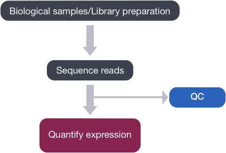

# QC with FASTQC

## Learning Objectives:

* Describe the contents and format of a FASTQ file
* Create a quality report using FASTQC
* Understand and use the environmental module system provided by the VACC 
* Create and a script to automate FASTQC on multiple files 
 
## Quality Control of FASTQ files

When working with high-throughput sequencing data, the raw reads you get off the sequencer will need to pass through a number of different tools in order to generate the final output. The first step in the RNA-Seq pipeline is to assess the quality of the sequence reads retrieved from the sequencing facility. 

<p align="center">

</p>


## Starting with FASTQ files 

The [FASTQ](https://en.wikipedia.org/wiki/FASTQ_format) file format is the defacto file format for sequence reads generated from next-generation sequencing technologies. This file format evolved from FASTA in that it contains sequence data, but also contains quality information. Similar to FASTA, the FASTQ file begins with a header line. The difference is that the FASTQ header is denoted by a `@` character. For a single record (sequence read), there are four lines, each of which are described below:

|Line|Description|
|----|-----------|
|1|Always begins with '@', followed by information about the read|
|2|The actual DNA sequence|
|3|Always begins with a '+', and sometimes the same info as in line 1|
|4|Has a string of characters representing the quality scores; must have same number of characters as line 2|

Let's use the following read as an example:

```
@HWI-ST330:304:H045HADXX:1:1101:1111:61397
CACTTGTAAGGGCAGGCCCCCTTCACCCTCCCGCTCCTGGGGGANNNNNNNNNNANNNCGAGGCCCTGGGGTAGAGGGNNNNNNNNNNNNNNGATCTTGG
+
@?@DDDDDDHHH?GH:?FCBGGB@C?DBEGIIIIAEF;FCGGI#########################################################
```

The line 4 has characters encoding the quality of each nucleotide in the read. The legend below provides the mapping of quality scores (Phred-33) to the quality encoding characters. *Different quality encoding scales exist (differing by offset in the ASCII table), but note the most commonly used one is fastqsanger, which is the scale output by Illumina since mid-2011.* 
 ```
 Quality encoding: !"#$%&'()*+,-./0123456789:;<=>?@ABCDEFGHI
                   |         |         |         |         |
    Quality score: 0........10........20........30........40                                
```
 
Using the quality encoding character legend, the first nucelotide in the read (C) is called with a quality score of 31 (corresponding to encoding character `@`), and our Ns are called with a score of 2 (corresponding to encoding character `#`). **As you can tell by now, this is a bad read.** 

Each quality score represents the probability that the corresponding nucleotide call is incorrect. This quality score is logarithmically based and is calculated as:

	Q = -10 x log10(P), where P is the probability that a base call is erroneous

These probabaility values are the results from the base calling algorithm and dependent on how much signal was captured for the base incorporation. The score values can be interpreted as follows:

|Phred Quality Score |Probability of incorrect base call |Base call accuracy|
|:-------------------:|:---------------------------------:|:-----------------:|
|10	|1 in 10 |	90%|
|20	|1 in 100|	99%|
|30	|1 in 1000|	99.9%|
|40	|1 in 10,000|	99.99%|

Therefore, for the first nucleotide in the read (C), there is less than a 1 in 1000 chance that the base was called incorrectly. Whereas, for the the end of the read there is greater than 50% probabaility that the base is called incorrectly.

## Assessing quality with FastQC

Now that we understand what information is stored in a FASTQ file, the next step is to examine quality metrics for our data.

[FastQC](http://www.bioinformatics.babraham.ac.uk/projects/fastqc/) provides a simple way to do some quality checks on raw sequence data coming from high throughput sequencing pipelines. It provides a modular set of analyses, which you can use to obtain an impression of whether your data has any problems that you should be aware of before moving on to the next analysis.

FastQC does the following:
* accepts FASTQ files (or BAM files) as input
* generates summary graphs and tables to help assess your data
* generates an easy-to-view HTML-based report with the graphs and tables

# Run FastQC  

## Environmental Module System 
We would like to run the FastQC tool on fastq files in the raw_fastq directory. However, if we were to run the following `fastqc` command now we would retrieve the following error:

```
fastqc --help

-bash: fastqc: command not found
```

This is due to the fact that this program is not available in your current environment. However, a great work-around to downloading and configuraing programs is to first check if they are available as library packages through the VACC environmental module system. 

Environmental Modules provide a convenient way for VACC users to load and unload packages. These packages are maintained and updated by the VACC. The following commands are necessary to work with modules: 

| Module commands | description |
|:---------:|:---------:|
| `module avail` | List all available software modules|
| `module load` | Loads the named software module|
| `module list` | Lists all the currently loaded modules | 
| `module unload` | Unload a specific module |
| `module purge` | Unload all loaded modules |
| `module help` | Displays general help/information about modules |

Change directories to `raw_data`.

```bash
cd raw_data
```  

Before we start using software, we have to load the module for each tool. 

If we check which modules we currently have loaded, we should not see FastQC.

```bash
module list
```

Let's load fastqc 

```bash
module load fastqc-0.11.7-gcc-7.3.0-vcaesw7
```

Once a module for a tool is loaded, you have essentially made it directly available to you like any other basic shell command.

```bash
module list
```

Now, let's create a directory to store the output of FastQC:

```bash
mkdir fastqc
```

We will need to specify this directory in the command to run FastQC. How do we know which argument to use?

```bash
fastqc --help
```

> **NOTE:** From the help manual, we know that `-o` (or `--outdir`) will create all output files in the specified output directory.

FastQC will accept multiple file names as input, so we can use the `*.fq` wildcard.

```bash
fastqc -o fastqc/ *.fq
```

***

** Class Activity**

For this script, you are only running fastqc on data that has been sequenced for one chromosome ... not the entire genome. Therefore, running fastqc will take a lot longer later on! 
Generate a script that will help you perform FASTQC on all fastq files within the `raw fastq` directory. Once you have completed your script, submit! 

Running parameters:
+ 10G of memory is required
+ 1 node, 2 tasks 
+ use a unique job name 

***

---
*This lesson has been developed by members of the teaching team at the [Harvard Chan Bioinformatics Core (HBC)](http://bioinformatics.sph.harvard.edu/). These are open access materials distributed under the terms of the [Creative Commons Attribution license](https://creativecommons.org/licenses/by/4.0/) (CC BY 4.0), which permits unrestricted use, distribution, and reproduction in any medium, provided the original author and source are credited.*

* *The materials used in this lesson was derived from work that is Copyright © Data Carpentry (http://datacarpentry.org/). 
All Data Carpentry instructional material is made available under the [Creative Commons Attribution license](https://creativecommons.org/licenses/by/4.0/) (CC BY 4.0).*
