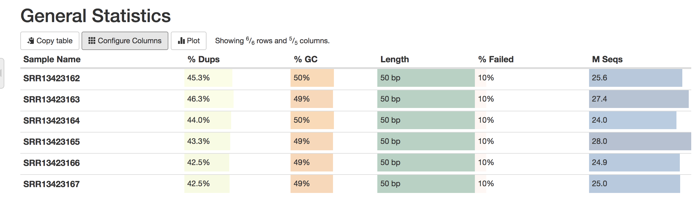
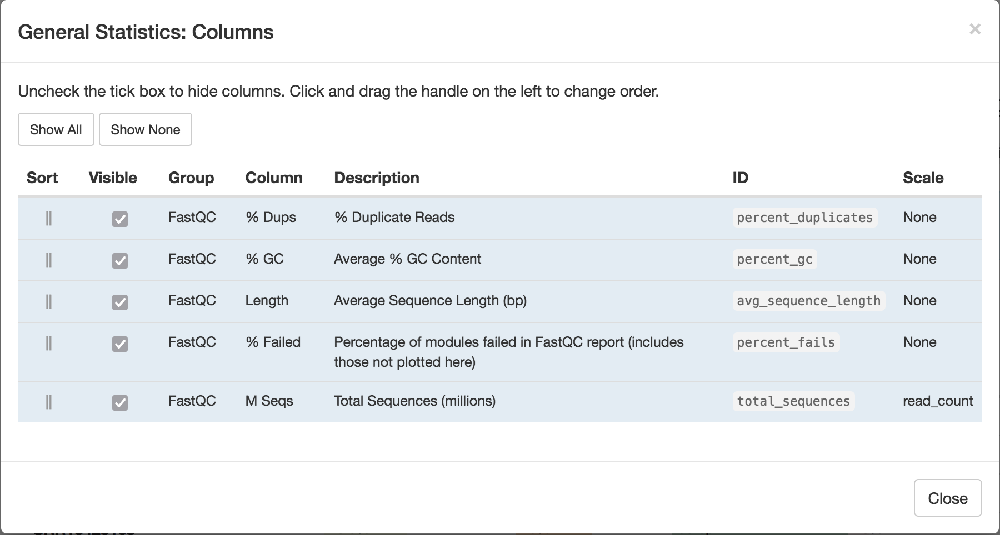
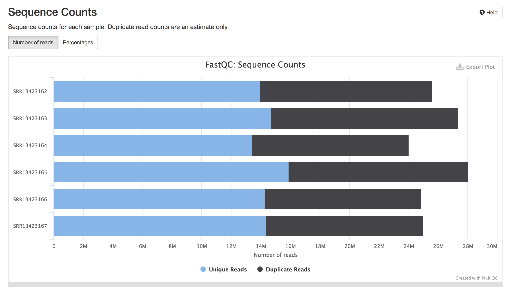
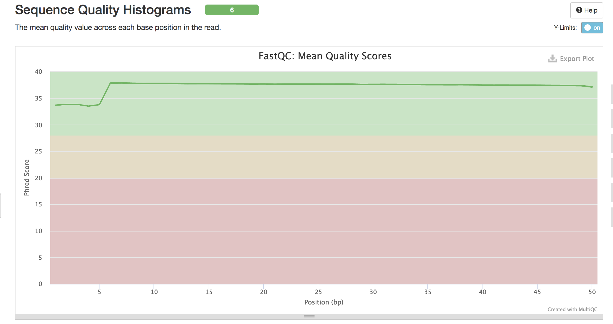
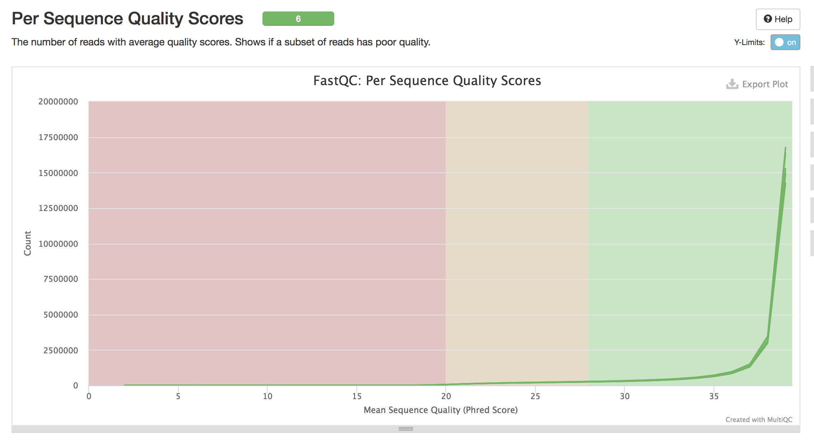
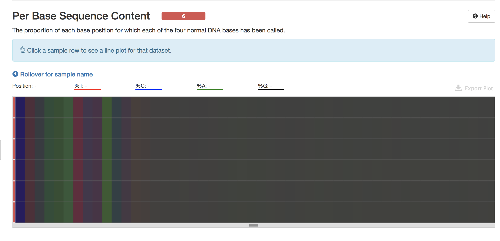
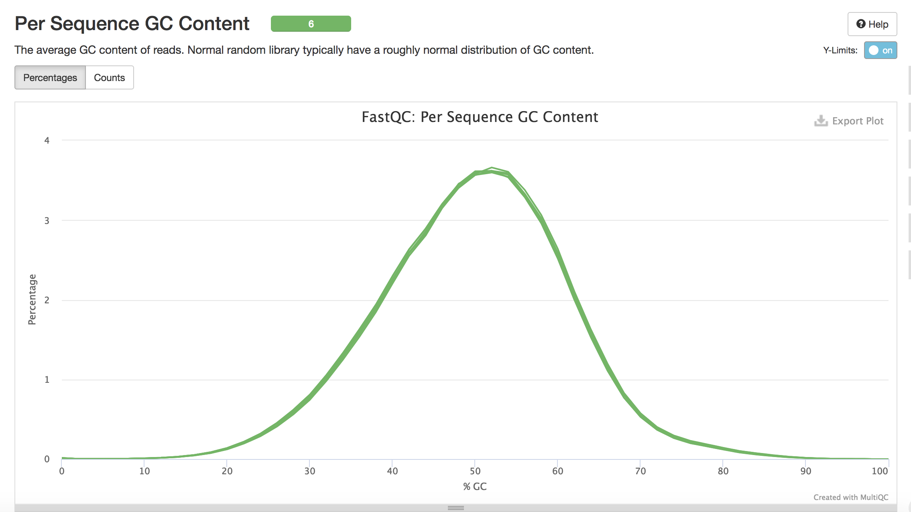
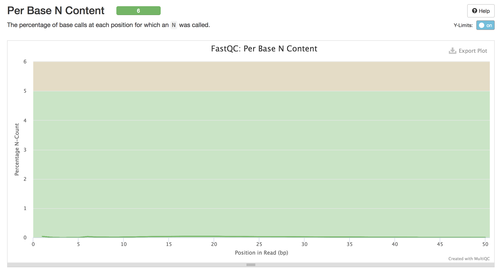
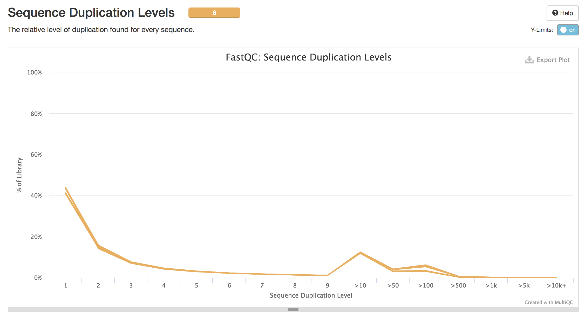
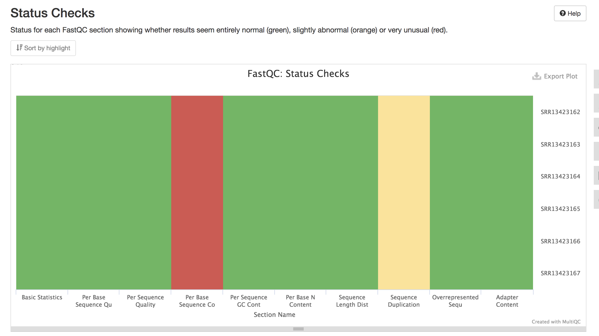

# Multiqc - flipped classroom 

## Learning Objectives
* Run the multiQC tool to gather QC metrics from multiple tools for all samples
* Assess and compare QC metrics among samples

## Documenting results and gathering QC metrics

As you go through the RNA-seq workflow (or any data analysis workflow), it is important to document the parameters you used for running the analysis. In addition, it is also very important to document the metrics/results at every step. 

As practice, you will be performing MULTIQC at two points: 
1. After downloading the FASTQC files from GEO (Homework #8). This will contain an aggregated report from FASTQC only. 
2. Then again after performing alignment (Homework #9). This will contain results from FASTQC & HISAT2 or STAR (depending on the aligner selected). 

Careful evaluation of metrics is a form of QC, and it will enable you to identify any issues with the data and/or the parameters you are using, as well as alert you to the presence of contamination, etc.  

There are several metrics you can evaluate in the RNA-seq workflow, these are discussed below using the program MULTIQC. MultiQC is able to make a report from the output of many different tools (for RNA-seq analysis and other NGS workflows) and it is able to combine the information for multiple samples.

**Class Exercise**

Today, you will be working on this exercise for the first 20 minutes of class. Your objective will be to: 

1. Download the data. These data are in the form of a `.zip` file output from FASTQC. These files are located on the shared drive: 

    ```
    /gpfs1/cl/mmg232/course_materials/multiqc_exercise
    ```

2. Once downloaded, you will see three folders each containing `.zip` files from individual projects. Run Multiqc for each of these projects. 

    ```
    Exercise1_GEO_data  Exercise2_Crypto_data  Exercise3_patient_data
    ```

3. View and interpret the multiqc results for each project using the metrics below. After the ~20 mins we will come back and discuss the results as a group. 

### Short description of datasets: 

Exercise1_GEO_data: 6 RNAseq samples downloaded from this [paper](../materials/Shan.et.al_tcf1_left1.pdf) 
https://www.ncbi.nlm.nih.gov/geo/query/acc.cgi?acc=GSE164713

```
GSM5017674 	WT CD8 RNAseq rep1
GSM5017675 	WT CD8 RNAseq rep2
GSM5017676 	WT CD8 RNAseq rep3
GSM5017677 	Tcf1/Lef1-deficient CD8 RNAseq rep1
GSM5017678 	Tcf1/Lef1-deficient CD8 RNAseq rep2
GSM5017679 	Tcf1/Lef1-deficient CD8 RNAseq rep3
```

Exercise2_Crypto_data: unpublished data, RNA-Seq, looking to understand the transcriptional changes occuring in the parasite Cryptosporidium in response to varying anticryptosporidial drugs. DMSO=control, EC90 = drug. 

Exercise3_patient_data: unpublished data, RNA-Seq, multiple myeloma cells with and without treatment 


## Assessing the quality control metrics

The main metrics to explore first are:

* percent duplicates 
* percent GC 
* legth 
* percent failed 
* total sequences (millions)

> Note: If you don't see exact columns as ours, you may need to configure the columns, which is a button just underneath the 'General Statistics' heading. 

<p align="center">

  </p>

Using `Configure Columns` button, we are going to choose the following columns:

<p align="center">

  </p>

In the above image, the description column is helpful in interpretating the table. For example, the total number of raw reads is given in the `M Seqs` column on the far right of the table. 

### Complexity

The complexity of the RNA-seq library can be explored with the `%Dups` column. If a large percentage of the library is duplicated, then this could indicate a library of either low complexity or over-amplification. If huge differences of `%Dups` exist between samples, this may lead to biases in the data, such as different %GC content.

GC bias could be caused by low-complexity libraries, differences in amplification, or library-specific issues. 

### Sequence Counts 

Sequence counts for each sample. Duplicate read counts are an estimate only.
See duplication section below. 

<p align="center">

  </p>

### Sequence Quality Histograms 
Notice the box-and-whisker plots are missing from the aggregated plot output from Multiqc. 

**What to look for:**  
It is normal with all Illumina sequencers for the median quality score to start out lower over the first 5-7 bases and to then rise. The average quality score will then steadily drop over the length of the read. With paired end reads the average quality scores for read 1 will almost always be higher than for read 2.

Why does the quality decrease over the read in Illumina? 
[Check out this answer](https://www.ecseq.com/support/ngs/why-does-the-sequence-quality-decrease-over-the-read-in-illumina)

<p align="center">

  </p>

### Per Sequence Quality Scores 

A plot of the total number of reads vs the average quality score over full length of that read.

**What to look for:**
The distribution of average read quality should be fairly tight in the upper range of the plot.

<p align="center">

  </p>

### Per Base Sequence Content 

Note, this plot looks very different from the FASTQC output! 

This plot reports the percent of bases called for each of the four nucleotides at each position across all reads in the file.

**What to look for:**   
With most RNA-Seq library preparation protocols there is clear non-uniform distribution of bases for the first 10-15 nucleotides; this is normal and expected depending on the type of library kit used (e.g. TruSeq RNA Library Preparation). This is totally normal for RNA-sequencing data even after removal of the adapter sequences. The random hexamer primers, which are used to generate the cDNA library from the RNA transcripts were shown to not bind completly random. This non-random binding leads to this bias in "per base sequence content" from base 1-15. RNA-Seq data showing this non-uniform base composition will always be classified as Failed by FastQC for this module even though the sequence is perfectly good.

<p align="center">

  </p>

### Per Sequence GC Content 

Plot of the number of reads vs. GC% per read. The displayed Theoretical Distribution assumes a uniform GC content for all reads.

**What to look for:**  
The expectation is that the GC content of all reads should form a normal distribution with the peak of the curve at the mean GC content for the organism sequenced. If the observed distribution deviates too far from the theoretical, FastQC will call a Fail. There are many situations in which this may occur. 
* For example, in RNA sequencing there may be a greater or lesser distribution of mean GC content among transcripts causing the observed plot to be wider or narrower than an idealized normal distribution. 
* If you have rRNA contamination in your data you may see a shifted GC content peak.

More information about the expected % GC content in an organism can be found here: 
https://www.ncbi.nlm.nih.gov/pmc/articles/PMC2909565/ 

<p align="center">

  </p>

### Per Base N Content 

Percent of bases at each position or bin with no base call, i.e. ‘N’.

**What to expect:**  
You should never see any point where this curve rises noticeably above zero. If it does this indicates a problem occurred during the sequencing run.  

<p align="center">

  </p>


### Sequence Duplication Levels 

Percentage of reads of a given sequence in the file which are present a given number of times in the file. 

**What to expect:**  
For whole genome shotgun data it is expected that nearly 100% of your reads will be unique (appearing only 1 time in the sequence data). This indicates a highly diverse library that was not over sequenced. If the sequencing output is extremely deep (e.g. > 100X the size of your genome) you will start to see some sequence duplication; this is inevitable as there are in theory only a finite number of completely unique sequence reads which can be obtained from any given input DNA sample.

In addition, when sequencing RNA there will be some very highly abundant transcripts and some lowly abundant. For example, it is not uncommon that 50 % of all reads align to the ten most highly expressed genes. The extremely high-read coverage for the particular highly expressed transcripts for RNA-seq data can easily lead to FASTQC read duplication levels of 70% or higher. Therefore, for RNA-Seq data this may be flagged as Failed by FastQC even though the duplication is expected.

<p align="center">

  </p>

### Overrepresented sequences 

Provides a list of sequences which appear more than expected in the file. Only the first 50bp are considered. A sequence is considered overrepresented if it accounts for ≥ 0.1% of the total reads.

**What to expect:**   
For RNA-Seq data it is possible that there may be some transcripts that are so abundant that they register as overrepresented sequence. It is always a good idea to BLAST these sequences, to find out what they are and if they are some sort of bacterial contaminant. 

### Adapter Content 

Cumulative plot of the fraction of reads where the sequence library adapter sequence is identified at the indicated base position. Only adapters specific to the library type are searched.

**What to expect:**     
Ideally Illumina sequence data should not have any adapter sequence present, however when using long read lengths it is possible that some of the library inserts are shorter than the read length resulting in read-through to the adapter at the 3’ end of the read. 

### Status Check 

Comprehensive view of all metrics in one plot. 

<p align="center">

  </p>

## Summary of Common issues

* Unexpected %GC for organism and/or % of each nucleotide does not remain similar across the read (except for first 10-12 bases for RNA-Seq)  
  * Probable cause(s): Contaminating sequences: different species, adapters, vector, mitochondrial/rRNA
* High level of sequence duplications
  * Probable cause(s): Low complexity library, too many cycles of PCR amplification / too little starting material
* Over-represented sequences more than 1-2%, unless expected based on experimental design
  * Probable cause(s): Contaminating sequences: adapters, vector, mitochondrial/rRNA


---
*This lesson has been developed by members of the teaching team at the [Harvard Chan Bioinformatics Core (HBC)](http://bioinformatics.sph.harvard.edu/). These are open access materials distributed under the terms of the [Creative Commons Attribution license](https://creativecommons.org/licenses/by/4.0/) (CC BY 4.0), which permits unrestricted use, distribution, and reproduction in any medium, provided the original author and source are credited.*
*Original Authors: Radhika Khetani, Mary Piper, Jihe Liu, Meeta Mistry*  

*This lesson also used materials from, "FASTQC Tutorial & FAQs", https://rtsf.natsci.msu.edu/genomics/tech-notes/fastqc-tutorial-and-faq/* 