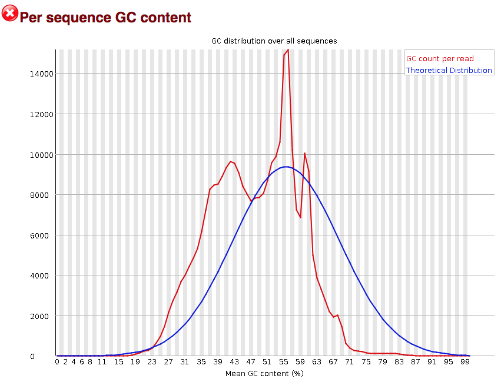
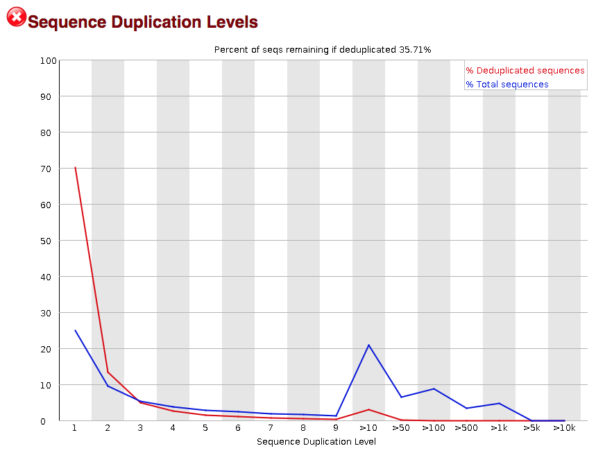

## Learning Objectives:

* Describe the contents and format of a FASTQ file
* Create a quality report using FASTQC
* Evaluate the quality of your NGS data using FastQC

## Recap: Advantages of Batch Job Submissions 

Batch job submission on an HPC (High-Performance Computing) system offers several advantages, particularly for computationally intensive tasks like bioinformatics, genomics, and large-scale data analysis.

1. **Efficient Resource Management:**
      
      + Jobs are queued and scheduled based on resource availability, ensuring optimal utilization of CPUs, memory, and GPUs.
      + Users can specify resource requirements (e.g., nodes, cores, memory) to avoid wasting computational power.

2. **Scalability:**
      
      + HPC clusters handle jobs of varying sizes, from single-threaded processes to massively parallel workloads.
      + Batch processing supports running multiple jobs concurrently, improving overall throughput.

3. **Parallel Execution:**
      
      + Batch submission allows running thousands of jobs in parallel (e.g., processing multiple sequencing samples).

4. **Job Monitoring:**
      
      + Provides insights into job status, resource usage, and debugging. 

## Looking inside of `sra_fqdump.sh`

Purpose: Is to download FASTQ files from the SRA. FASTQ files to be downloaded are listed in a text file with accession numbers provided by you! 

<figure markdown="span">
  { width="600"}
</figure>

To submit a script use the command: 

```bash
sbatch your-script.sh
```

<figure markdown="span">
  { width="600"}
</figure>

After submitting this script you will see `.out` files: 

<figure markdown="span">
  { width="600"}
</figure>

## STDOUT records the output of programs

Three data streams exist for all Linux programs: 

+ STDIN	(Standard Input - a way to send data into the program)
+ STDOUT (Standard Output - a way to send expected data out of the program)
+ STDERR	(Standard Error - a way to send errors or warnings out of the program)

## Quality Control of FASTQ files

When working with high-throughput sequencing data, the raw reads you get off the sequencer will need to pass through a number of different tools in order to generate the final output. The first step in the RNA-Seq pipeline is to assess the quality of the sequence reads retrieved from the sequencing facility. 

<figure markdown="span">
  { width="500"}
</figure>


## Starting with FASTQ files 

The FASTQ file format is the defacto file format for sequence reads generated from next-generation sequencing technologies. This file format evolved from FASTA in that it contains sequence data, but also contains quality information. Similar to FASTA, the FASTQ file begins with a header line. The difference is that the FASTQ header is denoted by a `@` character. For a single record (sequence read), there are four lines, each of which are described below:

|Line|Description|
|----|-----------|
|1|Always begins with '@', followed by information about the read|
|2|The actual DNA sequence|
|3|Always begins with a '+', and sometimes the same info as in line 1|
|4|Has a string of characters representing the quality scores; must have same number of characters as line 2|

Let's use the following read as an example:

```
@HWI-ST330:304:H045HADXX:1:1101:1111:61397
CACTTGTAAGGGCAGGCCCCCTTCACCCTCCCGCTCCTGGGGGANNNNNNNNNNANNNCGAGGCCCTGGGGTAGAGGGNNNNNNNNNNNNNNGATCTTGG
+
@?@DDDDDDHHH?GH:?FCBGGB@C?DBEGIIIIAEF;FCGGI#########################################################
```

The line 4 has characters encoding the quality of each nucleotide in the read. The legend below provides the mapping of quality scores (Phred-33) to the quality encoding characters. *Different quality encoding scales exist (differing by offset in the ASCII table), but note the most commonly used one is fastqsanger, which is the scale output by Illumina since mid-2011.* 
 ```
 Quality encoding: !"#$%&'()*+,-./0123456789:;<=>?@ABCDEFGHI
                   |         |         |         |         |
    Quality score: 0........10........20........30........40                                
```
 
Using the quality encoding character legend, the first nucelotide in the read (C) is called with a quality score of 31 (corresponding to encoding character `@`), and our Ns are called with a score of 2 (corresponding to encoding character `#`). **As you can tell by now, this is a bad read.** 

Each quality score represents the probability that the corresponding nucleotide call is incorrect. This quality score is logarithmically based and is calculated as:

	Q = -10 x log10(P), where P is the probability that a base call is erroneous

These probabaility values are the results from the base calling algorithm and dependent on how much signal was captured for the base incorporation. The score values can be interpreted as follows:

|Phred Quality Score |Probability of incorrect base call |Base call accuracy|
|:-------------------:|:---------------------------------:|:-----------------:|
|10	|1 in 10 |	90%|
|20	|1 in 100|	99%|
|30	|1 in 1000|	99.9%|
|40	|1 in 10,000|	99.99%|

Therefore, for the first nucleotide in the read (C), there is less than a 1 in 1000 chance that the base was called incorrectly. Whereas, for the the end of the read there is greater than 50% probabaility that the base is called incorrectly.

## Assessing quality with FastQC

Now that we understand what information is stored in a FASTQ file, the next step is to examine quality metrics for our data.

[FastQC](http://www.bioinformatics.babraham.ac.uk/projects/fastqc/) provides a simple way to do some quality checks on raw sequence data coming from high throughput sequencing pipelines. It provides a modular set of analyses, which you can use to obtain an impression of whether your data has any problems that you should be aware of before moving on to the next analysis.

FastQC does the following:
* accepts FASTQ files (or BAM files) as input
* generates summary graphs and tables to help assess your data
* generates an easy-to-view HTML-based report with the graphs and tables

## Running FastQC  

We would like to run the FastQC tool on fastq files in the raw_fastq directory. However, if we were to run the following `fastqc` command now we would retrieve the following error:

```bash
fastqc --help

-bash: fastqc: command not found
```

Let's load fastqc with the Environment Module System: 

```bash
module load gcc/13.3.0-xp3epyt
module load fastqc/0.12.1-qxseug5
```

Once a module for a tool is loaded, you have essentially made it directly available to you like any other basic shell command. Check to see it is loaded with: 

```bash
module list
```

Now, let's create a directory to store the output of FastQC:

```bash
mkdir fastqc
```

How do we know which argument to type to properly use `fastqc`?

```bash
fastqc --help
```

```
SYNOPSIS

	fastqc seqfile1 seqfile2 .. seqfileN

    fastqc [-o output dir] [--(no)extract] [-f fastq|bam|sam] 
           [-c contaminant file] seqfile1 .. seqfileN
```

Let's run fastqc on `Mov10_oe_1.subset.fq`

```bash
fastqc Mov10_oe_1.subset.fq
```

## FASTQC Outputs 

For each individual FASTQ file that is input to FastQC, there are **two output files that are generated**. 
   
1. The first is **an HTML file** which is a self-contained document with various graphs embedded into it. Each of the graphs evaluate different quality aspects of our data, we will discuss in more detail in this lesson. 

2. Alongside the HTML file is **a zip file** (with the same name as the HTML file, but with .zip added to the end). This file contains the different plots  from the report as separate image files but also contains data files which are designed to be easily parsed to allow for a more detailed and automated evaluation of the raw data on which the QC report is built.

!!! example "Class Exercise" 

      Run FASTQC on all FASTQ files in `raw_fastq`. FASTQC allows you to redirect your output into a specified location with the `-o` parameter. Be sure to use this parameter in your final code. 

If successful, you will see the following outputs inside of the `fastqc` folder: 

```bash
Irrel_kd_1.subset_fastqc.html  Irrel_kd_3.subset_fastqc.html  Mov10_oe_2.subset_fastqc.html
Irrel_kd_1.subset_fastqc.zip   Irrel_kd_3.subset_fastqc.zip   Mov10_oe_2.subset_fastqc.zip
Irrel_kd_2.subset_fastqc.html  Mov10_oe_1.subset_fastqc.html  Mov10_oe_3.subset_fastqc.html
Irrel_kd_2.subset_fastqc.zip   Mov10_oe_1.subset_fastqc.zip   Mov10_oe_3.subset_fastqc.zip
```

**Note:** We are running FASTQC interactively. This is running on the login node relatively quickly. This is because this alignment for these FASTQ files was only performed for a small portion of the chromosome 1. Later on, this will take a lot longer. Therefore, you will need to generate a script. 

Parameters for FASTQC: 
+ 10G of memory is required
+ 1 node, 2 tasks 


## Assessing the results from FastQC

!!! example "Class Exercise" 

      Grab the following folder from the location below. 

      ```bash
      /gpfs1/cl/mmg3320/course_materials/FASTQC_example
      ```


### Viewing the HTML report output from FASTQC 

All of the following are solutions that allow students to transfer files between remote (i.e. VACC) and local (i.e. your laptop) servers. 

1. An FTP application such as Filezilla

   <figure markdown="span">
      { width="500"}
   </figure>

2. RStudio (via VACC-OOD), you can export it or simply view it. 

   <figure markdown="span">
      { width="500"}
   </figure>

3. Using OpenOnDemand, use the "Download" button in File Explorer. 

   <figure markdown="span">
      { width="500"}
   </figure>

## Interpreting the HTML report

Now we can take a look at the metrics and assess the quality of our sequencing data!

FastQC has a really well documented [manual page](http://www.bioinformatics.babraham.ac.uk/projects/fastqc/) with [detailed explanations](http://www.bioinformatics.babraham.ac.uk/projects/fastqc/Help/) about every plot in the report. 

Within our report, a summary of all of the modules is given on the left-hand side of the report. Don't take the **yellow "WARNING"s** and **red "FAIL"s** too seriously; they should be interpreted as flags for modules to check out. 

<figure markdown="span">
  { width="200"}
</figure>

The first module gives the basic statistics for the sample. Generally it is a good idea to keep track of the total number of reads sequenced for each sample and to make sure the read length and %GC content is as expected.

<figure markdown="span">
  { width="500"}
</figure>


### Per base sequence quality

One of the most important analysis modules is the **"Per base sequence quality"** plot. This plot provides the distribution of quality scores at each position in the read across all reads. The y-axis gives the quality scores, while the x-axis represents the position in the read. The color coding of the plot denotes what are considered high, medium and low quality scores. 

This plot can alert us to whether there were any problems occuring during sequencing and whether we might need to contact the sequencing facility.

<figure markdown="span">
  { width="500"}
</figure>

For example, the box plot at nucleotide 1 shows the distribution of quality scores for **the first nucleotide of all reads** in the `Mov10_oe_1` sample. The yellow box represents the 25th and 75th percentiles, with the red line as the median. The whiskers are the 10th and 90th percentiles. The blue line represents the average quality score for the nucleotide. Based on these metrics, the quality scores for the first nucleotide are quite high, with nearly all reads having scores above 28.

The quality scores appear to drop going from the beginning toward the end of the reads. For reads generated by Illumina sequencing, this is not alarming and there are known causes for this drop in quality. 

**For Illumina sequencing, the quality of the nucleotide base calls are related to the signal intensity and purity of the fluorescent signal**. Low intensity fluorescence or the presence of multiple different fluorescent signals can lead to a drop in the quality score assigned to the nucleotide. Due to the nature of sequencing-by-synthesis there are some drops in quality that can be expected, but other quality issues can be indicative of a problem at the sequencing facility.


### Per sequence quality scores

The **"Per sequence quality scores"** plot gives you the average quality score on the x-axis and the number of sequences with that average on the y-axis. We hope the majority of our reads have a high average quality score with no large bumps at the lower quality values.

<figure markdown="span">
  { width="500"}
</figure>

  
This data has a small bump at a mean quality of 12. Since it doesn't represent a large proportion of the data, it isn't extremely worrisome, but it might be worth a quick check of the reads resulting in the poor quality scores.

### Per base sequence content

The next plot gives the **"Per base sequence content"**, which always gives a FAIL for RNA-seq data. This is because the first 10-12 bases result from the 'random' hexamer priming that occurs during RNA-seq library preparation. This priming is not as random as we might hope giving an enrichment in particular bases for these intial nucleotides. 

<figure markdown="span">
  { width="500"}
</figure>

### Per sequence GC content

The **"Per sequence GC content"** plot gives the GC distribution over all sequences. Generally is a good idea to note whether the GC content of the central peak corresponds to the [expected % GC for the organism](https://www.ncbi.nlm.nih.gov/pmc/articles/PMC2909565/). Also, the distribution should be normal unless over-represented sequences (sharp peaks on a normal distribution) or contamination with another organism (broad peak).

This plot would indicate some type of over-represented sequence with the sharp peaks, indicating either contamination or a highly over-expressed gene.

<figure markdown="span">
  { width="500"}
</figure>

### Sequence duplication

The next module explores numbers of duplicated sequences in the library. This plot can help identify a low complexity library, which could result from too many cycles of PCR amplification or too little starting material. For RNA-seq we don't normally do anything to address this in the analysis, but if this were a pilot experiment, we might adjust the number of PCR cycles, amount of input, or amount of sequencing for future libraries. In this analysis we seem to have a large number of duplicated sequences, but this is expected due to the subset of data we are working with containing the over-expression of MOV10.

<figure markdown="span">
  { width="500"}
</figure>

### Over-represented sequences

The **"Overrepresented sequences"** table is another important module as it displays the sequences (at least 20 bp) that occur in more than 0.1% of the total number of sequences. This table aids in identifying contamination, such as vector or adapter sequences. If the %GC content was off in the above module, this table can help identify the source. If not listed as a known adapter or vector, it can help to BLAST the sequence to determine the identity.

Since our data is just a subset of the original data and it contains the over-expressed MOV10 gene, if we BLAST the sequences we will find they belong to MOV10. For this experiment, these over-represented sequences are not concerning.

<figure markdown="span">
  { width="500"}
</figure>

***

## Summary

As our report only represents a subset of reads (chromosome 1) for `Mov10_oe_1.subset.fq`, which can skew the QC results. If the quality of the raw data is acceptable, we can move on to the next step and quantify gene expression.

---
*This lesson has been developed by members of the teaching team at the [Harvard Chan Bioinformatics Core (HBC)](http://bioinformatics.sph.harvard.edu/). These are open access materials distributed under the terms of the [Creative Commons Attribution license](https://creativecommons.org/licenses/by/4.0/) (CC BY 4.0), which permits unrestricted use, distribution, and reproduction in any medium, provided the original author and source are credited.*
