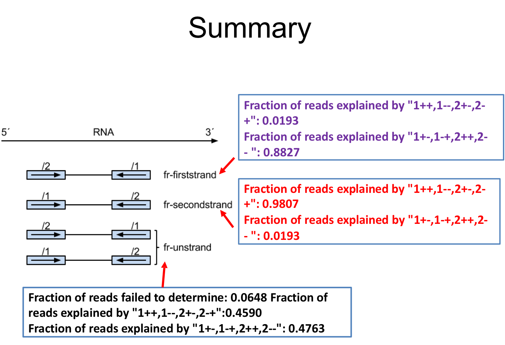

## Learning Objectives

- Discuss outputs from alignment 
- 

## Recap from last week 
We discussed alignment on FASTQ files using HISAT2 last week. Let's examine the outputs: 

```bash
align_CD8_16545144.out  SRR13423162_sorted.bam      SRR13423165_sorted.bam
multiqc_data            SRR13423162_sorted.bam.bai  SRR13423165_sorted.bam.bai
multiqc_report.html     SRR13423162.txt             SRR13423165.txt
SRR13423162.bam         SRR13423165.bam
SRR13423162.log         SRR13423165.log
```
HISAT2 produces multiple output files: 
* `.bam`: unsorted bam file
* `sorted.bam`: sorted bam file
* `.bam.bai`: index for sorted bam file 
* `.log`: log file with containing detailed information about the run. This file is most useful for troubleshooting and debugging. 


## RSeQC (Class Activity #1) 
Now that you have aligned reads in the form of a .bam file, you can proceed to perform additional QC on the BAM files. The major reason we are using this package in class is to utiltize the `infer_experiment.py` module. However, the RSeQC package offers a number of modules including evaluating sequencing saturation, mapped reads distribution, coverage uniformity, strand specificity, etc. You can read more about the package at the [RSeQC website](https://pythonhosted.org/RSeQC/).

Using `infer_experiment.py` will allow us with a way, if need be, to determine "strandedness of reads". Since everyone is reanalyzing published datasets, the authors may have provided this information to you already in the Methods section (or the GEO summary). But this doesn't always happen and its important to know this prior to counting readings with the `HTseq-count` program. 

### To install RSeQC: 

```bash
pip install RSeQC
``` 

*this will take a few minutes to install*

Test your installation: 
```bash
infer_experiment.py -h
```

If it worked you will see the following: 

```bash
Options:
  --version             show program's version number and exit
  -h, --help            show this help message and exit
  -i INPUT_FILE, --input-file=INPUT_FILE
                        Input alignment file in SAM or BAM format
  -r REFGENE_BED, --refgene=REFGENE_BED
                        Reference gene model in bed fomat.
  -s SAMPLE_SIZE, --sample-size=SAMPLE_SIZE
                        Number of reads sampled from SAM/BAM file.
                        default=200000
  -q MAP_QUAL, --mapq=MAP_QUAL
                        Minimum mapping quality (phred scaled) for an
                        alignment to be considered as "uniquely mapped".
                        default=30
```

***

### Using RSeQC (Class Activity #2) 

Files required to run `infer_experiment.py` RSeQC: 

* Aligned bam files 
* Index file for each bam file 
* A transcript bed file (in bed12 format)
	+ BED12: A BED file where chrom, start, end, name, score, thickStart, thickEnd, itemRgb, blockCount, blockSizes, and blockStarts are listed in twelve columns.
	+ For example: chr1 11873 14409 uc001aaa.3 0 + 11873 11873 0 3 354,109,1189, 0,739,1347,
	+ More information about bed12 format can be found [here](https://bedtools.readthedocs.io/en/latest/content/general-usage.html)


Step 1: Download datset for today's lesson:

```bash
/gpfs1/cl/mmg3320/course_materials/htseq_example

/gpfs1/cl/mmg3320/course_materials/RseQC_files 
```

+ One folder will contain the *bam* files 
+ The other folder will contain the *bed12* files 

Step 2: Run `infer_experiment.py`

+ Within the `htseq_example` folder run `infer_experiment.py`.
+ Use the hg38 bed12 file 
+ **Be sure to redirect the output to `unknown.log`** You will need this file for the next step.  


Step 3: Interpret the output 

+ Run multiqc within the `htseq_example` folder 
+ Is this a stranded or unstranded library? 
+ If you are using HISAT2 to perform the alignment which parameter would you consider adding? 
+ If you are using HT-Seq to count the read, what parameter would you add?

Below are images of the slides that will help you make these decisions. 

<p align="center">

</p>

<p align="center">

</p>

***

## Running HTSeq

First, you can always get more information on running HTSeq by going to the external [link](https://htseq.readthedocs.io/en/release_0.11.1/count.html). In fact, any time you are running a new program on your own, make it a habbit to find and keep the manual or website open on your screen. 

Load the HTSeq module with `module load`: 

```bash
module load py-htseq-0.11.2-gcc-7.3.0-lbzmhgz
```

Check to see that HTSeq is functional: 

```bash
htseq-count --help
```

You should the following output: 

```bash
usage: htseq-count [options] alignment_file gff_file

This script takes one or more alignment files in SAM/BAM format and a feature
file in GFF format and calculates for each feature the number of reads mapping
to it. See http://htseq.readthedocs.io/en/master/count.html for details.
```

**These are all the parameters you should be using. Take some time to read this.** 

```bash
positional arguments:
  samfilenames          Path to the SAM/BAM files containing the mapped reads. If '-' is selected,
                        read from standard input
  featuresfilename      Path to the GTF file containing the features


-f {sam,bam}, --format {sam,bam}
type of <alignment_file> data, either 'sam' or 'bam'
(default: sam)

-s {yes,no,reverse}, --stranded {yes,no,reverse}
whether the data is from a strand-specific assay.
Specify 'yes', 'no', or 'reverse' (default: yes).
'reverse' means 'yes' with reversed strand interpretation

-i IDATTR, --idattr IDATTR
GFF attribute to be used as feature ID (default, suitable for Ensembl GTF files: gene_id)

-m {union,intersection-strict,intersection-nonempty}, --mode {union,intersection-strict,intersection-nonempty}
mode to handle reads overlapping more than one feature
(choices: union, intersection-strict, intersection-nonempty; default: union)
```
***

### Class Exercise #3

Please write a script to process `unknown_sorted.bam` file into a count file. 

> Note htseq-count will take ~20 minutes to run just for this one sample. In the future, it is a good idea to create a `for loop` when you are ready to run your own samples.  

Below is **most** of the information you will need to run `htseq-count.sh`: 

+ GFF: /gpfs1/cl/mmg3320/course_materials/genome_index/GTF_files
+ -i : gene_id 
+ -m : union 
+ you will need to redirect the output to another file 
+ please take a look at all the positional arguments listed above, both should find its way into your code! 

Job Submission parameters:

```bash
#!/bin/bash
#SBATCH --partition=bluemoon
#SBATCH --nodes=1
#SBATCH --ntasks=2
#SBATCH --mem=5G
#SBATCH --time=5:00:00
#SBATCH --job-name=htseq-count
# %x=job-name %j=jobid
#SBATCH --output=%x_%j.out
```

#### Once you are done writing your script: 

+ Download the GFF file. Take a look at the first 10 lines using `head`. 
	+ If you wanted the Gene Symbol *DDX11L2* to appear instead of *ENSG00000290825.1* how would you alter your script? 

+ Show me your completed script before leaving for the day. 

***

**Have a nice spring break!**

<p align="center">

</p>

***

The for-loop to run HT-Seq on your samples for the final project is shown below. Each sample will take ~30 minutes each. 

```bash
#!/bin/bash
#SBATCH --partition=bluemoon
#SBATCH --nodes=1
#SBATCH --ntasks=4
#SBATCH --mem=10G
#SBATCH --time=30:00:00
#SBATCH --job-name=htseq-count
# %x=job-name %j=jobid
#SBATCH --output=%x_%j.out

module load py-htseq-0.11.2-gcc-7.3.0-lbzmhgz

# Iterate through all .bam files in the current directory
for bam_file in *.bam; do
    # Extract the filename without the .bam extension
    name=$(basename "$bam_file" .bam)
    echo "$name"

    # Run htseq-count with specified parameters
    htseq-count -f bam \
        -s reverse \
        -i gene_id \
        -m union \
        "$bam_file" /gpfs1/cl/mmg3320/course_materials/genome_index/GTF_files/human_gencode_v43.gtf > "$name.ENSG.count"
done

```
