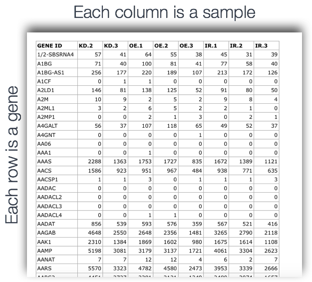
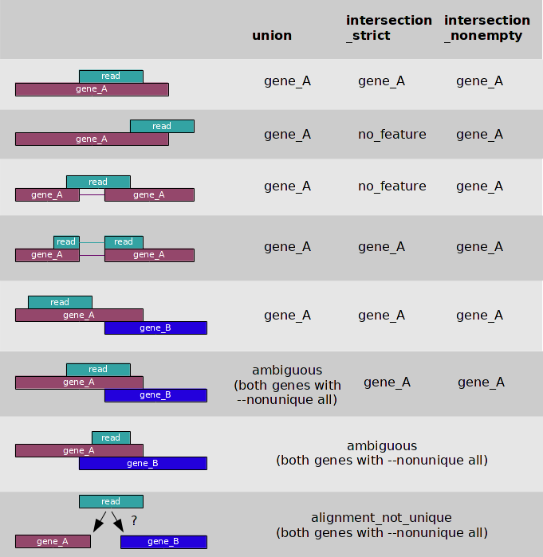
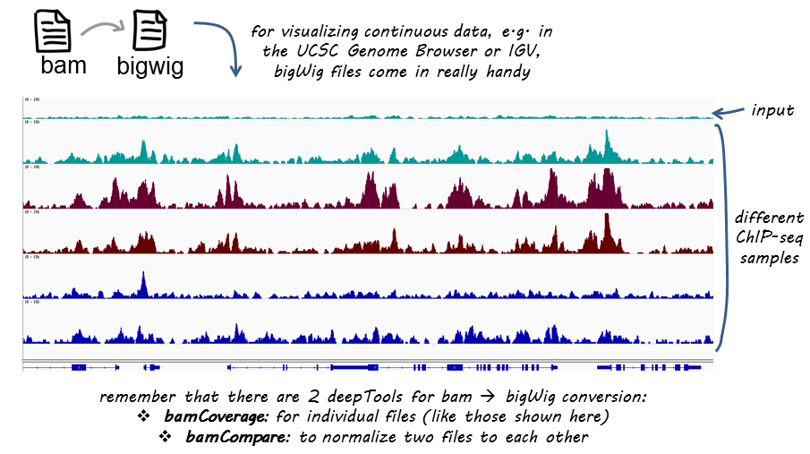
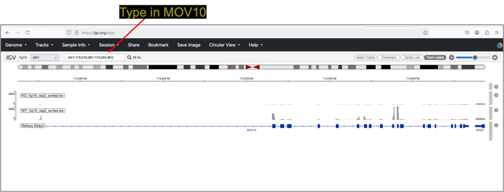

## Learning Objectives

* Conversion of BAM file to a counts file using `htseq-count`
* Conversion of BAM file to a bigWig file using `deeptools` 

## Counting reads as a measure of gene expression

Once we have our reads aligned to the genome, the next step is to count how many reads have mapped to each gene. Many tools can take BAM files as input and output the number of reads (counts) associated with each feature of interest (genes, exons, transcripts, etc.). Two commonly used counting tools are featureCounts and [htseq-count](https://htseq.readthedocs.io/en/release_0.11.1/count.html).

<figure markdown="span">
  { width="400" }
</figure>

* These tools report raw counts, meaning they only count reads that map uniquely to a single location in the genome. They are most effective for counting at the gene level. In this approach, the total read count for a gene (meta-feature) is the sum of reads assigned to each of its exons (features).

* Some other tools account for multiple transcripts per gene, assigning fractional counts instead of whole numbers. For example, if one read aligns to two transcripts, it may be counted as 0.5 for each transcript rather than a whole number.

* There are also tools that count multimapping reads, but this approach can lead to overcounting, which affects normalization and ultimately compromises the accuracy of differential gene expression analysis.

**Input for counting = multiple BAM files + 1 GTF file**

Simply speaking, the genomic coordinates of where the read is mapped (BAM) are cross-referenced with the genomic coordinates of whichever feature you are interested in counting expression of (GTF), it can be exons, genes or transcripts.

<figure markdown="span">
  { width="600" }
</figure>

**Output of counting = A count matrix, with genes as rows and samples are columns**

These are the "raw" counts and will be used in statistical programs downstream for differential gene expression. Below is a representative counts matrix. 

<figure markdown="span">
  { width="400" }
</figure>

We will begin by demonstrating the usage of HTSeq. HTSeq-count is a command-line tool used in RNA-Seq data analysis to count the number of sequencing reads that align to specific genomic features, such as genes. It is part of the HTSeq Python package and is commonly used in differential gene expression analysis pipelines.

## Basic Workflow

### Input Files:
    
  + SAM/BAM file: Contains aligned RNA-Seq reads (output from tools like HISAT2 or STAR).
  + GTF/GFF file: Contains gene annotations specifying genomic coordinates.

### Counting Reads:
  
  + HTSeq-count assigns each read to a genomic feature (usually a gene) based on predefined rules.
  + It outputs a table listing each gene and the number of reads assigned to it.

### Output:
  
  + A tab-delimited text file with two columns:
    + Gene ID
    + Read count

## Counting reads in features with `htseq-count` 

Given a file with aligned sequencing reads and a list of genomic features, a common task is to count how many reads map to each feature.

Here, a feature refers to a specific interval (i.e., a range of positions) on a chromosome or a union of such intervals.

Since our example data comes from an RNA-Seq experiment, we aim to count how many reads fall within the exonic regions of each gene. To do this, we first need information about exon positions, which can be obtained from GTF files—a common format provided by Ensembl (available here).

Special care must be taken when handling reads that align to or overlap with multiple features. The htseq-count script offers **three different modes** to handle such cases.

1. **Union (Recommended for most cases):**
   
    + A read is assigned to a feature if any part of the read overlaps with it.
    + If a read overlaps multiple features, it is not counted at all (to avoid ambiguity).

2. **Intersection-strict:**
    
    + A read is assigned to a feature only if every position of the read overlaps with that feature.
    + If a read overlaps multiple features but not completely within one, it is not counted.

3. **Intersection-nonempty:**
    
    + A read is assigned to a feature only if it overlaps with at least one feature at every position.
    + Unlike intersection-strict, it ignores positions where no features are present.

The figure below illustrates the effect of these three modes: 

<figure markdown="span">
  { width="400" }
</figure>


## Running `htseq-count`

Begin by loading the `htseq-count` module with `module load`

```bash
module load gcc/13.3.0-xp3epyt 
py-htseq/2.0.3-mb7ap7s
```

Run the following to check the module is loaded: 

```bash
htseq-count --help
```

```
usage: htseq-count [-h] [--version] [-f {sam,bam,auto}] [-r {pos,name}] [--max-reads-in-buffer MAX_BUFFER_SIZE] [-s {yes,no,reverse}] [-a MINAQUAL]
                   [-t FEATURE_TYPE] [-i IDATTR] [--additional-attr ADDITIONAL_ATTRIBUTES] [--add-chromosome-info]
                   [-m {union,intersection-strict,intersection-nonempty}] [--nonunique {none,all,fraction,random}]
                   [--secondary-alignments {score,ignore}] [--supplementary-alignments {score,ignore}] [-o SAMOUTS] [-p {SAM,BAM,sam,bam}]
                   [-d OUTPUT_DELIMITER] [-c OUTPUT_FILENAME] [--counts-output-sparse] [--append-output] [-n NPROCESSES] [--feature-query FEATURE_QUERY]
                   [-q] [--with-header]
                   samfilenames [samfilenames ...] featuresfilename
This script takes one or more alignment files in SAM/BAM format and a feature file in GFF format and calculates for each feature the number of reads
mapping to it. See http://htseq.readthedocs.io/en/master/count.html for details.
```

### Basic Command Syntax 

```bash
htseq-count -f bam -s no -i gene_id sample1.bam genes.gtf > gene_counts.txt
```

+ `-f bam` → Specifies input format (can be `sam` or `bam`).
+ `-s no` → Defines strandedness (`yes`, `no`, or `reverse`).
+ `-i gene_id` → used to identify the GTF feature attribute (`gene_name` or `gene_id`)
+ `aligned_reads.bam` → Input file with mapped reads.
+ `genes.gtf` → Reference annotation file.
+ `> gene_counts.txt` → Redirects output to a file.

#### Options

```bash 
-f <format>, --format=<format>

    Format of the input data. Possible values are sam (for text SAM files) and bam (for binary BAM files). Default is sam.
```

```bash
-s <yes/no/reverse>, --stranded=<yes/no/reverse>

    whether the data is from a strand-specific assay (default: `yes`)

    For stranded=no, a read is considered overlapping with a feature regardless of whether it is mapped to the same or the opposite strand as the feature. For stranded=yes and single-end reads, the read has to be mapped to the same strand as the feature. For paired-end reads, the first read has to be on the same strand and the second read on the opposite strand. For stranded=reverse, these rules are reversed.
```

```bash
-i <id attribute>, --idattr=<id attribute>

    GFF attribute to be used as feature ID. Several GFF lines with the same feature ID will be considered as parts of the same feature. The feature ID is used to identity the counts in the output table. The default, suitable for RNA-Seq analysis using an Ensembl GTF file, is `gene_id`.
```

## Key Considerations

**Stranded vs. Unstranded Data:**
  
  + Many RNA-Seq protocols preserve strand information. Setting -s yes or -s reverse ensures proper assignment.

**Feature Type:**
  
  + HTSeq-count assigns reads based on featuretype (default is exon in GTF). If needed, use -t to specify other features.

**Overlap Mode:**
  
  + Some reads may overlap multiple features; the -m flag determines how they are assigned (union, intersection-strict, intersection-nonempty).

## Limitations & Alternatives

  + HTSeq-count is a gene-level summarization tool; it does not handle transcript-level quantification.
  + It requires sorted BAM/SAM files.
  + Alternative tools like featureCounts (..which is faster) or Salmon/RSEM (for transcript-level quantification) may be preferred in some cases.


***

## Class Exercise Folder Content

```bash
├── bams
│   ├── KO_hg19_rep2_sorted.bam
│   ├── KO_hg19_rep2_sorted.bam.bai
│   ├── KO_hg19_rep3_sorted.bam
│   ├── KO_hg19_rep3_sorted.bam.bai
│   ├── WT_hg19_rep1_sorted.bam
│   ├── WT_hg19_rep1_sorted.bam.bai
│   ├── WT_hg19_rep2_sorted.bam
│   ├── WT_hg19_rep2_sorted.bam.bai
│   ├── WT_hg19_rep3_sorted.bam
│   └── WT_hg19_rep3_sorted.bam.bai
├── chr1-hg19_genes.gtf
├── logs
│   ├── KO_hg19_rep1.log
│   ├── KO_hg19_rep1.txt
│   ├── KO_hg19_rep2.log
│   ├── KO_hg19_rep2.txt
│   ├── KO_hg19_rep3.log
│   ├── KO_hg19_rep3.txt
│   ├── WT_hg19_rep1.log
│   ├── WT_hg19_rep1.txt
│   ├── WT_hg19_rep2.log
│   ├── WT_hg19_rep2.txt
│   ├── WT_hg19_rep3.log
│   └── WT_hg19_rep3.txt
└── refseq.hg19.bed12

```


## Class Exercise Part A

!!! example "Class Exercise: Running RSeQC"  

    1. **Copy Folder:** Make a copy of the following folder into your home directory: 
       
       ```bash
       /gpfs1/cl/mmg3320/course_materials/htseq_2025_demo
       ```

    2. **Determine Strandedness:** HtSeq-count requires setting the `-s` parameter based on the RNA-Seq library preparation protocol. You will need to run RSeQC to determine strandedness of the demo data. There are three options to select from: 
        + `-s yes`, reads are mapped to the same strand as the sense strand 
        + `-s no`, reads can map to either strand (unstranded)
        + `-s reverse`, reads are mapped to the opposite strand (anti-sense)
    

### How To Run RSeQC: 

+ Activate conda environment 

```bash
conda activate rseqc_env
```

+ Test that `RSeQC` is loaded:

```bash
infer_experiment.py --help
```

Expected Output:
```
Usage: infer_experiment.py [options]
Options:
  --version             show program's version number and exit
  -h, --help            show this help message and exit
  -i INPUT_FILE, --input-file=INPUT_FILE
                        Input alignment file in SAM or BAM format
  -r REFGENE_BED, --refgene=REFGENE_BED
                        Reference gene model in bed fomat.
```

+ The `rseqc-loop.sh` script is provided below. Make a copy and modify the path for variables `BAM_DIR` and `BED_FILE`. 

```bash
#!/bin/bash
#SBATCH --partition=general
#SBATCH --nodes=1
#SBATCH --ntasks=1  # Single task running sequentially
#SBATCH --mem=2G  # Adjust based on the number of BAM files
#SBATCH --time=1:00:00
#SBATCH --job-name=rseqc-loop
#SBATCH --output=run-%x_%j.out  # %x=job name, %j=job ID

# Define input directory (update if needed)
BAM_DIR="/users/p/d/pdrodrig/htseq_2025/bams"
BED_FILE="/users/p/d/pdrodrig/htseq_2025/refseq.hg19.bed12"
OUTPUT_DIR="rseqc_results"

# Create output directory if it doesn't exist
mkdir -p "$OUTPUT_DIR"

# Loop through all BAM files in the directory
for BAM_FILE in "$BAM_DIR"/*.bam; do
    # Extract filename without extension
    NAME=$(basename "$BAM_FILE" .bam)

    echo "Processing: $NAME"

    # Run infer_experiment.py
    infer_experiment.py -r "$BED_FILE" -i "$BAM_FILE" > "$OUTPUT_DIR/${NAME}.infer_experiment.txt"

    # Run read_distribution.py
    read_distribution.py -r "$BED_FILE" -i "$BAM_FILE" > "$OUTPUT_DIR/${NAME}.read_distribution.txt"
done

```

+ Submit the script and then check your outputs are the same size. This script will take ~5 minutes to run. 

```bash
-rw-r--r-- 1 pdrodrig pi-jdragon  165 Mar 16 11:38 KO_hg19_rep2_sorted.infer_experiment.log
-rw-r--r-- 1 pdrodrig pi-jdragon 1.1K Mar 16 11:39 KO_hg19_rep2_sorted.read_distribution.log
-rw-r--r-- 1 pdrodrig pi-jdragon  165 Mar 16 11:40 KO_hg19_rep3_sorted.infer_experiment.log
-rw-r--r-- 1 pdrodrig pi-jdragon 1.1K Mar 16 11:40 KO_hg19_rep3_sorted.read_distribution.log
-rw-r--r-- 1 pdrodrig pi-jdragon  165 Mar 16 11:41 WT_hg19_rep1_sorted.infer_experiment.log
-rw-r--r-- 1 pdrodrig pi-jdragon 1.1K Mar 16 11:41 WT_hg19_rep1_sorted.read_distribution.log
-rw-r--r-- 1 pdrodrig pi-jdragon  165 Mar 16 11:42 WT_hg19_rep2_sorted.infer_experiment.log
-rw-r--r-- 1 pdrodrig pi-jdragon 1.1K Mar 16 11:42 WT_hg19_rep2_sorted.read_distribution.log
-rw-r--r-- 1 pdrodrig pi-jdragon  165 Mar 16 11:43 WT_hg19_rep3_sorted.infer_experiment.log
-rw-r--r-- 1 pdrodrig pi-jdragon 1.1K Mar 16 11:44 WT_hg19_rep3_sorted.read_distribution.log
```

+ Deactivate the conda environment **before** running multiqc. 

```bash
conda deactivate
```

+ Run multiqc in the `rseqc_results/` folder to determine strandedness of the FASTQ files. 

+ **Note:** I tried running the multiqc-rseqc module yesterday and continued to get the issue: `The 'rseqc' MultiQC module broke...` 

If this happens to you, please download the `rseqc_results` folder and use the site [Seqera-Multiqc](https://seqera.io/multiqc/) instead. 
*Did you forget how to download files? Go to Frequently Asked Questions*

**I will need to work with the VACC to find a permanent solution.**


## Class Exercise Part B

!!! example "Class Exercise: Running HTSeq-count"  

    1. **Modify `htseq-count.sh` script:** You will need to alter the following:
        + add the required program modules 
        + add the correct path to the GTF file 
        + `-s` options include yes, no, or reverse
        + `-i` specify `gene_id`
    2. **Submit the `htseq-count.sh` script** after modifying it. This should only take a few minutes. 
    3. **Look inside** of the `htseq-count_XXXXXX.out` file after the job is completed. It should appear identical as below: 

    ```bash
    Processing: KO_hg19_rep2_sorted
    Processing: KO_hg19_rep3_sorted
    Processing: WT_hg19_rep1_sorted
    Processing: WT_hg19_rep2_sorted
    Processing: WT_hg19_rep3_sorted
    ```


The `htseq-count.sh` script is below: 

```bash
#!/bin/bash
#SBATCH --partition=general 
#SBATCH --nodes=1
#SBATCH --ntasks=4
#SBATCH --mem=10G
#SBATCH --time=30:00:00
#SBATCH --job-name=htseq-count    
#SBATCH --output=%x_%j.out  # %x=job-name, %j=jobid

# Load HTSeq module


# Iterate through all BAM files in the current directory
for BAM_FILE in *.bam; do

# Extract the filename without the .bam extension
NAME=$(basename "$BAM_FILE" .bam)
echo "Processing: $NAME"

# Run HTSeq-count
htseq-count -f bam  -s -i -m union "$BAM_FILE" /users/p/d/pdrodrig/htseq_2025/chr1-hg19_genes.gtf > "${NAME}.gene_id.count.txt" 2> "${NAME}.gene_id.summary"

done
```

+ `>` → Redirects the gene counts output to results/counts/sample_counts.txt.
+ `2>` → Redirects the summary of assigned/unassigned reads to results/counts/sample_counts.summary.


## Class Exercise Part C

!!! example "Class Exercise: Multiqc break"  

    1. Read the section below titled `htseq-count` output
    2. Generate a final multiqc output; this time do so inside of the `bams\` folder.  *This should work with no issue, it was only the RSeQC Module which is broken*

## `htseq-count` output

The output of htseq-count consists of two main files for each sample:

+ A summary/log file that reports how many reads were assigned to features and why some reads were unassigned.
  + View it with:

```bash
head KO_hg19_rep2_sorted.gene_id.summary 
```

```bash
76767 GFF lines processed.
100000 alignment records processed.
199252 alignment records processed.
```

+ A counts file that lists the number of reads mapped to each gene or feature. This is a tab-delimited file with gene IDs and their associated read counts. 
  + View it with:

```bash
head KO_hg19_rep2_sorted.gene_id.count.txt
```

```bash
AADACL3 0
AADACL4 0
ABCA4   0
ABCB10  0
ABCD3   1
ABL2    0
ACADM   0
ACAP3   0
ACBD3   0
ACBD6   1
```

```bash
tail KO_hg19_rep2_sorted.gene_id.count.txt
```

```bash
__no_feature    32813
__ambiguous     4372
__too_low_aQual 0
__not_aligned   15209
__alignment_not_unique  3667
```


## Resource Recommendations for `htseq-count`

An array will submit independent jobs and process each BAM file independently. 

```bash
#!/bin/bash
#SBATCH --partition=general
#SBATCH --array=1-8  # Adjust for the number of samples (1 per sample)
#SBATCH --nodes=1
#SBATCH --ntasks=1  
#SBATCH --mem=4G  # 2-6GB, 4GB is typically enough but specify 6GB for 100M+ reads
#SBATCH --time=2:00:00
#SBATCH --job-name=htseq-array
#SBATCH --output=htseq-%A_%a.out  # %A = job ID, %a = array task ID
```


## Creating bigWig files

We will now take our BAM files and convert them into bigWig files. The bigWig format is an indexed binary format useful for dense, continuous data that can be displayed in a genome browser as a graph/track.

To create bigWig files we will use [`deepTools`](http://deeptools.readthedocs.org/en/latest/content/list_of_tools.html), a suite of Python tools developed for the efficient analysis of high-throughput sequencing data, such as ChIP-seq, RNA-seq or MNase-seq. `deepTools` has a wide variety of commands that go beyond what we will cover today. 

<figure markdown="span">
  { width="700" }
</figure>

### Setting up 

**Checking/Creating index file for the BAM file:** Often, when working with BAM files you will find that many tools require an index (an associated `.bai` file). You can think of an index similar to that which is located at the back of a textbook - when you are interested in a particular subject, you look for the keyword in the index and identify the pages that contain the relevant information. Similarily, indexing the BAM file aims to achieve fast retrieval of alignments overlapping a specified region without going through the whole alignment file. Essentially, a `bai` file along with the `bam` ensures that downstream applications are able to use the information with the `bam` file much more speedily.

As a reminder, we used [SAMtools](http://samtools.sourceforge.net/), specifically the **`samtools index`** command, to index the BAM files.
  
### bamCoverage from deepTools

This command takes a **BAM file as input** and evaluates which areas of the genome have reads associated with them, i.e. how much of the genome is "covered" with reads. The coverage is calculated as the number of reads per bin, where bins are short consecutive sections of the genome (bins) that can be defined by the user. The **output of this command is a bigWig file**. 

These are some parameters of bamCoverage that are worth considering:
* `normalizeUsing`: Possible choices: RPKM, CPM, BPM, RPGC. By default, no normalization is applied. More on this below. 
* `binSize`: size of bins in bases (default is 50)
* `--effectiveGenomeSize`: the portion of the genome that is mappable. It is useful to consider this when computing your scaling factor.
* `smoothLength`: defines a window, larger than the `binSize`, to average the number of reads over. This helps produce a more continuous plot.
* `centerReads`: reads are centered with respect to the fragment length as specified by `extendReads`. This option is useful to get a sharper signal around enriched regions.

**Selecting Normalization method:** The methods for bigWig creation (`bamCoverage` and `bamCompare`) allows for normalization, which is great if we want **to compare different samples to each other and they vary in terms of sequencing depth**. DeepTools offers different **methods of normalization** as listed below, each is perfomed per bin. The default is no normalization.

* Reads Per Kilobase per Million mapped reads (RPKM)
  * number of reads per bin / (number of mapped reads (in millions) * bin length (kb))
* Counts per million (CPM); this is similar to CPM in RNA-seq
  * number of reads per bin / number of mapped reads (in millions)
* Bins Per Million mapped reads (BPM); same as TPM in RNA-seq
  * number of reads per bin / sum of all reads per bin (in millions)
* Reads per genomic content (RPGC)
  * number of reads per bin / scaling factor for 1x average coverage 
  * scaling factor is determined from the sequencing depth: total number of mapped reads * fragment length) / effective genome size
  * this option requires an effectiveGenomeSize


We will be using the bare minimum of parameters as shown in the code below. We decrease the bin size to increase the resolution of the track (this also means larger file size). If you are interested, feel free to test out some of the other parameters to create different bigWig files. You can load them into a genome viewer like IGV and observe the differences.

Let's create a bigWig file for `KO_hg19_rep2_sorted.bam` and `WT_hg19_rep2_sorted.bam`: 

```bash
module load deeptools/3.5.5 
```

```bash
bamCoverage -b KO_hg19_rep2_sorted.bam -o KO_hg19_rep2_sorted.bw 
```

**Note: Normally, this command can take up to 10 minutes to complete.**


Visualize with IGV: 

  + **Start IGV:** You may have this previously installed on your laptop. If not no worries, use the [IGV Web App](https://igv.org/). 
  + Load the Human genome (hg19) into IGV using the dropdown menu at the top left of your screen. 
  + Load the .bw file using the “Load from File…“ or "Tracks" option. 
  + Type MOV10 into the search bar.

<figure markdown="span">
  { width="600" }
</figure>

---
*This lesson has been developed by members of the teaching team at the [Harvard Chan Bioinformatics Core (HBC)](http://bioinformatics.sph.harvard.edu/). These are open access materials distributed under the terms of the [Creative Commons Attribution license](https://creativecommons.org/licenses/by/4.0/) (CC BY 4.0), which permits unrestricted use, distribution, and reproduction in any medium, provided the original author and source are credited.*
