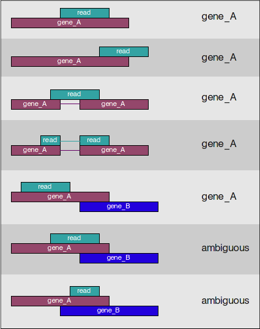

## Learning Objectives

* Conversion of BAM file to a counts file using `htseq-count`
* Conversion of BAM file to a bigWig file using `deeptools` 

## Counting reads as a measure of gene expression

Once we have our reads aligned to the genome, the next step is to count how many reads have mapped to each gene. Many tools can take BAM files as input and output the number of reads (counts) associated with each feature of interest (genes, exons, transcripts, etc.). Two commonly used counting tools are featureCounts and [htseq-count](https://htseq.readthedocs.io/en/release_0.11.1/count.html).

<figure markdown="span">
  { width="400" }
</figure>

* These tools report raw counts, meaning they only count reads that map uniquely to a single location in the genome. They are most effective for counting at the gene level. In this approach, the total read count for a gene (meta-feature) is the sum of reads assigned to each of its exons (features).

* Some other tools account for multiple transcripts per gene, assigning fractional counts instead of whole numbers. For example, if one read aligns to two transcripts, it may be counted as 0.5 for each transcript rather than a whole number.

* There are also tools that count multimapping reads, but this approach can lead to overcounting, which affects normalization and ultimately compromises the accuracy of differential gene expression analysis.

**Input for counting = multiple BAM files + 1 GTF file**

Simply speaking, the genomic coordinates of where the read is mapped (BAM) are cross-referenced with the genomic coordinates of whichever feature you are interested in counting expression of (GTF), it can be exons, genes or transcripts.

<figure markdown="span">
  { width="600" }
</figure>

**Output of counting = A count matrix, with genes as rows and samples are columns**

These are the "raw" counts and will be used in statistical programs downstream for differential gene expression. Below is a representative counts matrix. 

<figure markdown="span">
  { width="400" }
</figure>

We will begin by demonstrating the usage of HTSeq. HTSeq-count is a command-line tool used in RNA-Seq data analysis to count the number of sequencing reads that align to specific genomic features, such as genes. It is part of the HTSeq Python package and is commonly used in differential gene expression analysis pipelines.

## Basic Workflow

### Input Files:
    
  + SAM/BAM file: Contains aligned RNA-Seq reads (output from tools like HISAT2 or STAR).
  + GTF/GFF file: Contains gene annotations specifying genomic coordinates.

### Counting Reads:
  
  + HTSeq-count assigns each read to a genomic feature (usually a gene) based on predefined rules.
  + It outputs a table listing each gene and the number of reads assigned to it.

### Output:
  
  + A tab-delimited text file with two columns:
    + Gene ID
    + Read count

## Counting reads in features with `htseq-count` 

Given a file with aligned sequencing reads and a list of genomic features, a common task is to count how many reads map to each feature.

Here, a feature refers to a specific interval (i.e., a range of positions) on a chromosome or a union of such intervals.

Since our example data comes from an RNA-Seq experiment, we aim to count how many reads fall within the exonic regions of each gene. To do this, we first need information about exon positions, which can be obtained from GTF files—a common format provided by Ensembl (available here).

Special care must be taken when handling reads that align to or overlap with multiple features. The htseq-count script offers three different modes to handle such cases.

1. Union (Recommended for most cases):
   
    + A read is assigned to a feature if any part of the read overlaps with it.
    + If a read overlaps multiple features, it is not counted at all (to avoid ambiguity).

2. Intersection-strict:
    
    + A read is assigned to a feature only if every position of the read overlaps with that feature.
    + If a read overlaps multiple features but not completely within one, it is not counted.

3. Intersection-nonempty:
    
    + A read is assigned to a feature only if it overlaps with at least one feature at every position.
    + Unlike intersection-strict, it ignores positions where no features are present.

The figure below illustrates the effect of these three modes: 

<figure markdown="span">
  { width="400" }
</figure>


## Running `htseq-count`

Begin by loading the `htseq-count` module with `module load`

```bash
module load gcc/13.3.0-xp3epyt 
py-htseq/2.0.3-mb7ap7s
```

Then run the following to see if the module is loaded

```bash
htseq-count --help
```

```
usage: htseq-count [-h] [--version] [-f {sam,bam,auto}] [-r {pos,name}] [--max-reads-in-buffer MAX_BUFFER_SIZE] [-s {yes,no,reverse}] [-a MINAQUAL]
                   [-t FEATURE_TYPE] [-i IDATTR] [--additional-attr ADDITIONAL_ATTRIBUTES] [--add-chromosome-info]
                   [-m {union,intersection-strict,intersection-nonempty}] [--nonunique {none,all,fraction,random}]
                   [--secondary-alignments {score,ignore}] [--supplementary-alignments {score,ignore}] [-o SAMOUTS] [-p {SAM,BAM,sam,bam}]
                   [-d OUTPUT_DELIMITER] [-c OUTPUT_FILENAME] [--counts-output-sparse] [--append-output] [-n NPROCESSES] [--feature-query FEATURE_QUERY]
                   [-q] [--with-header]
                   samfilenames [samfilenames ...] featuresfilename
This script takes one or more alignment files in SAM/BAM format and a feature file in GFF format and calculates for each feature the number of reads
mapping to it. See http://htseq.readthedocs.io/en/master/count.html for details.
```

### Basic Command Syntax 

```bash
htseq-count -f bam -s no -i gene_id sample1.bam genes.gtf > gene_counts.txt
```

+ `-f bam` → Specifies input format (can be `sam` or `bam`).
+ `-s no` → Defines strandedness (`yes`, `no`, or `reverse`).
+ `-i gene_id` → used to identify the GTF feature attribute (`gene_name` or `gene_id`)
+ `aligned_reads.bam` → Input file with mapped reads.
+ `genes.gtf` → Reference annotation file.
+ `> gene_counts.txt` → Redirects output to a file.

#### Options

```bash 
-f <format>, --format=<format>

    Format of the input data. Possible values are sam (for text SAM files) and bam (for binary BAM files). Default is sam.
```

```bash
-s <yes/no/reverse>, --stranded=<yes/no/reverse>

    whether the data is from a strand-specific assay (default: `yes`)

    For stranded=no, a read is considered overlapping with a feature regardless of whether it is mapped to the same or the opposite strand as the feature. For stranded=yes and single-end reads, the read has to be mapped to the same strand as the feature. For paired-end reads, the first read has to be on the same strand and the second read on the opposite strand. For stranded=reverse, these rules are reversed.
```

```bash
-i <id attribute>, --idattr=<id attribute>

    GFF attribute to be used as feature ID. Several GFF lines with the same feature ID will be considered as parts of the same feature. The feature ID is used to identity the counts in the output table. The default, suitable for RNA-Seq analysis using an Ensembl GTF file, is `gene_id`.
```

## Key Considerations

  + Stranded vs. Unstranded Data:
    + Many RNA-Seq protocols preserve strand information. Setting -s yes or -s reverse ensures proper assignment.

  + Feature Type:
    + HTSeq-count assigns reads based on featuretype (default is exon in GTF). If needed, use -t to specify other features.

  + Overlap Mode:
    + Some reads may overlap multiple features; the -m flag determines how they are assigned (union, intersection-strict, intersection-nonempty).

## Limitations & Alternatives

  + HTSeq-count is a gene-level summarization tool; it does not handle transcript-level quantification.
  + It requires sorted BAM/SAM files.
  + Alternative tools like featureCounts (faster) or Salmon/RSEM (for transcript-level quantification) may be preferred in some cases.

***


!!! example "Class Exercise: HTSeq-count Instructions and Script"  

    1. **Copy Folder:** Make a copy of the following folder into your home directory: 
    2. **Determine Strandedness:** HtSeq-count requires setting the `-s` parameter based on the RNA-Seq library preparation protocol. The options are:
        + `-s yes`, reads are mapped to the same strand as the sense strand 
        + `-s no`, reads can map to either strand (unstranded)
        + `-s reverse`, reads are mapped to the opposite strand (anti-sense)
    3. **Generate and submit script:** You will need to add/specify/modify the following parameters:
      + add the module 
      + add the path to the GTF file: 
      + `-s` options include yes, no, or reverse
      + `-i` specify `gene_id`
    4. Submit the script when you are done using the example script below. 
    5. Rerun the script, this time change to `-i gene_name` instead. Be sure to change the name of the output file. What is the difference in the outputs? 
    
    The example script below will get you started: 

    #!/bin/bash
    #SBATCH --partition=general 
    #SBATCH --nodes=1
    #SBATCH --ntasks=4
    #SBATCH --mem=10G
    #SBATCH --time=30:00:00
    #SBATCH --job-name=htseq-count    
    #SBATCH --output=%x_%j.out  # %x=job-name, %j=jobid

    # Load HTSeq module


    # Define the path to the GTF file
    GTF_FILE=

    # Iterate through all BAM files in the current directory
    for BAM_FILE in *.bam; do

    # Extract the filename without the .bam extension
    NAME=$(basename "$BAM_FILE" .bam)
    echo "Processing: $NAME"

    # Run HTSeq-count
    htseq-count -f bam \
        -s \  # Modify based on your library strandedness
        -i gene_id \
        -m union \
        "$BAM_FILE" "$GTF_FILE" > "${NAME}.gene_id.count"

    done


### `htseq-count` output

The output of this tool is 2 files, *a count matrix* and *a summary file* that tabulates how many the reads were "assigned" or counted and the reason they remained "unassigned". Let's take a look at the summary file:
	
``` bash
$ less results/counts/Mov10_featurecounts.txt.summary
```
Now let's look at the count matrix:
	
``` bash
$ less results/counts/Mov10_featurecounts.txt
```	

## Resource Recommendations for `htseq-count`

An array will submit independent jobs and process each BAM file independently. 

```bash
#!/bin/bash
#SBATCH --partition=general
#SBATCH --array=1-8  # Adjust for the number of samples (1 per sample)
#SBATCH --nodes=1
#SBATCH --ntasks=1  
#SBATCH --mem=4G  # 2-6GB, 4GB is typically enough but specify 6GB for 100M+ reads
#SBATCH --time=2:00:00
#SBATCH --job-name=htseq-array
#SBATCH --output=htseq-%A_%a.out  # %A = job ID, %a = array task ID
```


## Creating bigWig files

We will now take our BAM files and convert them into bigWig files. The bigWig format is an indexed binary format useful for dense, continuous data that will be displayed in a genome browser as a graph/track, but also is used as input for some of the visualization commands we will be running in `deepTools`. 

[`deepTools`](http://deeptools.readthedocs.org/en/latest/content/list_of_tools.html), is a suite of Python tools developed for the efficient analysis of high-throughput sequencing data, such as ChIP-seq, RNA-seq or MNase-seq. `deepTools` has a wide variety of commands that go beyond those that are covered in this lesson. We encourage you to look through the documentation and explore on your own time. 

<figure markdown="span">
  { width="700" }
</figure>

*Image acquired from [deepTools documentation](http://deeptools.readthedocs.io/en/latest/content/tools/bamCoverage.html?highlight=bigwig) pages*


---
*This lesson has been developed by members of the teaching team at the [Harvard Chan Bioinformatics Core (HBC)](http://bioinformatics.sph.harvard.edu/). These are open access materials distributed under the terms of the [Creative Commons Attribution license](https://creativecommons.org/licenses/by/4.0/) (CC BY 4.0), which permits unrestricted use, distribution, and reproduction in any medium, provided the original author and source are credited.*
